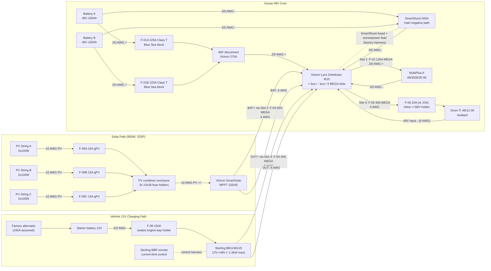
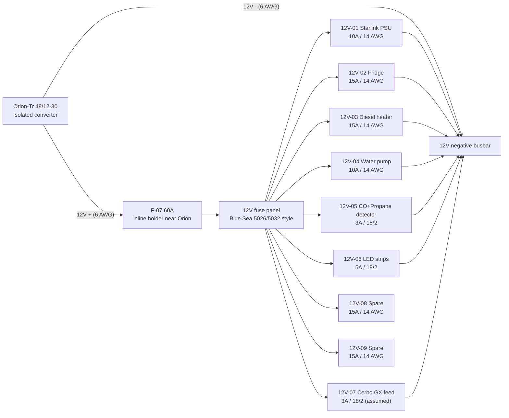
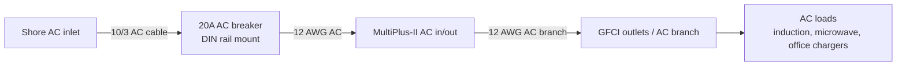
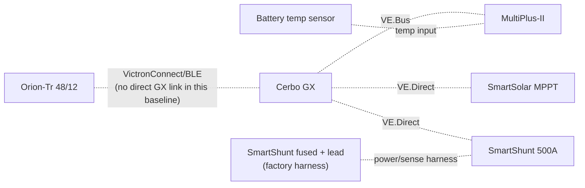

# Electrical Topology Diagram (Implementation v3)

As-of date: `2026-02-12`

Purpose: provide a complete, install-level electrical topology for the current build scope, including all major electrical components, fuse IDs, fuse housings, and planned wire gauges.

Related docs:
- Canonical electrical/system baseline: `docs/SYSTEMS.md`
- Detailed fuse matrix: `docs/ELECTRICAL_fuse_schedule.md`
- Decisions and unresolved items: `docs/TRACKING.md`
- Procurement source of truth: `bom/bom_estimated_items.csv`

## Sweep Outcomes Included In This Revision
- Corrected Sterling `BB1248120` modeling basis to `~1500W` max output (`~26A` at `57.6V`), replacing prior `120A @ 48V` planning assumption.
- Added explicit fuse-holder/housing definitions for every fuse family (`Class T`, Lynx `MEGA`, inline `MIDI/ANL/AMI`, PV `gPV`, and `ATO/ATC`).
- Added conductor schedule across `48V`, `12V`, PV, and AC segments with explicit assumptions.

## Complete Power Topology (48V Core + Charge Sources)

## 12V Distribution Topology (From Orion)

## AC Path Topology (Shore + Inverter Output)

## Monitoring and Control Topology

## Fuse Housing Map (Where Each Fuse Is Physically Housed)
| Fuse ID | Fuse value | Housing method | Location |
| --- | --- | --- | --- |
| `F-01A` | `225A Class T` | Blue Sea Class T fuse block | Battery compartment near Battery A `+` |
| `F-01B` | `225A Class T` | Blue Sea Class T fuse block | Battery compartment near Battery B `+` |
| `F-02` | `125A MEGA` | Lynx integrated slot holder | Lynx Slot 1 |
| `F-03` | `60A MEGA` | Lynx integrated slot holder | Lynx Slot 2 |
| `F-04` | `40A MEGA` | Lynx integrated slot holder | Lynx Slot 3 |
| `F-05` | `40A MEGA` | Lynx integrated slot holder | Lynx Slot 4 |
| `F-06` | `20A` target / `23A` MIDI fallback | Inline sealed holder (`>=58VDC`) | Electrical cabinet near Orion branch source |
| `F-07` | `60A` | Inline sealed holder (`>=32VDC`) | Electrical cabinet at Orion `12V +` source end |
| `F-08` | `150A` | Sealed engine-bay MEGA/ANL holder | Engine bay near starter battery `+` |
| `F-09A/B/C` | `15A gPV` each | `10x38` touch-safe fuse holders in PV combiner | Roof-entry combiner enclosure |
| `F-10` | Per branch (`ATO/ATC`) | Integrated blade sockets in 12V panel | Electrical cabinet |
| `OEM-SHUNT` | Factory low-current inline fuse (SmartShunt harness) | Integrated inline holder in Victron harness lead | Electrical cabinet near Lynx positive tap |

## Conductor Schedule (Start-to-Finish)
| Segment ID | Circuit segment | Nominal voltage | Current basis | Overcurrent protection | Planned wire gauge |
| --- | --- | --- | --- | --- | --- |
| `C-01` | Battery A `+` -> `F-01A` | `48V` | Battery branch, fuse-limited | `F-01A` `225A` | `2/0 AWG` |
| `C-02` | Battery B `+` -> `F-01B` | `48V` | Battery branch, fuse-limited | `F-01B` `225A` | `2/0 AWG` |
| `C-03` | Class T outputs -> disconnect input | `48V` | Combined trunk current | `F-01A/B` | `2/0 AWG` each branch |
| `C-04` | Disconnect output -> Lynx `+` bus | `48V` | Aggregate branch current (`<=265A` theoretical from Lynx slots) | Upstream Class T fuses | `2/0 AWG` |
| `C-05` | Battery negatives -> SmartShunt battery side | `48V` | Aggregate return current | N/A (main negative path) | `2/0 AWG` each branch |
| `C-06` | SmartShunt load side -> Lynx `-` bus | `48V` | Aggregate return current | N/A | `2/0 AWG` |
| `C-06A` | Lynx positive tap -> SmartShunt positive sense/power lead | `48V` | Shunt electronics supply (very low current) | Factory inline fuse in OEM harness | OEM harness lead |
| `C-07` | Lynx Slot 1 (`F-02`) -> MultiPlus `DC+` | `48V` | Inverter branch, fuse-limited | `F-02` `125A` | `2/0 AWG` (manual minimum `AWG 1` on short runs) |
| `C-08` | MultiPlus `DC-` -> Lynx `-` bus | `48V` | Inverter return current | `F-02` protects paired positive | `2/0 AWG` |
| `C-09` | MPPT `BAT+` -> Lynx Slot 2 (`F-03`) | `48V` | Controller output (`45A` max) | `F-03` `60A` | `6 AWG` |
| `C-10` | MPPT `BAT-` -> Lynx `-` bus | `48V` | Controller return current | `F-03` protects paired positive | `6 AWG` |
| `C-11` | Sterling output `+` -> Lynx Slot 3 (`F-04`) | `48V` | Charger output (`~26A` nominal max) | `F-04` `40A` | `6 AWG` planned (`10 AWG` minimum per Sterling table) |
| `C-12` | Sterling output `-` -> Lynx `-` bus | `48V` | Charger return current | `F-04` protects paired positive | `6 AWG` |
| `C-13` | Lynx Slot 4 (`F-05`) -> `F-06` holder | `48V` | Orion branch feeder, fuse-limited | `F-05` `40A` | `6 AWG` |
| `C-14` | `F-06` -> Orion `48V +` input | `48V` | Orion input, fuse-limited | `F-06` `20A`/`23A` | `6 AWG` planned (`8 AWG` minimum per Orion table) |
| `C-15` | Orion `48V -` input -> Lynx `-` bus | `48V` | Orion input return current | `F-06` protects paired positive | `6 AWG` |
| `C-16` | Starter battery `+` -> `F-08` -> Sterling input `+` | `12V` | Charger input path, fuse-limited | `F-08` `150A` | `2/0 AWG` planned (`2 AWG` minimum per Sterling table) |
| `C-17` | Vehicle return/chassis -> Sterling input `-` | `12V` | Charger input return | `F-08` protects paired positive | `2/0 AWG` planned |
| `C-18` | Orion `12V +` -> `F-07` -> 12V panel `+` bus | `12V` | Converter output path (`30A` continuous, `60A` fuse) | `F-07` `60A` | `6 AWG` planned (`8 AWG` minimum per Orion table) |
| `C-19` | Orion `12V -` -> 12V negative busbar | `12V` | Converter output return | `F-07` protects paired positive | `6 AWG` |
| `C-20` | 12V panel -> Starlink PSU | `12V` | Branch load | `F-10` `10A` | `14 AWG duplex` |
| `C-21` | 12V panel -> Fridge | `12V` | Branch load | `F-10` `15A` | `14 AWG duplex` |
| `C-22` | 12V panel -> Diesel heater | `12V` | Branch load | `F-10` `15A` | `14 AWG duplex` |
| `C-23` | 12V panel -> Water pump | `12V` | Branch load | `F-10` `10A` | `14 AWG duplex` |
| `C-24` | 12V panel -> CO + propane detector | `12V` | Branch load | `F-10` `3A` | `18/2` |
| `C-25` | 12V panel -> LED strips | `12V` | Branch load | `F-10` `5A` | `18/2` |
| `C-26` | 12V panel -> Cerbo GX power feed | `12V` | Branch load (`~3W`) | `F-10` `3A` (assumed) | `18/2` |
| `C-27` | PV strings -> `F-09` combiner -> MPPT PV input | PV string voltage (`3S`) | String current + combiner output current | `F-09A/B/C` `15A` each | `10 AWG` PV wire |
| `C-28` | Shore inlet -> AC breaker -> Multi AC-in | `120VAC` | Shore branch current | `20A` AC breaker | `10/3` inlet feed, `12 AWG` branch to inverter |
| `C-29` | Multi AC-out -> GFCI/outlet branches | `120VAC` | Inverter AC branch current | AC breakers + GFCI protection | `12 AWG` branch wire |

## Additional Components Included In Topology Scope
- `48V` disconnect (`275A`)
- Pre-charge resistor (commissioning/soft-charge aid before connecting large DC loads)
- 12V negative busbar
- AC breaker + DIN rail
- GFCI outlet branch hardware
- Battery temperature sensor wiring to inverter/monitoring path
- SmartShunt fused positive sense/power lead (factory harness)

## Assumptions (Explicit)
1. Cable sizing assumes stranded copper conductors, enclosed vehicle routing, and typical one-way run lengths of `<=10 ft` unless otherwise stated.
2. Voltage-drop design intent used here: `<=2%` on major `48V` power runs and `<=3%` on `12V` branch circuits.
3. `F-09` PV string fuse value (`15A`) remains provisional until final module datasheet max-series-fuse rating is confirmed.
4. Cerbo GX feed is assumed from the `12V` panel (`12V-07`) for branch-level serviceability.
5. Orion branch remains split-protection (`F-05` upstream feeder + `F-06` device-level input fuse).
6. Big 3 alternator-upgrade path is purchase-later; this diagram captures the current stock-alternator-first architecture.

## Completion Status
- Topology is complete for current BOM scope and load model scope.
- Remaining work is procurement-level SKU lock and field-validation (run lengths, thermal checks, and voltage-drop measurements).
