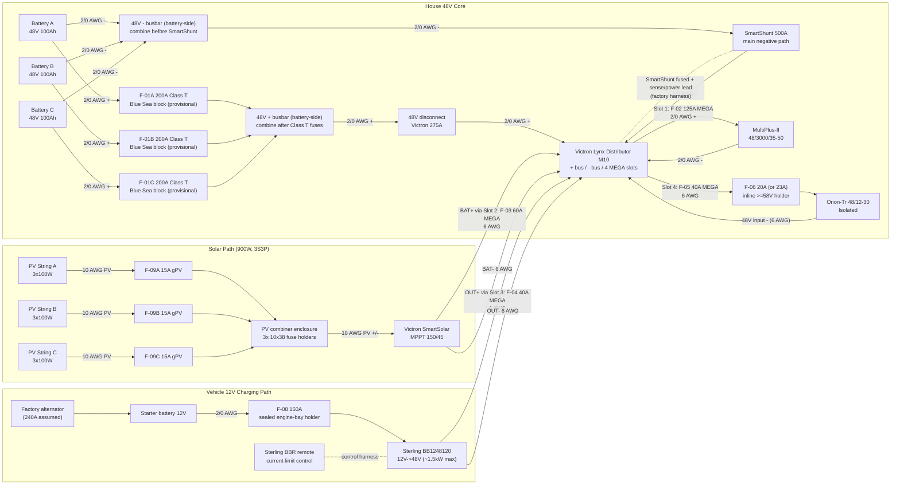
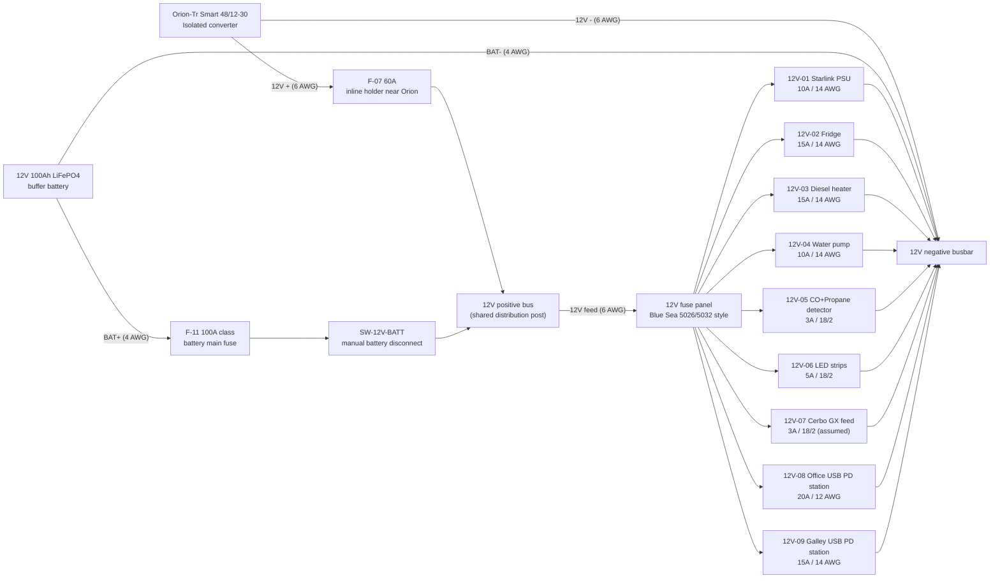
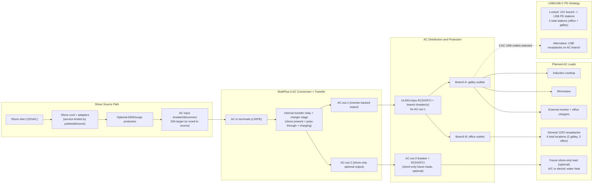
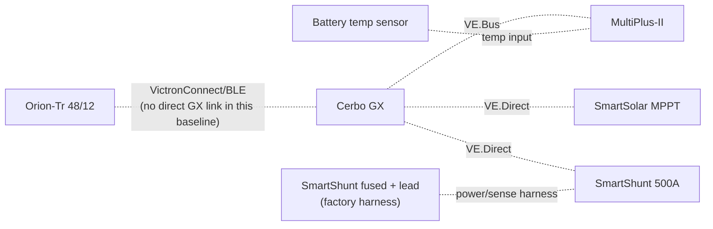

# Electrical Topology Diagram (Implementation v4)

As-of date: `2026-02-18`

Purpose: provide a complete, install-level electrical topology for the current build scope, including all major electrical components, fuse IDs, fuse housings, and planned wire gauges.

Related docs:
- Canonical electrical/system baseline: `docs/SYSTEMS.md`
- Detailed fuse matrix: `docs/ELECTRICAL_fuse_schedule.md`
- Battery and trunk recalculation record: `docs/ELECTRICAL_battery_fuse_wire_recalc_2026-02-18.md`
- Decisions and unresolved items: `docs/TRACKING.md`
- Procurement source of truth: `bom/bom_estimated_items.csv`

## Sweep Outcomes Included In This Revision
- Corrected Sterling `BB1248120` modeling basis to `~1500W` max output (`~26A` at `57.6V`), replacing prior `120A @ 48V` planning assumption.
- Added explicit fuse-holder/housing definitions for every fuse family (`Class T`, Lynx `MEGA`, inline `MIDI/ANL/AMI`, PV `gPV`, and `ATO/ATC`).
- Added conductor schedule across `48V`, `12V`, PV, and AC segments with explicit assumptions.
- Updated 12V topology to a shared bus fed by Orion-Tr Smart and a `12V 100Ah` buffer battery, with `F-11` source fuse plus `SW-12V-BATT` manual isolation.

## Battery Fuse/Wire Recalculation Basis (2026-02-18)
- Scope in this pass is limited to battery-side and major `48V` trunk paths (`C-01` through `C-15`).
- Provisional battery listing inputs used: `51.2V 100Ah`, `<=200A` current limit per battery.
- Conservative sizing factors used in this pass:
1. Parallel-sharing factor `K_share = 1.5`
2. Continuous margin factor `K_cont = 1.25`
- Current envelope used for battery-discharge branch sizing in current architecture: `I_total = F-02 + F-05 = 125A + 40A = 165A`.
- Per-battery design current: `I_batt_design = (165A / 3) * 1.5 = 82.5A`.
- Continuous-adjusted minimum battery branch fuse threshold: `I_fuse_min = 82.5A * 1.25 = 103.1A`.
- Provisional battery branch fuse selection: `F-01A/B/C = 200A Class T`, constrained by the provisional battery `<=200A` current-limit listing.
- Final lock gate: validate true `51.2V` battery datasheet/manual current and terminal limits before permanent fuse lock; if lower limits are confirmed, move to `175A`.
- Cable procurement remains scenario-band based until CAD run lengths are frozen. Current buy baseline for `2/0` is `50 ft` total (replacing legacy `30 ft` placeholder).

## Complete Power Topology (48V Core + Charge Sources)

## 12V Distribution Topology (Shared Bus With Buffer Battery)

## AC Path Topology (Shore + Inverter Output, Full Hierarchy)

### AC Operating Behavior (Expected)
- Shore present: MultiPlus transfer relay closes, AC-in is passed to AC-out paths, and charger stage charges the `48V` bank.
- Shore absent: MultiPlus transfers to inverter mode and powers `AC-out-1` from battery; `AC-out-2` drops by design.
- Input current limit should be set to the actual shore source (`15A`, `20A`, or `30A` adapter-limited) to avoid pedestal/source breaker trips.

### AC Safety/Protection Chain (What Must Exist)
- Upstream AC input protection/disconnect before MultiPlus AC-in.
- AC-out branch protection including UL943-class residual-current protection and overcurrent protection sized to branch wiring and expected load.
- Continuous equipment grounding path from shore inlet through MultiPlus and branch circuits, plus chassis bond in mobile install context.
- Neutral/ground handling must follow MultiPlus relay behavior; do not add an always-bonded downstream neutral-ground bond in branch receptacle wiring.

### AC Reference Basis (Manufacturer Guidance)
- Victron MultiPlus-II `120V` installation guidance (`AC-in` breaker sizing, UL943-class residual-current protection on outputs, and AC-out-2 shore-only behavior): `https://www.victronenergy.com/media/pg/MultiPlus-II_120V/en/installation.html`
- Victron MultiPlus-II datasheet (`48/3000/35-50` baseline model reference): `https://www.victronenergy.com/upload/documents/Datasheet-MultiPlus-II-inverter-charger-120V-EN.pdf`

### AC/USB Baseline Locked For BOM
- Shore interface: `30A` RV-style inlet baseline with adapter kit for `15A`/`20A` hookups.
- AC input protection: dedicated AC input breaker/disconnect upstream of MultiPlus AC-in.
- AC-out-1 distribution: two protected branches (`20A` galley, `15A` office) with GFCI-at-first-outlet strategy.
- Receptacle plan: `4` total `120V` receptacle locations (`2` galley, `2` office).
- USB charging plan: `2` DC-fed USB PD station assemblies on `12V` branches (`1` office, `1` galley) with branch baselines of `20A` (office) and `15A` (galley).
- AC-out-2 remains optional and not in Phase 1 procurement baseline.

## Monitoring and Control Topology

## Fuse and Switch Housing Map (Where Each Item Is Physically Housed)
| Item ID | Item value/type | Housing method | Location |
| --- | --- | --- | --- |
| `F-01A` | `200A Class T` (provisional) | Blue Sea Class T fuse block (`110A-200A` family) | Battery compartment near Battery A `+` |
| `F-01B` | `200A Class T` (provisional) | Blue Sea Class T fuse block (`110A-200A` family) | Battery compartment near Battery B `+` |
| `F-01C` | `200A Class T` (provisional) | Blue Sea Class T fuse block (`110A-200A` family) | Battery compartment near Battery C `+` |
| `F-02` | `125A MEGA` | Lynx integrated slot holder | Lynx Slot 1 |
| `F-03` | `60A MEGA` | Lynx integrated slot holder | Lynx Slot 2 |
| `F-04` | `40A MEGA` | Lynx integrated slot holder | Lynx Slot 3 |
| `F-05` | `40A MEGA` | Lynx integrated slot holder | Lynx Slot 4 |
| `F-06` | `20A` target / `23A` MIDI fallback | Inline sealed holder (`>=58VDC`) | Electrical cabinet near Orion branch source |
| `F-07` | `60A` | Inline sealed holder (`>=32VDC`) | Electrical cabinet at Orion `12V +` source end |
| `F-08` | `150A` | Sealed engine-bay MEGA/ANL holder | Engine bay near starter battery `+` |
| `F-09A/B/C` | `15A gPV` each | `10x38` touch-safe fuse holders in PV combiner | Roof-entry combiner enclosure |
| `F-10` | Per branch (`ATO/ATC`) | Integrated blade sockets in 12V panel | Electrical cabinet |
| `F-11` | `100A` class (12V buffer battery main) | Sealed inline MIDI/AMI/ANL holder | Within ~`7"` of 12V buffer battery positive post |
| `SW-12V-BATT` | Manual battery disconnect switch | Sealed rotary DC switch body | Electrical cabinet near 12V positive bus for service access |
| `OEM-SHUNT` | Factory low-current inline fuse (SmartShunt harness) | Integrated inline holder in Victron harness lead | Electrical cabinet near Lynx positive tap |

## Conductor Schedule (Start-to-Finish)
| Segment ID | Circuit segment | Nominal voltage | Current basis | Overcurrent protection | Planned wire gauge |
| --- | --- | --- | --- | --- | --- |
| `C-01` | Battery A `+` -> `F-01A` | `48V` | Battery branch, fuse-limited | `F-01A` `200A` provisional | `2/0 AWG` |
| `C-02` | Battery B `+` -> `F-01B` | `48V` | Battery branch, fuse-limited | `F-01B` `200A` provisional | `2/0 AWG` |
| `C-02C` | Battery C `+` -> `F-01C` | `48V` | Battery branch, fuse-limited | `F-01C` `200A` provisional | `2/0 AWG` |
| `C-03` | Class T outputs -> battery-side `48V +` busbar -> disconnect input | `48V` | Combined trunk current | `F-01A/B/C` | `2/0 AWG` each branch |
| `C-04` | Disconnect output -> Lynx `+` bus | `48V` | Aggregate branch current (`<=265A` theoretical from Lynx slots) | Upstream Class T fuses | `2/0 AWG` |
| `C-05` | Battery negatives -> battery-side `48V -` busbar -> SmartShunt battery side | `48V` | Aggregate return current | N/A (main negative path) | `2/0 AWG` each branch |
| `C-06` | SmartShunt load side -> Lynx `-` bus | `48V` | Aggregate return current | N/A | `2/0 AWG` |
| `C-06A` | Lynx positive tap -> SmartShunt positive sense/power lead | `48V` | Shunt electronics supply (very low current) | Factory inline fuse in OEM harness | OEM harness lead |
| `C-07` | Lynx Slot 1 (`F-02`) -> MultiPlus `DC+` | `48V` | Inverter branch, fuse-limited | `F-02` `125A` | `2/0 AWG` (manual minimum `AWG 1` on short runs) |
| `C-08` | MultiPlus `DC-` -> Lynx `-` bus | `48V` | Inverter return current | `F-02` protects paired positive | `2/0 AWG` |
| `C-09` | MPPT `BAT+` -> Lynx Slot 2 (`F-03`) | `48V` | Controller output (`45A` max) | `F-03` `60A` | `6 AWG` |
| `C-10` | MPPT `BAT-` -> Lynx `-` bus | `48V` | Controller return current | `F-03` protects paired positive | `6 AWG` |
| `C-11` | Sterling output `+` -> Lynx Slot 3 (`F-04`) | `48V` | Charger output (`~26A` nominal max) | `F-04` `40A` | `6 AWG` planned (`10 AWG` minimum per Sterling table) |
| `C-12` | Sterling output `-` -> Lynx `-` bus | `48V` | Charger return current | `F-04` protects paired positive | `6 AWG` |
| `C-13` | Lynx Slot 4 (`F-05`) -> `F-06` holder | `48V` | Orion branch feeder, fuse-limited | `F-05` `40A` | `6 AWG` |
| `C-14` | `F-06` -> Orion `48V +` input | `48V` | Orion input, fuse-limited | `F-06` `20A`/`23A` | `6 AWG` planned (`8 AWG` minimum per Orion table) |
| `C-15` | Orion `48V -` input -> Lynx `-` bus | `48V` | Orion input return current | `F-06` protects paired positive | `6 AWG` |
| `C-16` | Starter battery `+` -> `F-08` -> Sterling input `+` | `12V` | Charger input path, fuse-limited | `F-08` `150A` | `2/0 AWG` planned (`2 AWG` minimum per Sterling table) |
| `C-17` | Vehicle return/chassis -> Sterling input `-` | `12V` | Charger input return | `F-08` protects paired positive | `2/0 AWG` planned |
| `C-18` | Orion `12V +` -> `F-07` -> shared 12V positive bus | `12V` | Converter output path (`30A` continuous, `60A` fuse) | `F-07` `60A` | `6 AWG` planned (`8 AWG` minimum per Orion table) |
| `C-19` | Orion `12V -` -> 12V negative busbar | `12V` | Converter output return | `F-07` protects paired positive | `6 AWG` |
| `C-19A` | 12V buffer battery `+` -> `F-11` -> `SW-12V-BATT` -> shared 12V positive bus | `12V` | Buffer source path and service isolation path | `F-11` `100A` class | `4 AWG` planned |
| `C-19B` | 12V buffer battery `-` -> 12V negative busbar | `12V` | Buffer battery return path | N/A (paired with `C-19A`) | `4 AWG` planned |
| `C-19C` | Shared 12V positive bus -> 12V fuse panel `+` bus | `12V` | Main 12V distribution feed path | Upstream source fuses (`F-07` / `F-11`) | `6 AWG` planned |
| `C-20` | 12V panel -> Starlink PSU | `12V` | Branch load | `F-10` `10A` | `14 AWG duplex` |
| `C-21` | 12V panel -> Fridge | `12V` | Branch load | `F-10` `15A` | `14 AWG duplex` |
| `C-22` | 12V panel -> Diesel heater | `12V` | Branch load | `F-10` `15A` | `14 AWG duplex` |
| `C-23` | 12V panel -> Water pump | `12V` | Branch load | `F-10` `10A` | `14 AWG duplex` |
| `C-24` | 12V panel -> CO + propane detector | `12V` | Branch load | `F-10` `3A` | `18/2` |
| `C-25` | 12V panel -> LED strips | `12V` | Branch load | `F-10` `5A` | `18/2` |
| `C-26` | 12V panel -> Cerbo GX power feed | `12V` | Branch load (`~3W`) | `F-10` `3A` (assumed) | `18/2` |
| `C-27` | PV strings -> `F-09` combiner -> MPPT PV input | PV string voltage (`3S`) | String current + combiner output current | `F-09A/B/C` `15A` each | `10 AWG` PV wire |
| `C-28` | Shore inlet -> shore cord/adapter -> AC input breaker/disconnect | `120VAC` | Source-limited shore current | Source-size-matched AC breaker/disconnect (`20A` target baseline) | `10/3` shore feed to inlet/breaker area |
| `C-29` | AC input breaker/disconnect -> MultiPlus AC-in | `120VAC` | MultiPlus AC input current | Upstream AC breaker/disconnect (`C-28`) | `12 AWG` stranded AC conductors |
| `C-30` | MultiPlus AC-out-1 -> branch RCD/GFCI + breaker assembly | `120VAC` | Inverter-backed branch distribution current | UL943-class RCD/GFCI + branch breakers (`20A` galley, `15A` office) | `12 AWG` stranded AC conductors |
| `C-31` | Branch A -> galley receptacle locations (`2`) | `120VAC` | Branch load (induction, microwave, galley outlets) | `C-30` branch protection stack | `12 AWG` stranded AC conductors |
| `C-32` | Branch B -> office receptacle locations (`2`) | `120VAC` | Branch load (monitor and office outlet use) | `C-30` branch protection stack | `12 AWG` stranded AC conductors |
| `C-33` | MultiPlus AC-out-2 (optional) -> shore-only future load branch | `120VAC` | Shore-only branch current | Dedicated breaker + UL943-class RCD/GFCI for AC-out-2 | `12 AWG` stranded AC conductors |
| `C-34` | 12V panel -> USB PD station branch (office zone) | `12V` | High-demand office charging branch (`100W + 65W` class station budget) | `F-10` branch fuse (`20A`) | `12 AWG duplex` baseline |
| `C-35` | 12V panel -> USB PD station branch (galley zone) | `12V` | Galley charging branch (`65W` class USB-C plus USB-A/C loads) | `F-10` branch fuse (`15A`) | `14 AWG duplex` baseline |

## 3x Battery Bank Bench-Build Cut List (2/0 AWG)
Purpose: make the bench build orderable without needing final camper run lengths. Treat lengths below as *bench module* lengths only; final install harnesses should be re-cut after layout freeze.

Assumptions:
1. Battery terminals are `M8` (verify your battery stud size before ordering lugs).
2. Class T fuse blocks and battery-side busbars use `3/8"` studs (treat as `M10` lugs unless your specific hardware differs).
3. Lynx Distributor is the `M10` model (main connections `M10`; internal/fuse studs may still be `M8` depending on the position).

| Cable ID | Qty | From -> To | Color | Gauge | Lug A | Lug B |
| --- | --- | --- | --- | --- | --- | --- |
| `BATT+_A/B/C` | `3` | Battery `+` -> Class T block line side | red | `2/0` | `M8` | `M10` |
| `FUSE_TO_POSBUS_A/B/C` | `3` | Class T block load side -> `48V +` busbar | red | `2/0` | `M10` | `M10` |
| `POSBUS_TO_DISC` | `1` | `48V +` busbar -> disconnect input | red | `2/0` | `M10` | `M10` |
| `DISC_TO_LYNX+` | `1` | disconnect output -> Lynx `+` input | red | `2/0` | `M10` | `M10` |
| `BATT-_A/B/C` | `3` | Battery `-` -> `48V -` busbar | black | `2/0` | `M8` | `M10` |
| `NEGBUS_TO_SHUNT` | `1` | `48V -` busbar -> SmartShunt battery side | black | `2/0` | `M10` | `M10` |
| `SHUNT_TO_LYNX-` | `1` | SmartShunt load side -> Lynx `-` input | black | `2/0` | `M10` | `M10` |
| `LYNX_SLOT1_TO_MULTI+` | `1` | Lynx Slot 1 `DC+` -> MultiPlus `DC+` | red | `2/0` | `M8` | `M8` |
| `LYNX_TO_MULTI-` | `1` | Lynx `-` -> MultiPlus `DC-` | black | `2/0` | `M8` | `M8` |

Torque reference (verify against your exact manuals/hardware):
- MultiPlus-II DC terminals: `12 Nm` (`M8` nut) per Victron installation guidance.
- SmartShunt shunt bolts: max `21 Nm` (`M10` on 500A model) per Victron installation guidance.
- Lynx Distributor `M10` model: `M10` nuts `33 Nm` (older serials may be lower), and `M8` nuts `14 Nm` per Victron Lynx installation guidance.

## Additional Components Included In Topology Scope
- `48V` disconnect (`275A`)
- Pre-charge resistor (commissioning/soft-charge aid before connecting large DC loads)
- Battery-side `48V +` combine busbar (after Class T fuses)
- Battery-side `48V -` combine busbar (battery-only, before SmartShunt)
- Shared 12V positive bus/distribution post (Orion + buffer battery feed combine point)
- 12V negative busbar
- 12V buffer battery main fuse (`F-11`) and manual disconnect switch (`SW-12V-BATT`)
- Shore AC inlet + cord/adapter interface hardware
- AC input breaker/disconnect hardware (compact load-center baseline; DIN-only if swapped at SKU lock)
- AC branch RCD/GFCI + breaker hardware
- Receptacle boxes + `120V` outlets (`4` planned locations: `2` galley, `2` office)
- Optional AC-out-2 branch protection path for future shore-only loads
- USB PD station branch hardware (`2` stations: office + galley)
- Battery temperature sensor wiring to inverter/monitoring path
- SmartShunt fused positive sense/power lead (factory harness)

## Assumptions (Explicit)
1. Cable sizing assumes stranded copper conductors, enclosed vehicle routing, and typical one-way run lengths of `<=10 ft` unless otherwise stated.
2. Voltage-drop design intent used here: `<=2%` on major `48V` power runs and `<=3%` on `12V` branch circuits.
3. `F-09` PV string fuse value (`15A`) remains provisional until final module datasheet max-series-fuse rating is confirmed.
4. Cerbo GX feed is assumed from the `12V` panel (`12V-07`) for branch-level serviceability.
5. Orion branch remains split-protection (`F-05` upstream feeder + `F-06` device-level input fuse).
6. No low-voltage-disconnect (LVD) automation is included in Phase 1; protection is source fusing plus manual `SW-12V-BATT` isolation.
7. Big 3 alternator-upgrade path is purchase-later; this diagram captures the current stock-alternator-first architecture.
8. `F-01A/B/C` are provisionally set to `200A` pending final `51.2V` battery datasheet/manual confirmation; if validated limits are lower, shift to `175A`.
9. `2/0` cable quantity planning for procurement is scenario-band based (`50 ft` total baseline) until CAD route lengths are locked.

## Completion Status
- DC/PV topology is complete for current BOM scope and load model scope.
- AC hierarchy is now complete at architecture level, including transfer behavior, branch strategy, and protection chain.
- Remaining work is SKU-level part lock and run-length field validation for the now-locked AC/USB architecture.
