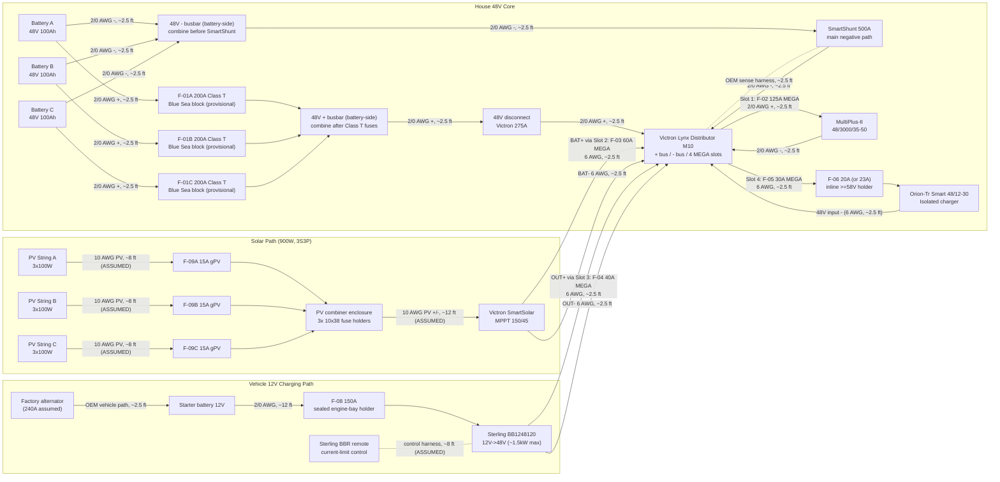
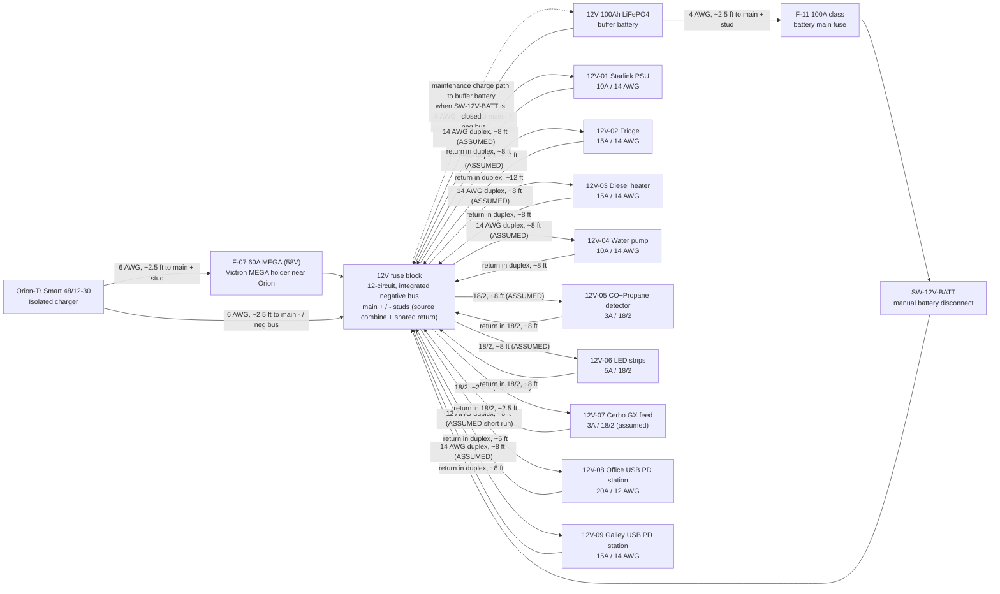
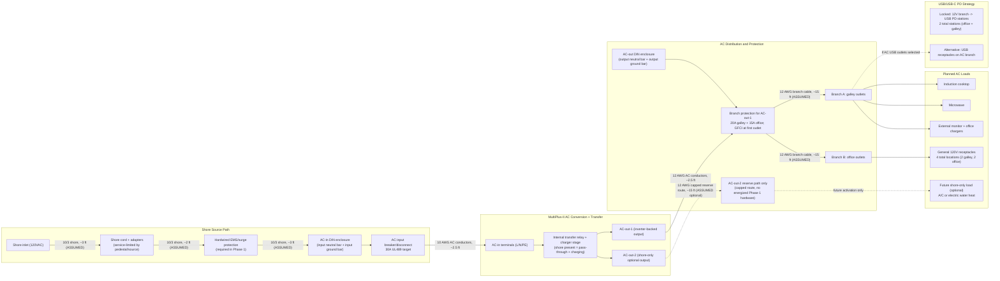
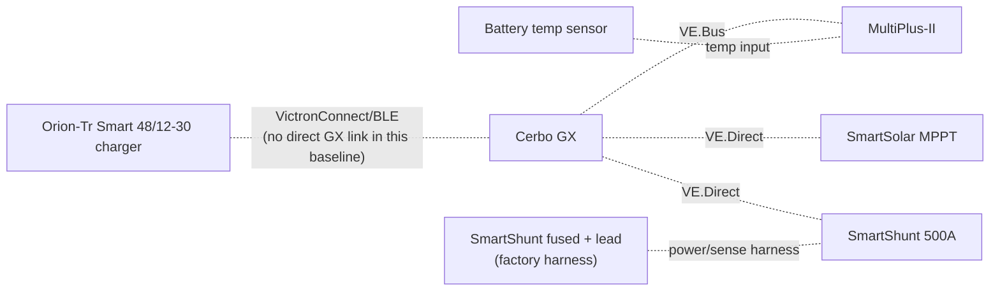

# Electrical Topology Diagram (Implementation v5)

As-of date: `2026-02-18`

Purpose: provide a complete, install-level electrical topology for the current build scope, including all major electrical components, fuse IDs, fuse housings, planned wire gauges, and estimated one-way run lengths for procurement planning.

Related docs:
- Canonical electrical/system baseline: `docs/SYSTEMS.md`
- Detailed fuse matrix: `docs/ELECTRICAL_fuse_schedule.md`
- Battery and trunk recalculation record: `docs/ELECTRICAL_battery_fuse_wire_recalc_2026-02-18.md`
- Decisions and unresolved items: `docs/TRACKING.md`
- Procurement source of truth: `bom/bom_estimated_items.csv`

## Sweep Outcomes Included In This Revision
- Corrected Sterling `BB1248120` modeling basis to `~1500W` max output (`~26A` at `57.6V`), replacing prior `120A @ 48V` planning assumption.
- Added explicit fuse-holder/housing definitions for every fuse family (`Class T`, Lynx `MEGA`, inline `MIDI/ANL/AMI`, PV `gPV`, and `ATO/ATC`).
- Added conductor schedule across `48V`, `12V`, PV, and AC segments with explicit assumptions.
- Updated 12V topology to a shared 12V junction fed by an Orion-Tr Smart `48/12-30` charger and a `12V 100Ah` buffer battery branch, with `F-11` source fuse plus `SW-12V-BATT` manual isolation.
- Added a full-circuit estimated run-length validation pass (`C-01` through `C-35`) and purchase-ready wire rollup totals.

## Length Estimation Defaults Used In This Pass
1. Cabinet internal interconnect default: `2.5 ft` one-way (`ASSUMED`).
2. Cabinet-to-near load branch default: `8 ft` one-way (`ASSUMED`).
3. Cabinet-to-far load branch default: `12 ft` one-way (`ASSUMED`).
4. AC branch to receptacle chain default: `15 ft` one-way per branch leg (`ASSUMED`).
5. Policy lock: use the smallest gauge that meets current and voltage-drop targets; do not auto-upsize, but flag warnings when margin is tight.
6. Parallel battery bank lock: keep `BATT+_A/B/C` equal length and `BATT-_A/B/C` equal length.

## Battery Fuse/Wire Recalculation Basis (2026-02-18)
- Scope in this pass is limited to battery-side and major `48V` trunk paths (`C-01` through `C-15`).
- Provisional battery listing inputs used: `51.2V 100Ah`, `<=200A` current limit per battery.
- Conservative sizing factors used in this pass:
1. Parallel-sharing factor `K_share = 1.5`
2. Continuous margin factor `K_cont = 1.25`
- Current envelope used for battery-discharge branch sizing in current architecture: `I_total = F-02 + F-05 = 125A + 30A = 155A`.
- Per-battery design current: `I_batt_design = (155A / 3) * 1.5 = 77.5A`.
- Continuous-adjusted minimum battery branch fuse threshold: `I_fuse_min = 77.5A * 1.25 = 96.9A`.
- Provisional battery branch fuse selection: `F-01A/B/C = 200A Class T`, constrained by the provisional battery `<=200A` current-limit listing.
- Final lock gate: validate true `51.2V` battery datasheet/manual current and terminal limits before permanent fuse lock; if lower limits are confirmed, move to `175A`.
- Cable procurement remains estimate-based until CAD/field run lengths are frozen. This pass sets a no-padding `2/0` estimate baseline of `61.5 ft` total (`34.5 ft` red, `27.0 ft` black), replacing the legacy `50 ft` scenario placeholder.

## Complete Power Topology (48V Core + Charge Sources)

## 12V Distribution Topology (Shared Junction With Buffer Battery)

### 12V Operating Intent (Locked)
- Orion-Tr Smart `48/12-30` is the primary `12V` charger/feed source.
- `SW-12V-BATT` is **normally closed** in operation; open is service/isolation mode only.
- With `SW-12V-BATT` closed, Orion output at the fuse-block main `+` stud maintains/charges the `12V` buffer battery through the shared-junction path.
- With `SW-12V-BATT` open, the buffer battery is isolated from the main `+` stud; this mode is for service/troubleshooting only and not the default operating state.
- The buffer battery remains in the active operating path during normal use and is intended to absorb transients/peaks on the `12V` rail.
- The fuse block is the `12V` junction device in this baseline: main `+` stud is the source-combine point, and the integrated negative bus/main `-` is the shared return point.
- Do not solder-splice high-current source conductors; terminate with crimped lugs on rated studs/junction hardware.

## AC Path Topology (Shore + Inverter Output, Full Hierarchy)

### AC Operating Behavior (Expected)
- Shore present: MultiPlus transfer relay closes, AC-in is passed to AC-out paths, and charger stage charges the `48V` bank.
- Shore absent: MultiPlus transfers to inverter mode and powers `AC-out-1` from battery; `AC-out-2` drops by design.
- AC-in hardware is `30A` (`TT-30` + hardwired EMS + `30A` breaker + `10 AWG` AC-in conductors); set MultiPlus input current limit to actual source (`15A`, `20A`, or `30A`) to avoid pedestal/source breaker trips.

### AC Safety/Protection Chain (What Must Exist)
- Upstream shore protection chain before MultiPlus AC-in: shore inlet -> hardwired EMS -> `30A` AC input breaker/disconnect.
- AC-out branch protection including UL943-class residual-current protection and overcurrent protection sized to branch wiring and expected load.
- Split-panel architecture with dedicated neutral/ground bars per AC enclosure and no AC-in/AC-out neutral mixing.
- Continuous equipment grounding path from shore inlet through MultiPlus and branch circuits, plus chassis bond in mobile install context.
- Neutral/ground handling must follow MultiPlus relay behavior; do not add an always-bonded downstream neutral-ground bond in branch receptacle wiring.

### AC Reference Basis (Manufacturer Guidance)
- Victron MultiPlus-II `120V` installation guidance (`AC-in` breaker sizing, UL943-class residual-current protection on outputs, and AC-out-2 shore-only behavior): `https://www.victronenergy.com/media/pg/MultiPlus-II_120V/en/installation.html`
- Victron MultiPlus-II datasheet (`48/3000/35-50` baseline model reference): `https://www.victronenergy.com/upload/documents/Datasheet-MultiPlus-II-inverter-charger-120V-EN.pdf`

### AC/USB Baseline Locked For BOM
- Shore interface: `30A` RV-style inlet baseline with adapter kit for `15A`/`20A` hookups.
- AC input protection: dedicated hardwired-EMS + AC-in DIN enclosure + `30A` AC input breaker/disconnect upstream of MultiPlus AC-in.
- AC-out-1 distribution: two protected branches (`20A` galley, `15A` office) with GFCI-at-first-outlet strategy.
- Receptacle plan: `4` total `120V` receptacle locations (`2` galley, `2` office).
- USB charging plan: `2` DC-fed USB PD station assemblies on `12V` branches (`1` office, `1` galley) with branch baselines of `20A` (office) and `15A` (galley).
- AC-out-2 remains reserve-only in Phase 1 (labeled capped route; no energized branch hardware procured).

## Monitoring and Control Topology

## Fuse and Switch Housing Map (Where Each Item Is Physically Housed)
| Item ID | Item value/type | Housing method | Location |
| --- | --- | --- | --- |
| `F-01A` | `200A Class T` (provisional) | Blue Sea Class T fuse block (`110A-200A` family) | Battery compartment near Battery A `+` |
| `F-01B` | `200A Class T` (provisional) | Blue Sea Class T fuse block (`110A-200A` family) | Battery compartment near Battery B `+` |
| `F-01C` | `200A Class T` (provisional) | Blue Sea Class T fuse block (`110A-200A` family) | Battery compartment near Battery C `+` |
| `F-02` | `125A MEGA` | Lynx integrated slot holder | Lynx Slot 1 |
| `F-03` | `60A MEGA` | Lynx integrated slot holder | Lynx Slot 2 |
| `F-04` | `40A MEGA` | Lynx integrated slot holder | Lynx Slot 3 |
| `F-05` | `30A MEGA` | Lynx integrated slot holder | Lynx Slot 4 |
| `F-06` | `20A` target / `23A` MIDI fallback | Inline sealed holder (`>=58VDC`) | Electrical cabinet near Orion branch source |
| `F-07` | `60A MEGA` (`58V` class) | Victron MEGA fuse holder | Electrical cabinet at Orion `12V +` source end |
| `F-08` | `150A` | Sealed engine-bay MEGA/ANL holder | Engine bay near starter battery `+` |
| `F-09A/B/C` | `15A gPV` each | `10x38` touch-safe fuse holders in PV combiner | Roof-entry combiner enclosure |
| `F-10` | Per branch (`ATO/ATC`) | Integrated blade sockets in generic 12V fuse block | Electrical cabinet |
| `F-11` | `100A` class (12V buffer battery main) | Sealed inline MIDI/AMI/ANL holder | Within ~`7"` of 12V buffer battery positive post |
| `SW-12V-BATT` | Manual battery disconnect switch | Sealed rotary DC switch body | Electrical cabinet near 12V fuse-block main `+` stud for service access |
| `OEM-SHUNT` | Factory low-current inline fuse (SmartShunt harness) | Integrated inline holder in Victron harness lead | Electrical cabinet near Lynx positive tap |

## Conductor Schedule (Start-to-Finish)
| Segment ID | Circuit segment | Nominal voltage | Current basis | Overcurrent protection | Planned wire gauge | Estimated one-way length (this pass) |
| --- | --- | --- | --- | --- | --- | --- |
| `C-01` | Battery A `+` -> `F-01A` | `48V` | Battery branch, fuse-limited | `F-01A` `200A` provisional | `2/0 AWG` | `2.5 ft` (`ASSUMED`, equal-length set) |
| `C-02` | Battery B `+` -> `F-01B` | `48V` | Battery branch, fuse-limited | `F-01B` `200A` provisional | `2/0 AWG` | `2.5 ft` (`ASSUMED`, equal-length set) |
| `C-02C` | Battery C `+` -> `F-01C` | `48V` | Battery branch, fuse-limited | `F-01C` `200A` provisional | `2/0 AWG` | `2.5 ft` (`ASSUMED`, equal-length set) |
| `C-03` | Class T outputs -> battery-side `48V +` busbar -> disconnect input | `48V` | Combined trunk current | `F-01A/B/C` | `2/0 AWG` each branch | `2.5 ft each branch` (`ASSUMED`, `4` conductors in rollup) |
| `C-04` | Disconnect output -> Lynx `+` bus | `48V` | Aggregate discharge design current (`155A` = `F-02 125A` + `F-05 30A`; `255A` Lynx fuse sum is non-concurrent theoretical) | Upstream Class T fuses | `2/0 AWG` | `2.5 ft` (`ASSUMED`) |
| `C-05` | Battery negatives -> battery-side `48V -` busbar -> SmartShunt battery side | `48V` | Mixed-path rollup: `3x` battery-negative branches at `77.5A` design each + `NEGBUS_TO_SHUNT` trunk at `155A` aggregate | N/A (main negative path) | `2/0 AWG` each branch | `2.5 ft each branch` (`ASSUMED`, `4` conductors in rollup) |
| `C-06` | SmartShunt load side -> Lynx `-` bus | `48V` | Aggregate return current | N/A | `2/0 AWG` | `2.5 ft` (`ASSUMED`) |
| `C-06A` | Lynx positive tap -> SmartShunt positive sense/power lead | `48V` | Shunt electronics supply (very low current) | Factory inline fuse in OEM harness | OEM harness lead | `2.5 ft` (`ASSUMED`) |
| `C-07` | Lynx Slot 1 (`F-02`) -> MultiPlus `DC+` | `48V` | Inverter branch, fuse-limited | `F-02` `125A` | `2/0 AWG` (manual minimum `AWG 1` on short runs) | `2.5 ft` (`ASSUMED`) |
| `C-08` | MultiPlus `DC-` -> Lynx `-` bus | `48V` | Inverter return current | `F-02` protects paired positive | `2/0 AWG` | `2.5 ft` (`ASSUMED`) |
| `C-09` | MPPT `BAT+` -> Lynx Slot 2 (`F-03`) | `48V` | Controller output (`45A` max) | `F-03` `60A` | `6 AWG` | `2.5 ft` (`ASSUMED`) |
| `C-10` | MPPT `BAT-` -> Lynx `-` bus | `48V` | Controller return current | `F-03` protects paired positive | `6 AWG` | `2.5 ft` (`ASSUMED`) |
| `C-11` | Sterling output `+` -> Lynx Slot 3 (`F-04`) | `48V` | Charger output (`~26A` nominal max) | `F-04` `40A` | `6 AWG` planned (`10 AWG` minimum per Sterling table) | `2.5 ft` (`ASSUMED`) |
| `C-12` | Sterling output `-` -> Lynx `-` bus | `48V` | Charger return current | `F-04` protects paired positive | `6 AWG` | `2.5 ft` (`ASSUMED`) |
| `C-13` | Lynx Slot 4 (`F-05`) -> `F-06` holder | `48V` | Orion branch feeder, fuse-limited | `F-05` `30A` | `6 AWG` | `2.5 ft` (`ASSUMED`) |
| `C-14` | `F-06` -> Orion `48V +` input | `48V` | Orion input, fuse-limited | `F-06` `20A`/`23A` | `6 AWG` planned (`8 AWG` minimum per Orion table) | `2.5 ft` (`ASSUMED`) |
| `C-15` | Orion `48V -` input -> Lynx `-` bus | `48V` | Orion input return current | `F-06` protects paired positive | `6 AWG` | `2.5 ft` (`ASSUMED`) |
| `C-16` | Starter battery `+` -> `F-08` -> Sterling input `+` | `12V` | Charger input path, fuse-limited | `F-08` `150A` | `2/0 AWG` planned (`2 AWG` minimum per Sterling table) | `12 ft` (`ASSUMED`, long vehicle run) |
| `C-17` | Vehicle return/chassis -> Sterling input `-` | `12V` | Charger input return | `F-08` protects paired positive | `2/0 AWG` planned | `12 ft` (`ASSUMED`, long vehicle run) |
| `C-18` | Orion `12V +` -> `F-07` -> 12V fuse block main `+` stud | `12V` | Charger output path (`30A` continuous, `60A` fuse) | `F-07` `60A` | `6 AWG` planned (`8 AWG` minimum per Orion table) | `2.5 ft` (`ASSUMED`) |
| `C-19` | Orion `12V -` -> 12V fuse block integrated `-` bus / main `-` stud | `12V` | Charger output return | `F-07` protects paired positive | `6 AWG` | `2.5 ft` (`ASSUMED`) |
| `C-19A` | 12V buffer battery `+` -> `F-11` -> `SW-12V-BATT` -> 12V fuse block main `+` stud | `12V` | Buffer source path and service isolation path | `F-11` `100A` class | `4 AWG` planned | `2.5 ft` (`ASSUMED`) |
| `C-19B` | 12V buffer battery `-` -> 12V fuse block integrated `-` bus / main `-` stud | `12V` | Buffer battery return path | N/A (paired with `C-19A`) | `4 AWG` planned | `2.5 ft` (`ASSUMED`) |
| `C-20` | 12V panel -> Starlink PSU | `12V` | Branch load | `F-10` `10A` | `14 AWG duplex` | `8 ft` (`ASSUMED`, near-load branch) |
| `C-21` | 12V panel -> Fridge | `12V` | Branch load | `F-10` `15A` | `14 AWG duplex` | `12 ft` (`ASSUMED`, far-load branch) |
| `C-22` | 12V panel -> Diesel heater | `12V` | Branch load | `F-10` `15A` | `14 AWG duplex` | `8 ft` (`ASSUMED`, near-load branch) |
| `C-23` | 12V panel -> Water pump | `12V` | Branch load | `F-10` `10A` | `14 AWG duplex` | `8 ft` (`ASSUMED`, near-load branch) |
| `C-24` | 12V panel -> CO + propane detector | `12V` | Branch load | `F-10` `3A` | `18/2` | `8 ft` (`ASSUMED`, near-load branch) |
| `C-25` | 12V panel -> LED strips | `12V` | Branch load | `F-10` `5A` | `18/2` | `8 ft` (`ASSUMED`, near-load branch) |
| `C-26` | 12V panel -> Cerbo GX power feed | `12V` | Branch load (`~3W`) | `F-10` `3A` (assumed) | `18/2` | `2.5 ft` (`ASSUMED`, cabinet internal) |
| `C-27` | PV strings -> `F-09` combiner -> MPPT PV input | PV string voltage (`3S`) | String current + combiner output current | `F-09A/B/C` `15A` each | `10 AWG` PV wire | `12 ft` trunk + `3x8 ft` string legs (`ASSUMED`) |
| `C-28` | Shore inlet -> shore cord/adapter -> hardwired EMS -> AC-in DIN enclosure / AC input breaker | `120VAC` | Source-limited shore current (adapter-constrained at source) | `30A` AC input breaker/disconnect baseline with source-current-limit settings policy | `10/3` shore feed to inlet/EMS/AC-in area | `8 ft` (`ASSUMED`) |
| `C-29` | AC input breaker/disconnect -> MultiPlus AC-in | `120VAC` | MultiPlus AC input current (`30A` hardware basis) | Upstream `30A` AC breaker/disconnect (`C-28`) | `10 AWG` stranded AC conductors | `2.5 ft` (`ASSUMED`, cabinet internal) |
| `C-30` | MultiPlus AC-out-1 -> branch RCD/GFCI + breaker assembly | `120VAC` | Inverter-backed branch distribution current | UL943-class RCD/GFCI + branch breakers (`20A` galley, `15A` office) | `12 AWG` stranded AC conductors | `2.5 ft` (`ASSUMED`, cabinet internal) |
| `C-31` | Branch A -> galley receptacle locations (`2`) | `120VAC` | Branch load (induction, microwave, galley outlets) | `C-30` branch protection stack | `12 AWG` stranded AC conductors | `15 ft` (`ASSUMED`, branch leg default) |
| `C-32` | Branch B -> office receptacle locations (`2`) | `120VAC` | Branch load (monitor and office outlet use) | `C-30` branch protection stack | `12 AWG` stranded AC conductors | `15 ft` (`ASSUMED`, branch leg default) |
| `C-33` | MultiPlus AC-out-2 (reserve-only) -> capped route for future shore-only branch | `120VAC` | N/A in Phase 1 (route reserved only) | N/A in Phase 1 (no energized branch hardware) | `12 AWG` stranded AC conductors (reserve path only) | `15 ft` (`ASSUMED`, reserve route default) |
| `C-34` | 12V panel -> USB PD station branch (office zone) | `12V` | High-demand office charging branch (`100W + 65W` class station budget) | `F-10` branch fuse (`20A`) | `12 AWG duplex` baseline | `5 ft` (`ASSUMED`, short-run requirement) |
| `C-35` | 12V panel -> USB PD station branch (galley zone) | `12V` | Galley charging branch (`65W` class USB-C plus USB-A/C loads) | `F-10` branch fuse (`15A`) | `14 AWG duplex` baseline | `8 ft` (`ASSUMED`, near-load branch) |

## Wiring Validation Worksheet (Estimate Pass, 2026-02-18)
Calculation basis for drop screening:
1. `V_drop = I * (2 * L_one_way * R_per_ft)`
2. Resistance basis used in this pass (`ohm/ft`): `2/0=0.0000779`, `6 AWG=0.0003951`, `4 AWG=0.0002485`, `12 AWG=0.001588`, `14 AWG=0.002525`, `18/2=0.006385`, `10 AWG=0.000999`.
3. Design targets: `<=2%` on major `48V` trunks, `<=3%` on planned `12V`/AC branches.
4. `C-05` is a rollup row that includes both branch and trunk return paths; voltage-drop screen shown is the conservative worst-case (`155A`) within that rollup.

| Circuit ID | From | To | Fuse | Current basis | Gauge | Estimated one-way length | Voltage drop % | BOM gauge bucket | Status |
| --- | --- | --- | --- | --- | --- | --- | --- | --- | --- |
| `C-01` | Battery A `+` | `F-01A` | `F-01A 200A` | `77.5A` design branch share | `2/0 AWG` | `2.5 ft` | `0.06%` @ `51.2V` | Row `28` (`2/0 red`) | PASS |
| `C-02` | Battery B `+` | `F-01B` | `F-01B 200A` | `77.5A` design branch share | `2/0 AWG` | `2.5 ft` | `0.06%` @ `51.2V` | Row `28` (`2/0 red`) | PASS |
| `C-02C` | Battery C `+` | `F-01C` | `F-01C 200A` | `77.5A` design branch share | `2/0 AWG` | `2.5 ft` | `0.06%` @ `51.2V` | Row `28` (`2/0 red`) | PASS |
| `C-03` | Class T load studs | `48V +` bus / disconnect input | `F-01A/B/C` | `77.5A` per branch | `2/0 AWG` | `2.5 ft` each (`x4` conductors) | `0.06%` @ `51.2V` | Row `28` (`2/0 red`) | PASS |
| `C-04` | Disconnect output | Lynx `+` bus | Upstream Class T | `155A` aggregate | `2/0 AWG` | `2.5 ft` | `0.12%` @ `51.2V` | Row `28` (`2/0 red`) | PASS |
| `C-05` | Battery `-` branches | SmartShunt battery side via `48V -` bus | N/A | `77.5A` per battery-negative branch; row rollup also includes one `155A` trunk (`NEGBUS_TO_SHUNT`) | `2/0 AWG` | `2.5 ft` each (`x4` conductors) | `0.12%` @ `51.2V` (worst-case rollup) | Row `28` (`2/0 black`) | PASS |
| `C-06` | SmartShunt load side | Lynx `-` bus | N/A | `155A` aggregate return | `2/0 AWG` | `2.5 ft` | `0.12%` @ `51.2V` | Row `28` (`2/0 black`) | PASS |
| `C-06A` | Lynx positive tap | SmartShunt sense/power lead | OEM inline fuse | OEM harness current | OEM harness | `2.5 ft` | N/A (low-current OEM lead) | Row `23` (kit harness) | PASS |
| `C-07` | Lynx Slot 1 `DC+` | MultiPlus `DC+` | `F-02 125A` | `125A` | `2/0 AWG` | `2.5 ft` | `0.10%` @ `51.2V` | Row `28` (`2/0 red`) | PASS |
| `C-08` | MultiPlus `DC-` | Lynx `-` bus | `F-02` paired | `125A` | `2/0 AWG` | `2.5 ft` | `0.10%` @ `51.2V` | Row `28` (`2/0 black`) | PASS |
| `C-09` | MPPT `BAT+` | Lynx Slot 2 | `F-03 60A` | `45A` | `6 AWG` | `2.5 ft` | `0.17%` @ `51.2V` | Row `29` (`6 AWG red`) | PASS |
| `C-10` | MPPT `BAT-` | Lynx `-` bus | `F-03` paired | `45A` | `6 AWG` | `2.5 ft` | `0.17%` @ `51.2V` | Row `29` (`6 AWG black`) | PASS |
| `C-11` | Sterling output `+` | Lynx Slot 3 | `F-04 40A` | `26A` | `6 AWG` | `2.5 ft` | `0.10%` @ `51.2V` | Row `29` (`6 AWG red`) | PASS |
| `C-12` | Sterling output `-` | Lynx `-` bus | `F-04` paired | `26A` | `6 AWG` | `2.5 ft` | `0.10%` @ `51.2V` | Row `29` (`6 AWG black`) | PASS |
| `C-13` | Lynx Slot 4 | `F-06` source side | `F-05 30A` | `30A` | `6 AWG` | `2.5 ft` | `0.12%` @ `51.2V` | Row `29` (`6 AWG red`) | PASS |
| `C-14` | `F-06` load side | Orion `48V +` | `F-06 20A/23A` | `20A` | `6 AWG` | `2.5 ft` | `0.08%` @ `51.2V` | Row `29` (`6 AWG red`) | PASS |
| `C-15` | Orion `48V -` | Lynx `-` bus | `F-06` paired | `20A` | `6 AWG` | `2.5 ft` | `0.08%` @ `51.2V` | Row `29` (`6 AWG black`) | PASS |
| `C-16` | Starter battery `+` | Sterling input `+` | `F-08 150A` | `125A` design | `2/0 AWG` | `12 ft` | `1.95%` @ `12V` | Row `28` (`2/0 red`) | PASS (near 2%; keep routing clean) |
| `C-17` | Vehicle return/chassis | Sterling input `-` | `F-08` paired | `125A` design | `2/0 AWG` | `12 ft` | `1.95%` @ `12V` | Row `28` (`2/0 black`) | PASS (near 2%; verify crimp/ground prep) |
| `C-18` | Orion `12V +` | Fuse block main `+` stud | `F-07 60A` | `30A` | `6 AWG` | `2.5 ft` | `0.49%` @ `12V` | Row `29` (`6 AWG red`) | PASS |
| `C-19` | Orion `12V -` | Fuse block integrated `-` bus / main `-` stud | `F-07` paired | `30A` | `6 AWG` | `2.5 ft` | `0.49%` @ `12V` | Row `29` (`6 AWG black`) | PASS |
| `C-19A` | Buffer battery `+` | Fuse block main `+` stud (via `F-11/SW`) | `F-11 100A` | `50A` design | `4 AWG` | `2.5 ft` | `0.52%` @ `12V` | Row `30` (`4 AWG red`) | PASS |
| `C-19B` | Buffer battery `-` | Fuse block integrated `-` bus / main `-` stud | N/A | `50A` design | `4 AWG` | `2.5 ft` | `0.52%` @ `12V` | Row `30` (`4 AWG black`) | PASS |
| `C-20` | 12V fuse panel | Starlink PSU | `F-10 10A` | `8A` | `14 AWG duplex` | `8 ft` | `2.69%` @ `12V` | Row `32` (`14 AWG duplex`) | PASS (near 3%) |
| `C-21` | 12V fuse panel | Fridge | `F-10 15A` | `7A` | `14 AWG duplex` | `12 ft` | `3.54%` @ `12V` | Row `32` (`14 AWG duplex`) | WARN (shorten run or move to `12 AWG`) |
| `C-22` | 12V fuse panel | Diesel heater | `F-10 15A` | `10A` startup screen | `14 AWG duplex` | `8 ft` | `3.37%` @ `12V` | Row `32` (`14 AWG duplex`) | WARN (startup drop margin tight) |
| `C-23` | 12V fuse panel | Water pump | `F-10 10A` | `7A` | `14 AWG duplex` | `8 ft` | `2.36%` @ `12V` | Row `32` (`14 AWG duplex`) | PASS |
| `C-24` | 12V fuse panel | CO+propane detector | `F-10 3A` | `0.2A` | `18/2` | `8 ft` | `0.17%` @ `12V` | Row `33` (`18/2`) | PASS |
| `C-25` | 12V fuse panel | LED strips | `F-10 5A` | `5A` | `18/2` | `8 ft` | `4.26%` @ `12V` | Row `33` (`18/2`) | WARN (`18/2` only if shorter run/lower current) |
| `C-26` | 12V fuse panel | Cerbo GX feed | `F-10 3A` | `0.3A` | `18/2` | `2.5 ft` | `0.08%` @ `12V` | Row `33` (`18/2`) | PASS |
| `C-27` | PV strings/combiner | MPPT PV input | `F-09A/B/C 15A` | `30A` trunk screen | `10 AWG PV` | `12 ft` trunk + `3x8 ft` string legs | `0.72%` @ `100V` trunk screen | Row `31` (10 AWG pair-equivalent) | PASS (string leg lengths still ASSUMED) |
| `C-28` | Shore inlet/EMS path | AC input breaker/disconnect | Source-limited AC OCP | `30A` hardware basis | `10/3` | `8 ft` | `0.40%` @ `120VAC` | Row `114` (`10/3 shore + AC-in feed`) | PASS |
| `C-29` | AC input breaker/disconnect | MultiPlus AC-in | Upstream AC OCP | `30A` hardware basis | `10 AWG AC` | `2.5 ft` | `0.12%` @ `120VAC` | Row `114` (`10/3 shore + AC-in feed`) | PASS |
| `C-30` | MultiPlus AC-out-1 | Branch RCD/GFCI+breaker assembly | Branch OCP stack | `20A` | `12 AWG AC` | `2.5 ft` | `0.13%` @ `120VAC` | Row `113` (`12 AWG AC branch`) | PASS |
| `C-31` | Branch A | Galley receptacle chain | `20A` branch OCP | `20A` | `12 AWG AC` | `15 ft` | `0.79%` @ `120VAC` | Row `113` (`12 AWG AC branch`) | PASS |
| `C-32` | Branch B | Office receptacle chain | `15A` branch OCP | `15A` | `12 AWG AC` | `15 ft` | `0.60%` @ `120VAC` | Row `113` (`12 AWG AC branch`) | PASS |
| `C-33` | MultiPlus AC-out-2 | Reserve-only capped route | N/A in Phase 1 | N/A | `12 AWG AC` (reserve path only) | `15 ft` | `0.60%` @ `120VAC` (future-use screen) | N/A (not procured in Phase 1) | RESERVE |
| `C-34` | 12V fuse panel | Office USB PD station | `F-10 20A` | `20A` design cap | `12 AWG duplex` | `5 ft` | `2.65%` @ `12V` | Row `116` (`12 AWG + 14 AWG USB set`) | PASS (keep `<=5 ft` or upsize) |
| `C-35` | 12V fuse panel | Galley USB PD station | `F-10 15A` | `8A` expected | `14 AWG duplex` | `8 ft` | `2.69%` @ `12V` | Row `116` (`12 AWG + 14 AWG USB set`) | PASS (near 3%; if sustained current rises, move to `12 AWG`) |

## Wire Rollup (No-Padding Purchase Baseline)
| Gauge / cable family | Estimated total | Source circuits | BOM row |
| --- | --- | --- | --- |
| `2/0 AWG` red | `34.5 ft` | `C-01`, `C-02`, `C-02C`, `C-03`, `C-04`, `C-07`, `C-16` | `28` |
| `2/0 AWG` black | `27.0 ft` | `C-05`, `C-06`, `C-08`, `C-17` | `28` |
| `6 AWG` red | `12.5 ft` | `C-09`, `C-11`, `C-13`, `C-14`, `C-18` | `29` |
| `6 AWG` black | `10.0 ft` | `C-10`, `C-12`, `C-15`, `C-19` | `29` |
| `4 AWG` red | `2.5 ft` | `C-19A` | `30` |
| `4 AWG` black | `2.5 ft` | `C-19B` | `30` |
| `10 AWG pair-equivalent` (PV) | `36 ft route` (`72 ft` conductor equivalent) | `C-27` (`3x8 ft` strings + `12 ft` combiner trunk, `ASSUMED`) | `31` |
| `14 AWG duplex` | `44 ft` | `C-20`, `C-21`, `C-22`, `C-23`, `C-35` | `32` |
| `18/2` | `18.5 ft` | `C-24`, `C-25`, `C-26` | `33` |
| `12 AWG AC branch cable` | `35 ft` (`C-33` excluded in Phase 1) | `C-30` through `C-32` | `113` |
| `10/3 shore + AC-in feed` | `11 ft` | `C-28`, `C-29` | `114` |
| USB branch mix (`12 AWG` + `14 AWG`) | `5 ft` (`12 AWG`) + `8 ft` (`14 AWG`) | `C-34`, `C-35` | `116` |

Notes:
1. This table is a base estimate only; it intentionally excludes order padding and termination waste.
2. Apply personal order overage at checkout based on actual spool cut increments and routing confidence.
3. Parallel bank balancing is locked: `C-01/C-02/C-02C` and battery-negative branches in `C-05` remain equal length.

## 3x Battery Bank Bench-Build Cut List (2/0 AWG)
Purpose: make the bench build orderable without needing final camper run lengths. Treat lengths below as *bench module* lengths only; final install harnesses should be re-cut after layout freeze.

Assumptions:
1. Battery terminals are `M8` (verify your battery stud size before ordering lugs).
2. Class T fuse blocks and battery-side busbars use `3/8"` studs (treat as `M10` lugs unless your specific hardware differs).
3. Lynx Distributor is the `M10` model (main connections `M10`; internal/fuse studs may still be `M8` depending on the position).

| Cable ID | Qty | From -> To | Color | Gauge | Est. one-way length | Lug A | Lug B |
| --- | --- | --- | --- | --- | --- | --- | --- |
| `BATT+_A/B/C` | `3` | Battery `+` -> Class T block line side | red | `2/0` | `2.5 ft` each (`ASSUMED`) | `M8` | `M10` |
| `FUSE_TO_POSBUS_A/B/C` | `3` | Class T block load side -> `48V +` busbar | red | `2/0` | `2.5 ft` each (`ASSUMED`) | `M10` | `M10` |
| `POSBUS_TO_DISC` | `1` | `48V +` busbar -> disconnect input | red | `2/0` | `2.5 ft` (`ASSUMED`) | `M10` | `M10` |
| `DISC_TO_LYNX+` | `1` | disconnect output -> Lynx `+` input | red | `2/0` | `2.5 ft` (`ASSUMED`) | `M10` | `M10` |
| `BATT-_A/B/C` | `3` | Battery `-` -> `48V -` busbar | black | `2/0` | `2.5 ft` each (`ASSUMED`) | `M8` | `M10` |
| `NEGBUS_TO_SHUNT` | `1` | `48V -` busbar -> SmartShunt battery side | black | `2/0` | `2.5 ft` (`ASSUMED`) | `M10` | `M10` |
| `SHUNT_TO_LYNX-` | `1` | SmartShunt load side -> Lynx `-` input | black | `2/0` | `2.5 ft` (`ASSUMED`) | `M10` | `M10` |
| `LYNX_SLOT1_TO_MULTI+` | `1` | Lynx Slot 1 `DC+` -> MultiPlus `DC+` | red | `2/0` | `2.5 ft` (`ASSUMED`) | `M8` | `M8` |
| `LYNX_TO_MULTI-` | `1` | Lynx `-` -> MultiPlus `DC-` | black | `2/0` | `2.5 ft` (`ASSUMED`) | `M8` | `M8` |

Locked balancing rule for the `3x` parallel bank:
1. Keep `BATT+_A/B/C` equal length, same lug geometry, and same cable family.
2. Keep `BATT-_A/B/C` equal length, same lug geometry, and same cable family.
3. If an unavoidable routing offset appears in final install, log a warning and verify sharing with clamp-current checks under load and charge.

Torque reference (verify against your exact manuals/hardware):
- MultiPlus-II DC terminals: `12 Nm` (`M8` nut) per Victron installation guidance.
- SmartShunt shunt bolts: max `21 Nm` (`M10` on 500A model) per Victron installation guidance.
- Lynx Distributor `M10` model: `M10` nuts `33 Nm` (older serials may be lower), and `M8` nuts `14 Nm` per Victron Lynx installation guidance.

## Additional Components Included In Topology Scope
- `48V` disconnect (`275A`)
- Pre-charge resistor (commissioning/soft-charge aid before connecting large DC loads)
- Battery-side `48V +` combine busbar (after Class T fuses)
- Battery-side `48V -` combine busbar (battery-only, before SmartShunt)
- 12V fuse block main `+` stud used as source-combine point (Orion + buffer battery feed)
- 12V fuse block integrated negative bus/main `-` used as shared return point
- 12V buffer battery main fuse (`F-11`) and manual disconnect switch (`SW-12V-BATT`)
- Shore AC inlet + cord/adapter interface hardware
- Hardwired EMS in shore path before AC-in breaker/disconnect
- Split AC-in and AC-out DIN enclosures with dedicated neutral/ground bars per enclosure
- AC branch RCD/GFCI + breaker hardware
- Receptacle boxes + `120V` outlets (`4` planned locations: `2` galley, `2` office)
- AC-out-2 reserve-only capped route (no energized Phase 1 branch hardware)
- USB PD station branch hardware (`2` stations: office + galley)
- Battery temperature sensor wiring to inverter/monitoring path
- SmartShunt fused positive sense/power lead (factory harness)

## Assumptions (Explicit)
1. Cable sizing assumes fine-strand copper conductors (OFC welding-cable baseline for high-current DC paths), enclosed vehicle routing, and the estimated one-way lengths listed in this document.
2. Voltage-drop design intent used here: `<=2%` on major `48V` power runs and `<=3%` on `12V` branch circuits.
3. `F-09` PV string fuse value (`15A`) remains provisional until final module datasheet max-series-fuse rating is confirmed.
4. Cerbo GX feed is assumed from the `12V` panel (`12V-07`) for branch-level serviceability.
5. Orion branch remains split-protection (`F-05` upstream feeder + `F-06` device-level input fuse).
6. No low-voltage-disconnect (LVD) automation is included in Phase 1; protection is source fusing plus manual `SW-12V-BATT` isolation.
7. Big 3 alternator-upgrade path is purchase-later; this diagram captures the current stock-alternator-first architecture.
8. `F-01A/B/C` are provisionally set to `200A` pending final `51.2V` battery datasheet/manual confirmation; if validated limits are lower, shift to `175A`.
9. `2/0` cable quantity planning baseline in this pass is `61.5 ft` total no-padding (`34.5 ft` red + `27.0 ft` black); user-applied order padding is intentionally deferred to checkout.

## Completion Status
- DC/PV topology is complete for current BOM scope and load model scope.
- AC hierarchy is complete at architecture level, including transfer behavior, branch strategy, and protection chain.
- Full-circuit estimate pass is now documented with run lengths, voltage-drop screening, and purchase rollups.
- Remaining work is final measured-length replacement and SKU-level closeout before final cut-to-length harness production.
