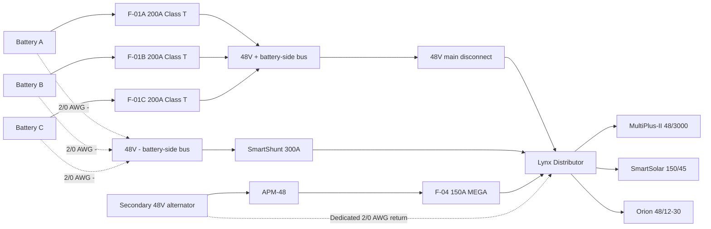
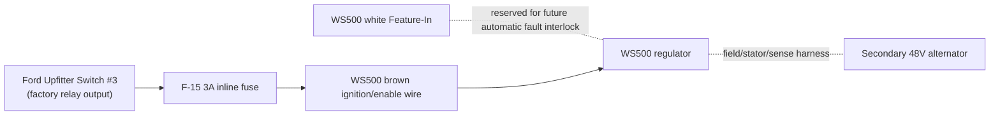

# 48V Electrical Architecture

## Document role
- This file owns the final `48V` electrical architecture for the active build baseline.
- Use it for house-bank structure, alternator-path direction, shutdown logic, and manual control-path intent.
- Keep full conductor schedules, fuse matrices, and layout-level implementation detail in `docs/implementation/`.
- Keep unresolved vendor gates, risk state, and follow-up closure items in `docs/core/TRACKING.md`.
- Keep broad project sequencing and day-to-day execution framing in `docs/core/PROJECT.md` or the active plan docs.

As-of date: `2026-03-20`

Purpose: hold the finalized, concise `48V` house and alternator architecture in one place so wiring, protection, shutdown behavior, and BOM references are easy to understand without re-reading the historical trade studies.

Related docs:
- `docs/implementation/ELECTRICAL_overview_diagram.md`
- `docs/implementation/ELECTRICAL_fuse_schedule.md`
- `docs/core/SYSTEMS.md`
- `docs/core/TRACKING.md`
- `bom/bom_estimated_items.csv`

## Final direction
- House architecture stays `48V` core with `3x 51.2V 100Ah` batteries in parallel.
- Alternator charging is the dedicated `48V` secondary alternator path, not Sterling B2B.
- Protection baseline is `Mechman + WS500 + Balmar APM-48`.
- Manual alternator-charge enable/disable is through Ford `Upfitter Switch #3`.
- `Upfitter #3` is a low-current control signal only. It does not carry alternator output current.
- `WS500` white `Feature-In` is reserved for future fault-interlock work, not required in Phase 1.

## Locked component set
| Function | Locked baseline | BOM row(s) |
| --- | --- | --- |
| House batteries | `3x` Dumfume `51.2V 100Ah` LiFePO4 | `3` |
| Main house disconnect | Victron `275A` battery switch | `5` |
| Main fused distribution | Victron Lynx Distributor `M10` | `6` |
| Battery branch protection | `F-01A/B/C` `200A` Class T (provisional pending final battery limit confirmation) | `7`, `105` |
| Inverter/charger | MultiPlus-II `48/3000/35-50` | `12` |
| 48V to 12V charger | Orion-Tr Smart `48/12-30` | `20` |
| Monitoring | Cerbo GX + SmartShunt `300A` | `22`, `23` |
| Alternator kit | Mechman `48V` secondary alternator kit with `WS500` | `168` |
| Load-dump clamp | Balmar `APM-48` | `169` |
| Alternator branch fuse | `F-04` `150A` MEGA (`58V/80V`) in Lynx Slot 3 | `170` |
| WS500 low-current fuse set | `F-12`, `F-13`, `F-14` | `171` |
| WS500 Upfitter #3 control kit | `F-15` + control wire + holder/terminals | `176` |

## 48V power path

## Alternator control path

### Control logic
- `Upfitter #3 ON`: `WS500` brown wire is energized, regulator is allowed to run, alternator charging can occur.
- `Upfitter #3 OFF`: `WS500` is disabled through the brown wire, regulator field output collapses, and alternator charging stops.
- Use `Upfitter #3` as the manual alternator-charge shutdown control.
- Do not use the main `48V` disconnect as the first alternator shutdown method while the engine is running and the secondary alternator is charging.

### Why `Upfitter #3`
- It is already a factory-switched, relay-driven `12V` control source.
- It keeps the WS500 control in the truck cab without adding a separate aftermarket switch.
- It is suitable for a low-current enable signal, but not for any high-current alternator or battery conductor.
- A local inline fuse is still required because the factory upfitter circuit fuse is much larger than the small-gauge WS500 control wire.

## Fusing and wire baseline
| ID | Function | Locked value | Wire basis |
| --- | --- | --- | --- |
| `F-01A/B/C` | Battery branch positive protection | `200A` Class T provisional | `2/0 AWG` |
| `F-04` | Alternator branch into Lynx Slot 3 | `150A` MEGA (`58V/80V`) | `2/0 AWG` |
| `F-12` | WS500 power lead | `10A` baseline (`15A` if required by alternator case) | harness lead |
| `F-13` | WS500 battery positive sense | `3A` | harness lead |
| `F-14` | WS500 current-sense lead | `5A` where required by selected shunt layout | harness lead |
| `F-15` | Upfitter #3 to WS500 brown ignition wire | `3A` inline ATO/ATC | `16 AWG` TXL/GXL control wire |

### Major conductors
- Battery branch and main `48V` trunk wiring: `2/0 AWG`.
- Secondary alternator positive path (`ALT B+ -> APM-48 -> F-04 -> Lynx`): `2/0 AWG`, `~20 ft` one-way planning basis.
- Secondary alternator dedicated negative return (`ALT B- -> Lynx -`): `2/0 AWG`, `~20 ft` one-way planning basis.
- Orion `48V` feeder and MPPT battery leads: `6 AWG`.
- Upfitter #3 control lead to WS500 brown wire: `16 AWG` TXL/GXL planning basis, `~6 ft` one-way assumed until measured.

## APM-48 wiring intent
- Mount the `APM-48` at the alternator end of the `48V` branch, as close to the alternator output as practical.
- Connect APM red to alternator `B+`.
- Connect APM black to alternator `B-`, or to the approved alternator ground/case point if the alternator is not isolated-ground.
- Do not stack the APM ring terminals under the main battery cable lugs unless the product instructions for the exact unit explicitly allow it.

## Normal operating sequence
1. Main `48V` disconnect closed.
2. `Upfitter #3` switched `ON`.
3. Engine running.
4. `WS500` enabled and regulating.
5. Alternator charges the house bank through `APM-48` and `F-04`.

## Fault and shutdown sequence
If a battery pack trips or an alternator fault is suspected:
1. Switch `Upfitter #3` `OFF` to disable the `WS500`.
2. Wait for alternator charge current to collapse.
3. Open the main `48V` disconnect only after alternator charging is no longer active, if full house shutdown is required.

Reason:
- The regulator should be shut down first.
- The `APM-48` is a protection layer, not the primary shutdown method.

## One-battery-trip behavior
- If one battery BMS disconnects but the other two remain online, the `48V` bus should stay up.
- The system does not immediately become a full-bank load dump event just because one battery disappears.
- The practical effect is that charge and discharge current redistribute to the remaining batteries.
- The real hazard is a cascade where the second and third battery also disconnect under active alternator charge.

## What is still not fully closed
- Final Mechman kit fitment/content confirmation for the exact truck.
- Final `WS500` harness polarity confirmation (`PH` vs `NH`).
- Official vendor confirmation that the documented Dumfume battery/BMS behavior is acceptable with the `WS500`.
- Exact alternator negative/case isolation behavior in the installed Mechman kit.
- Whether future automatic fault-interlock logic should be added on the WS500 `Feature-In` or through an external relay.

## Rule for future edits
- Update this file first for any `48V` architecture, alternator-control, or shutdown-strategy change.
- Keep the implementation files for wiring detail and fuse placement, not for high-level architecture decisions.
