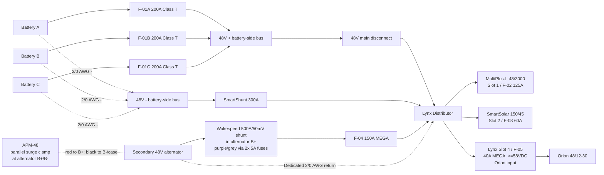
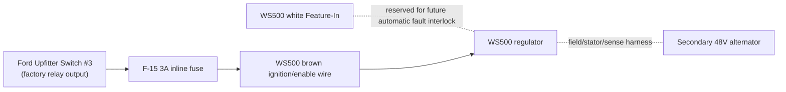

---
aliases:
  - 48V electrical architecture
  - Hiatus 48V baseline
tags:
  - hiatus/core
  - hiatus/electrical
status: active
related:
  - "[[SYSTEMS]]"
  - "[[ELECTRICAL_overview_diagram]]"
  - "[[ELECTRICAL_fuse_schedule]]"
  - "[[ELECTRICAL_Mechman_WS500_APM48_install_guide]]"
  - "[[TRACKING]]"
---

# 48V Electrical Architecture

## Document role
- This file owns the final `48V` electrical architecture for the active build baseline.
- Use it for house-bank structure, alternator-path direction, shutdown logic, and manual control-path intent.
- Keep full conductor schedules, fuse matrices, and layout-level implementation detail in `docs/implementation/`.
- Keep unresolved vendor gates, risk state, and follow-up closure items in `docs/core/TRACKING.md`.
- Keep broad project sequencing and day-to-day execution framing in `docs/core/PROJECT.md` or the active plan docs.

As-of date: `2026-07-19`

Purpose: hold the finalized, concise `48V` house and alternator architecture in one place so wiring, protection, shutdown behavior, and BOM references are easy to understand without re-reading the historical trade studies.

Related docs:
- [Electrical topology diagram](../implementation/ELECTRICAL_overview_diagram.md)
- [Electrical fuse schedule](../implementation/ELECTRICAL_fuse_schedule.md)
- [Mechman / WS500 / APM-48 install guide](../implementation/ELECTRICAL_Mechman_WS500_APM48_install_guide.md)
- [Systems](SYSTEMS.md)
- [Tracking](TRACKING.md)
- [Estimated BOM](../../bom/bom_estimated_items.csv)

## Final direction
- House architecture stays `48V` core with `3x 51.2V 100Ah` batteries in parallel.
- Alternator charging is the dedicated `48V` secondary alternator path; obsolete pre-Mechman charger hardware is removed from active planning.
- Protection baseline is `Mechman + WS500 + Balmar APM-48`.
- Manual alternator-charge enable/disable is through Ford `Upfitter Switch #3`.
- `Upfitter #3` is a low-current control signal only. It does not carry alternator output current.
- `WS500` white `Feature-In` is reserved for future fault-interlock work, not required in Phase 1.

## Current commissioning state (`2026-08-02`)
- `48V` bus has been live-tested: owner measured `55.5V` throughout the system, including at the MultiPlus.
- MultiPlus-II DC/inverter mode has been switched on with inverter light illuminated, slight normal hum, and no reported error lights.
- SmartShunt and Orion-Tr Smart are visible in VictronConnect.
- Cerbo GX access point/remote-console workflow is active; Cerbo power is a small inline fused feed from the `48V` system side and MultiPlus communication is via `VE.Bus` RJ45.
- Shore charging has been tested through the MultiPlus at household-outlet current limits. The first short test proved basic AC-in/charger function; later owner verification redid the settings and confirmed first-battery behavior entered bulk, then quickly transitioned to absorption at/near `100%` as planned.
- MultiPlus LiFePO4 charge-profile programming/verification is treated as closed for the current shore-charger setup. Current target is `56.8V` absorption/charge, `54.0V` float, short absorption dwell, equalization off, conservative LiFePO4 storage behavior, and source-current limit matched to the actual shore circuit. The Dumfume manual's `58.4V +/-0.2V` value is documented, but because the same manual also lists `58.4V` as charge-limit/over-charge protection voltage, it is not the active routine charger target. `DVCC` remains disabled unless a documented BMS/GX control path is added.
- The electrical module is hard-mounted through the finished floor to registered truck-bed hardpoints and is now tied into the hard-mounted Bench/Galley extrusion structure; owner reports the integrated assembly is extremely stiff. The remaining road-restraint work is battery/cooler capture plus terminal/cable protection. The driver-rear shore inlet and cable route are physically installed. One accessible, enclosed, conductor/gauge-rated three-wire `L/N/PE` splice into the AC-input side remains before dead checks and first use.
- All three batteries' `2/0 AWG` branch leads are cut, lugged, heat-shrunk, and landed at the battery-side positive/negative busbars. The three batteries are not yet paralleled: Battery 1 completed the corrected isolated charge cycle, Battery 2 remained in normal upper-`54V` bulk at the overnight `2026-08-02/03` checkpoint, and Battery 3 remains pending before individual rest/record and `<=0.1V` matching.
- Owner reports the Orion now charges the `12V` buffer battery correctly and the `12V` system is operating as intended. Remaining commissioning gates are the shore `L/N/PE` splice plus polarity/PE/neutral-isolation checks, supervised permanent-path shore proof, individual charge/rest/`<=0.1V` matching and parallel-bank closeout, AC-out branch/GFCI commissioning, secondary-alternator commissioning, final Cerbo mounting, and board strain-relief/abrasion-control.

## Locked component set
| Function | Locked baseline | BOM row(s) |
| --- | --- | --- |
| House batteries | `3x` Dumfume `51.2V 100Ah` LiFePO4 | `3` |
| Main house disconnect | Victron `275A` battery switch | `5` |
| Main fused distribution | Victron Lynx Distributor `M10` | `6` |
| Battery branch protection | `F-01A/B/C` `200A` Class T; manual-backed battery limit is `200A` max continuous discharge per battery, with terminal/manufacturer fuse guidance still not separately specified; owner confirmed `3` holders and `4` slow-blow Class T fuses total | `7` |
| Inverter/charger | MultiPlus-II `48/3000/35-50` | `12` |
| 48V to 12V charger | Orion-Tr Smart `48/12-30`; fed directly from Lynx Slot 4 through one verified `40A` MEGA (`58VDC` minimum under the locked `56.8V` charge ceiling; Victron `CIP138040020 40A/80V` is the replacement fallback) into the existing `6 AWG` input pair; no separate inline/DIN input fuse; keep `6 AWG` and `F-07 60A/80V` on 12V output | `20`, `10`, `11` |
| Monitoring | Cerbo GX + SmartShunt `300A` | `22`, `23` |
| Alternator kit | Mechman `48V` secondary alternator kit with `WS500` | `168` |
| Load-dump clamp | Balmar `APM-48` | `169` |
| Alternator branch fuse | `F-04` `150A` MEGA (`58V/80V`) in Lynx Slot 3 | `170` |
| WS500 `PH-VAN` and alternator-shunt sense protection | One `15A` bank-voltage-rated fuse/holder on the short red combined regulator-power/positive-sense lead, plus two separate bank-voltage-rated `5A` fuse/holders on purple/grey at the positive alternator shunt | `171`, `351` |
| WS500 Upfitter #3 control kit | `F-15` + control wire + holder/terminals | `176` |

## Battery manual limits and charger-programming baseline
- Battery model basis: Dumfume `51.2V 100Ah` LiFePO4, `3x` in parallel (`1S3P`; manual allows up to `1S4P`).
- Per-battery charge voltage: `58.4V +/-0.2V`; charge-limit/over-charge protection voltage also listed as `58.4V`.
- Per-battery current references: recommended charge `20A`; max continuous charge `100A`; recommended discharge `50A`; max continuous discharge `200A`.
- Bank-level reference for current `3x` setup: recommended charge `60A`; max continuous charge `300A`; recommended discharge `150A`; max continuous discharge `600A`.
- Protection thresholds: over-discharge protection `36.8V`, recovery `43.2V`; discharge overcurrent protection `600A`; short-circuit protection `1800A`.
- Temperature thresholds: low-temp charge protection approx `41F-50F` with recovery at `50F`; high-temp protection listed as `157F`/`140F`.
- MultiPlus-II charger limit is `35A`, so full-output charging is below the bank's `60A` recommended-charge reference (`~11.7A` per battery in `3P`). For first household-outlet tests, keep AC input current at `10A`, then `12A` max on a normal `15A` source. Current charger-programming target is `56.8V` absorption/charge, `54.0V` float, `52.8V` storage if shown, `0.5h` max absorption, equalization off, and temperature compensation off.

## 48V power path

```mermaid
flowchart LR
    BATA["Battery A"] --> F01A["F-01A 200A Class T"]
    BATB["Battery B"] --> F01B["F-01B 200A Class T"]
    BATC["Battery C"] --> F01C["F-01C 200A Class T"]

    F01A --> POSBUS["48V + battery-side bus"]
    F01B --> POSBUS
    F01C --> POSBUS
    POSBUS --> DISC["48V main disconnect"]
    DISC --> LYNX["Lynx Distributor"]

    BATA -. "2/0 AWG -" .-> NEGBUS["48V - battery-side bus"]
    BATB -. "2/0 AWG -" .-> NEGBUS
    BATC -. "2/0 AWG -" .-> NEGBUS
    NEGBUS --> SHUNT["SmartShunt 300A"]
    SHUNT --> LYNX

    ALT48["Secondary 48V alternator"] --> WSSHUNT["Wakespeed 500A/50mV shunt\nin alternator B+\npurple/grey via 2x 5A fuses"]
    WSSHUNT --> F04["F-04 150A MEGA"]
    F04 --> LYNX
    APM48["APM-48\nparallel surge clamp\nat alternator B+/B-"] -. "red to B+; black to B-/case" .- ALT48
    ALT48 -. "Dedicated 2/0 AWG return" .-> LYNX

    LYNX --> MULTI["MultiPlus-II 48/3000\nSlot 1 / F-02 125A"]
    LYNX --> MPPT["SmartSolar 150/45\nSlot 2 / F-03 60A"]
    LYNX --> F05["Lynx Slot 4 / F-05\n40A MEGA, >=58VDC\nOrion input"]
    F05 --> ORION["Orion 48/12-30"]
```

## Alternator control path

```mermaid
flowchart LR
    UP3["Ford Upfitter Switch #3\n(factory relay output)"] --> F15["F-15 3A inline fuse"]
    F15 --> BROWN["WS500 brown ignition/enable wire"]
    WHITE["WS500 white Feature-In"] -. "reserved for future automatic fault interlock" .- WS500["WS500 regulator"]
    BROWN --> WS500
    WS500 -. "field/stator/sense harness" .- ALT48["Secondary 48V alternator"]
```

### Control logic
- `Upfitter #3 ON`: `WS500` brown wire is energized, regulator is allowed to run, alternator charging can occur.
- `Upfitter #3 OFF`: `WS500` is disabled through the brown wire, regulator field output collapses, and alternator charging stops.
- Use `Upfitter #3` as the manual alternator-charge shutdown control.
- Do not use the main `48V` disconnect as the first alternator shutdown method while the engine is running and the secondary alternator is charging.

### Why `Upfitter #3`
- It is already a factory-switched, relay-driven `12V` control source.
- It keeps the WS500 control in the truck cab without adding a separate aftermarket switch.
- It is suitable for a low-current enable signal, but not for any high-current alternator or battery conductor.
- A local inline fuse is still required because the factory upfitter circuit fuse is much larger than the small-gauge WS500 control wire.

## Fusing and wire baseline
| ID | Function | Locked value | Wire basis |
| --- | --- | --- | --- |
| `F-01A/B/C` | Battery branch positive protection | `200A` Class T provisional | `2/0 AWG` |
| `F-04` | Alternator branch into Lynx Slot 3 | `150A` MEGA (`58V/80V`) | `2/0 AWG` |
| `F-05` | Lynx Slot 4 -> Orion `48V` input | MEGA `40A`, body-marked `>=58VDC`; Victron `CIP138040020 40A/80V` replacement fallback | Existing `6 AWG` direct to Orion; single input fuse |
| `F-06` | Retired standalone Orion input fuse position | Not installed | MIDI/FKS/DIN concepts superseded; do not stack with `F-05` |
| `F-12/F-13-PHVAN` | WS500 `PH-VAN` combined regulator-power / positive-voltage-sense red lead | One `15A` fuse/holder rated above the `48V` bank maximum; former separate `3A` position is not installed | short harness lead at house/main positive bus; do not extend |
| `CERBO-PWR` | Cerbo GX low-current power feed | `1A-3A` inline fuse/holder rated for the `48V` bank maximum; system/load side of main disconnect preferred for bench shutdown | `18 AWG` red/black duplex acceptable |
| `WS500-CS-H/L` | Purple/grey current-sense high/low to positive-branch Wakespeed shunt | Separate `5A` fuse in each lead, each holder/fuse rated above bank maximum; mount immediately at shunt | harness leads; twist pair after protection and route away from noise |
| `F-15` | Upfitter #3 to WS500 brown ignition wire | `3A` inline ATO/ATC on 12V control circuit | `16 AWG` TXL/GXL control wire |

### Major conductors
- Battery branch and main `48V` trunk wiring: `2/0 AWG`.
- Parallel battery-current sharing target is similar **total loop resistance** per battery path, not equal positive-only length. The current bench layout may use short/medium/long positive leads balanced by long/medium/short negative leads; do not add unnecessary cable coils solely to make positive leads identical.
- Secondary alternator positive path (`ALT B+ -> long 2/0 -> separate Wakespeed 500A/50mV alternator shunt -> short 2/0 jumper -> F-04 -> Lynx`): `2/0 AWG`, `~20 ft` one-way planning basis. Purple/current-sense-high lands on the alternator side of the positive shunt; grey/current-sense-low lands on the Lynx side; each lead gets its own bank-voltage-rated `5A` fuse immediately at the shunt. Configure the WS500 for `Shunt at Alternator`; the Victron SmartShunt remains the separate battery/SOC shunt. The `APM-48` is wired in parallel across alternator `B+` and `B-`/case; it is not in series with this conductor.
- Secondary alternator dedicated negative return (`ALT B- -> Lynx -`): `2/0 AWG`, `~20 ft` one-way planning basis.
- Orion `48V` feeder: existing `6 AWG` remains as the no-rework path from Lynx Slot 4 and is protected by `F-05 40A` MEGA (`>=58VDC`); it is electrically overkill, and flexible fine-strand `10 AWG` would be adequate if ever replaced for unrelated reasons. MPPT battery leads and Orion `12V` output remain `6 AWG`.
- Upfitter #3 control lead to WS500 brown wire: `16 AWG` TXL/GXL planning basis, `~6 ft` one-way assumed until measured.

### Grounding and bonding separation
- **AC protective earth:** the MultiPlus external `M6 PE` lug is mandatory in this mobile installation. Bond it with at least the Victron-manual `4 mm²` conductor; current build default is `10 AWG` green stranded copper to a verified truck-chassis bond point. Do not use the aluminum camper shell or 80/20 as the only protective-earth conductor.
- **Exposed aluminum shell:** add a separate corrosion-compatible bonding jumper from the Hiatus shell to the chassis/equipment-ground network and verify low-resistance continuity. Mechanical shell/bed mounting contact is not accepted as proof of a durable bond.
- **AC neutral:** do not add a fixed neutral-ground bond downstream. The MultiPlus internal ground relay remains enabled: AC-out neutral bonds to chassis in inverter mode and that bond opens when external AC is accepted.
- **DC negatives:** do not jumper MultiPlus PE/case to Lynx negative or the `12V` negative bus. Keep normal `48V`/`12V` current on dedicated returns. The Mechman branch still uses dedicated `2/0` negative to the Lynx/load side of the SmartShunt; physically confirm isolated-ground versus case-ground behavior before commissioning. If the alternator is case-grounded, treat that as the likely deliberate house-negative/chassis reference and verify there is no second path that bypasses the SmartShunt.

## APM-48 wiring intent
- Mount the `APM-48` at the alternator end of the `48V` branch, as close to the alternator output/ground points as practical.
- Treat the APM-48 as a parallel surge/load-dump clamp across the alternator, not a series device in the alternator charge-current path.
- Connect APM red to alternator `B+`.
- Connect APM black to alternator `B-`, or to the approved alternator ground/case point if the alternator is not isolated-ground.
- Do **not** place either APM connector under the main battery cable lugs; Balmar's quick-start sheet explicitly prohibits placing APM connectors under the battery cable lugs.

## Normal operating sequence
1. Main `48V` disconnect closed.
2. `Upfitter #3` switched `ON`.
3. Engine running.
4. `WS500` enabled and regulating.
5. Alternator charges the house bank through `APM-48` and `F-04`.

## Fault and shutdown sequence
If a battery pack trips or an alternator fault is suspected:
1. Switch `Upfitter #3` `OFF` to disable the `WS500`.
2. Wait for alternator charge current to collapse.
3. Open the main `48V` disconnect only after alternator charging is no longer active, if full house shutdown is required.

Reason:
- The regulator should be shut down first.
- The `APM-48` is a protection layer, not the primary shutdown method.

## One-battery-trip behavior
- If one battery BMS disconnects but the other two remain online, the `48V` bus should stay up.
- The system does not immediately become a full-bank load dump event just because one battery disappears.
- The practical effect is that charge and discharge current redistribute to the remaining batteries.
- The real hazard is a cascade where the second and third battery also disconnect under active alternator charge.

## What is still not fully closed
- Physical inventory/procurement confirmation for `F-04` `150A` high-voltage MEGA stock, the one `15A` `PH-VAN` red-lead fuse/holder, and the `F-15` `3A` Upfitter-control hardware.
- Exact Mechman field-voltage/WS500 derate setting and alternator negative/case-isolation behavior in the installed kit.
- Official vendor confirmation that the documented Dumfume battery/BMS behavior is acceptable with the `WS500`.
- Whether future automatic fault-interlock logic should be added on the WS500 `Feature-In` or through an external relay.

## Rule for future edits
- Update this file first for any `48V` architecture, alternator-control, or shutdown-strategy change.
- Keep the implementation files for wiring detail and fuse placement, not for high-level architecture decisions.
