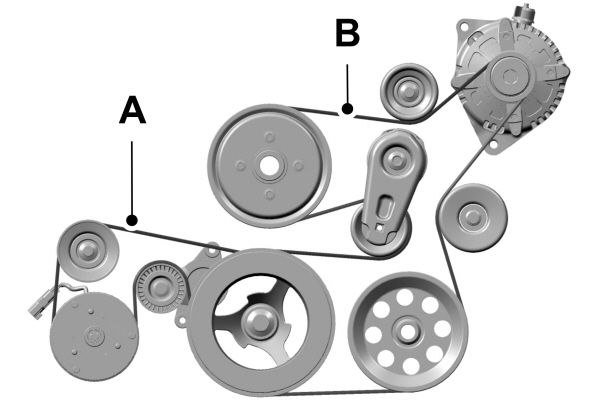

---
aliases:
  - Mechman WS500 APM48 install guide
  - 48V alternator install guide
  - alternator commissioning guide
tags:
  - hiatus/implementation
  - hiatus/electrical
  - hiatus/alternator
status: active
related:
  - "[[ELECTRICAL_48V_ARCHITECTURE]]"
  - "[[ELECTRICAL_overview_diagram]]"
  - "[[ELECTRICAL_fuse_schedule]]"
  - "[[OPERATIONS]]"
---

# Mechman `48V` Alternator + WS500 + APM-48 Install Guide

As-of date: `2026-07-27`

Purpose: one shop-reference document for installing and commissioning the Hiatus dedicated `48V` secondary alternator path: Mechman `48V` alternator/bracket, Wakespeed `WS500`, Balmar `APM-48`, Ford Upfitter `#3` enable, and the existing `48V` house bank/Lynx architecture.

This is an implementation guide, not a substitute for the official manuals. Use the official PDFs for diagrams, connector pinouts, belt routing images, torque values, and firmware/app screens. This guide owns the build-specific sequence, gates, and no-go rules.

## Current build baseline

- Truck: `2021` Ford F-350 `7.3L` gas / Godzilla platform.
- Alternator path: dedicated `48V` secondary alternator, regulated by Wakespeed `WS500`.
- Protection layer: Balmar `APM-48` at the alternator.
- House bank: `3x` Dumfume `51.2V 100Ah` LiFePO4 in parallel (`1S3P`), internal BMS, no confirmed CAN/closed-loop Wakespeed integration.
- House distribution: Victron Lynx Distributor, SmartShunt, MultiPlus-II `48/3000/35-50`, Orion-Tr Smart `48/12-30`.
- Manual charge enable: Ford `Upfitter Switch #3 -> F-15 3A inline fuse -> WS500 brown ignition/enable wire`.
- Main alternator branch: `2/0 AWG` positive and dedicated `2/0 AWG` negative return, `F-04 150A MEGA` at Lynx Slot 3 / house-bank end.

## Current physical/staged-driving status

Owner update, `2026-06-11`: the alternator noise was traced to the Mechman-supplied idler pulley not being seated properly. After tightening/seating the idler, the noise went away. Mechman also confirmed that the truck can be driven with the `48V` alternator mechanically installed and unwired/electrically disabled.

Practical staged-install status:

1. **Mechanical-only staged driving is acceptable for this build after the belt/idler/noise check passes, but it is still a disabled alternator, not a commissioned charging system.**
2. The alternator must remain electrically inert while unwired:
   - WS500 not enabled;
   - field/regulator connector disconnected or capped/isolated;
   - alternator `B+` booted/capped and not connected to an unterminated live cable;
   - all studs/cable ends insulated and strain-relieved;
   - no partial wiring can accidentally energize the field.
3. Do **not** drive with the alternator capable of producing power into an unfused, unterminated, partially wired, or disconnected house-bank path.
4. Do **not** energize the WS500 / field circuit until main charge cable, dedicated negative return, APM-48, fusing, sense wiring, shunt/current sense, temperature sensing, and WS500 profile are installed and checked.
5. If belt/idler noise returns, treat it as a mechanical belt/pulley seating issue first: stop, inspect alignment/tension/hardware, then re-test at idle before road use.

Staged approach:

- Stage 1: bracket/alternator/belt installed; alternator electrically inert; idler seated; belt/noise check passed; road driving OK in this disabled state.
- Stage 2: install/route large cables, APM, and rough-in WS500 wiring, but keep WS500 disabled until termination/protection is complete.
- Stage 3: wire/configure WS500 with Upfitter `#3` OFF; verify app/profile/sensors before first enable.
- Stage 4: first charging run with meters and a planned shutdown path.

## Hard no-go rules

- Do not allow the `48V` alternator to charge without a properly configured WS500.
- Do not open the `48V` battery/main disconnect while the engine is running and the alternator is charging.
- Do not use the main `48V` disconnect as the normal alternator shutdown method.
- Do not rely on the APM-48 as the primary shutdown method. It is a surge clamp / backup protection layer.
- Do not connect the alternator positive cable without source-side protection at the house-bank/Lynx end.
- Do not rely on chassis/sheet-metal/factory grounds as the normal `48V` alternator return path.
- Do not bury the WS500, APM, fuses, or sense/shunt wiring where inspection is impossible.
- Do not intentionally provoke a battery BMS disconnect while the alternator is producing current.
- Do not assume Victron SmartShunt/Cerbo DVCC is a cell-level BMS or a replacement for Wakespeed/BMS communication.

## Source documents reviewed

### Local repo references

- `references/Mechman General 48v install INSTR-48V-GEN_3-28-2025.pdf`
- `references/Mechman 48v Alt Install Guide INSTR-48V-GEN_3-28-2025.pdf` — duplicate of the general `48V` install guide.
- `references/Mechman dual alternator bracket INSTR-GZDB-20.pdf`
- `media/references/mechman-ws500-apm48-install-guide/7.3l-single-generator-belt-routing-owner-confirmed-2026-06-08.jpg` — owner-confirmed `7.3L` single-generator belt-routing orientation reference.
- `references/WS500-Product-Manual-09-30-2022-V2.pdf`
- `references/WS500-Quick-Start-Guide-09-30-2022-V3.pdf`
- `references/Alternator Protection Module PDS-APM-24.pdf` — official Balmar APM quick-start PDF, despite filename; applies by module voltage class.
- `references/Dunfume_36V_48V_100Ah_Battery_-_User_Manual.pdf`

### Online source URLs checked in this pass

- Mechman `48V` Alternator Installation Instructions: `https://www.mechman.com/instructions/48v-alternator-installation-instructions/`
- Mechman `INSTR-48V GEN_3-28-2025` PDF: `https://mechman.com/content/instructional-pdfs/INSTR-48V%20GEN_3-28-2025.pdf`
- Mechman `48-Volt Warning`: `https://www.mechman.com/instructions/48volt-warning/`
- Mechman `INSTR-48V-WARN_3-28-2025` PDF: `https://mechman.com/content/instructional-pdfs/INSTR-48V-WARN_3-28-2025.pdf`
- Mechman `7.3L Godzilla Dual Alternator Bracket` instructions: `https://www.mechman.com/instructions/73l-godzilla-dual-alternator-bracket-assembly-instruction-manual/`
- Mechman `INSTR-GZDB-20` PDF: `https://mechman.com/content/instructional-pdfs/INSTR-GZDB-20.pdf`
- Wakespeed `WS500` product page: `https://www.wakespeed.com/product/ws500-advanced-alternator-regulator/`
- Wakespeed `WS500` Product Manual `10.21.24`: `https://www.wakespeed.com/wp-content/uploads/WS500-Product-Manual-10.21.24-compressed.pdf`
- Wakespeed Communications and Configuration Guide `v2.6.1`: `https://www.wakespeed.com/wp-content/uploads/Wakespeed-Communications-and-Configuration-Guide-v2.6.1-1.pdf`
- Wakespeed `WS500` Data Sheet `9-26-22`: `https://www.wakespeed.com/wp-content/uploads/Wakespeed-WS500-Data-Sheet-9-26-22.pdf`
- Wakespeed Victron Cerbo GX Guide `4.29.24`: `https://www.wakespeed.com/wp-content/uploads/Wakespeed-Victron-Cerbo-GX-Guide_4.29.24-1.pdf`
- Balmar APM-48 product page: `https://balmar.net/product/apm-48/`
- Balmar Alternator Protection Modules page: `https://balmar.net/alternator-protection-modules/`
- Balmar APM quick-start / product sheet: `https://balmar.net/wp-content/uploads/2022/09/PDS-APM-24.pdf`

## What the official docs say that matters

### Mechman `48V` general install guide

- Use pure copper cable.
- Aim to limit voltage drop to `2%` between alternator and battery bank.
- General cable chart:
  - up to `100A`, `5 ft` one-way: `6 AWG`;
  - up to `150A`, `10 ft` one-way: `4 AWG`;
  - up to `200A`, `15 ft` one-way: `2 AWG`;
  - up to `250A`, `20 ft` one-way: `1/0 AWG`.
- Verify sizing separately for runs longer than `20 ft` or systems over `250A`.
- Fuse the positive charge cable within `12 in` of the battery-bank connection.
- Ground cable must be equal to or larger than the positive cable and must connect directly from alternator to battery bank.
- Avoid sheet metal/factory grounds for the `48V` alternator return path.
- Do not operate the system without a properly configured regulator.
- Fully charge the `48V` batteries with a compatible charger before first startup.
- First-start check: start vehicle, apply modest load, raise RPM to `2500`, verify bank voltage rises at least `1V`, and verify charge and ground path voltage drop each show `<0.1V` under load.

### Mechman `7.3L` Godzilla bracket guide

- Kit contents include:
  - dual alternator bracket for Ford `7.3L`;
  - `7.3L` step washer;
  - smooth idler pulley;
  - `88.06 in` serpentine belt;
  - M10/M8 flanged hardware.
- Mechanical sequence:
  1. Attach bracket to engine with `4x M10-1.5 x 90mm` flanged bolts.
  2. Install idler pulley with step washer and `M8-1.25 x 35mm` flanged bolt.
  3. Install OEM-compatible saddle-mount alternator with `M10-1.5 x 90mm` and `M10-1.5 x 40mm` bolts.
  4. Install second OEM-compatible T-mount alternator with `3x M10-1.5 x 80mm` bolts.
  5. Install the supplied `88.06 in` serpentine belt per the Mechman diagram.
- The guide text extraction does not include torque values. Use Ford/Mechman service data for torque, not guesses.

Owner-confirmed single-generator routing orientation, `2026-06-08`:

- On the truck's `7.3L` single-generator belt layout, label `A` in the saved reference image is the belt span **closest to the engine**.
- Label `B` is the belt span **furthest from the engine**.
- Use this as an orientation aid while still following the official Mechman/Ford routing and torque instructions for the actual install state.

### Wakespeed WS500 wiring/control facts

- Brown ignition/enable wire must see at least `8.5VDC` to turn the WS500 on.
- Brown can be fed from ignition, oil-pressure switch, or another circuit active only when engine is running.
- In this build, brown is fed by Ford `Upfitter #3` through `F-15 3A`.
- White Feature-In is configurable; in LiFePO4/CPE use it can force float or be assigned to other behavior. Do not assign it casually.
- Red alternator positive / regulator power wire: fuse at `10A`, or `15A` for extra-large-case alternator.
- Red/yellow positive battery voltage-sense wire: fuse at `3A`.
- Black/yellow negative sense wire: connect to negative of the bank being charged.
- Purple/grey shunt-current-sense pair: default `500A/50mV`; purple high side closest to charging source, grey low side closest to system ground.
- Alternator temp sensor mounts to rear case bolt or alternator ground-terminal bolt.
- Battery temp sensor is important on LiFePO4 because charging must stop outside battery temperature limits.
- Power and voltage-sense wires must be fused and must be placed so the regulator does not lose the battery reference while the alternator is still operating.
- Wakespeed notes that the positive battery switch shown in its wiring diagrams must be ON whenever engine is running.

### Wakespeed `48V` / high-energy cautions

- Wakespeed treats `48V` lithium alternator systems as high-energy systems where uncontrolled disconnect/load-dump can create destructive voltage spikes.
- Wakespeed documentation describes `48V` load-dump spikes upward of `400V` if the battery/contactors/FETs disconnect before the alternator can be shut down.
- Alternators may need hundreds of milliseconds to shut down; Wakespeed guidance discusses needing advance notice before disconnect, with `2 seconds` as a practical warning target in their high-energy discussion.
- CAN/BMS integration is materially safer than a simple charge-enable wire because it can communicate limits and fault state before disconnect.
- DVCC/Cerbo monitoring is not a replacement for true WS500/BMS safety communication.
- The Dumfume bank has internal BMSs and no confirmed CAN integration, so treat BMS disconnect as an emergency backstop, not a normal charge-control event.

### Balmar APM-48 facts

- APM-48 is a surge/load-dump protection module for `48V` alternator systems.
- Install at the alternator, across alternator output/ground points:
  - red APM ring terminal to alternator `B+` post;
  - black APM lead to alternator `B-` if isolated ground, or clean alternator case mounting bolt if case ground.
- Secure the APM case to a battery cable with zip ties.
- Do **not** place either APM connector under the battery cable lugs.
- Green LED means protecting.
- Red LED and/or beep/chirp means protection failure; replace APM.
- If alternator cable nuts loosen, the APM cannot protect the alternator.
- No surge protection device can protect against unlimited surge amplitude, power, or duration.

## System map for this build

### High-current path

1. Alternator `B+` output stud.
2. `2/0 AWG` positive charge cable routed to house electrical board.
3. `F-04 150A MEGA` in Lynx Slot 3 near the house-bank/Lynx end.
4. Lynx positive bus.
5. Battery bank through main disconnect/battery-side protection.

The APM-48 is **not** a series device in that path. It is a parallel surge clamp installed at the alternator between `B+` and `B-`/case ground.

### Return path

1. Alternator `B-` / approved negative terminal / approved ground point.
2. Dedicated `2/0 AWG` negative return cable.
3. Lynx negative bus / house negative return path.
4. SmartShunt / battery negative bus according to the active architecture.

Do not use chassis-only return for the `48V` alternator branch.

### Regulator/control path

1. Ford `Upfitter #3` factory switched `12V` output.
2. `F-15 3A` inline fuse close to the upfitter/control-wire source.
3. `16 AWG` TXL/GXL control lead to WS500 brown ignition/enable wire.
4. Upfitter `#3 ON` allows WS500 to run; Upfitter `#3 OFF` disables WS500 field control.

### WS500 `PH-VAN` sense/protection path

- The confirmed `PH-VAN` harness joins regulator power and positive voltage sense on one short red lead at the house/main positive bus; do not extend it.
- Protect that red lead with one `15A` fuse/holder rated above the `48V` bank maximum (`F-12/F-13-PHVAN`, active BOM row `171`). The former separate `3A F-13` concept in inactive row `320` is not installed on this harness.
- Purple/grey current-sense pair runs to the Wakespeed analog shunt/current-sense point without another inline fuse.
- Alternator and battery temperature sensors are installed before first charging run.

## Installation phases

### Phase 0 — preflight and documentation at the bench

Before opening the truck:

- Print or save locally:
  - Mechman `INSTR-GZDB-20` bracket PDF for belt routing image;
  - Mechman `INSTR-48V GEN_3-28-2025`;
  - Mechman `48V` warning sheet;
  - Wakespeed WS500 current product manual;
  - Wakespeed communications/configuration guide;
  - Balmar APM quick-start sheet.
- Photograph the current belt path and engine-bay state before disassembly.
- Confirm Mechman alternator terminals/labels:
  - `B+` output;
  - `B-` / negative / case-ground behavior;
  - field terminal/harness plug;
  - stator/tach terminal if used;
  - temp sensor mounting point.
- Confirm WS500 harness type matches alternator field polarity:
  - `WS500-PH` for positive/B-type field;
  - `WS500-NH` for negative/A-type field.
- Confirm whether Mechman's supplied alternator field is `12V` or true `48V`. Many `48V` alternators use a `12V` field; Wakespeed has derate guidance for this. Do not guess.
- Confirm all required fuses/holders are present and voltage-rated for the circuit they are on.
- Confirm the batteries are above low-temp charge cutoff and not in any BMS protection state.

No-go if these are unknown:

- field polarity / harness type;
- alternator ground style;
- whether a terminal is `B+`, `B-`, field, or stator;
- WS500 profile/configuration basis;
- battery temperature state.

### Phase 1 — mechanical bracket/alternator install

Official Mechman order:

1. Engine cool; ignition OFF.
2. Disconnect negative terminals of all batteries involved in the work area.
3. Install dual alternator bracket with `4x M10-1.5 x 90mm` bolts.
4. Install smooth idler pulley with step washer and `M8-1.25 x 35mm` bolt.
5. Install saddle-mount alternator with `M10-1.5 x 90mm` and `M10-1.5 x 40mm` bolts.
6. Install T-mount alternator with `3x M10-1.5 x 80mm` bolts.
7. Install `88.06 in` belt using Mechman belt-routing diagram.
8. Check pulley alignment, belt tension, clearance, and no-contact zones.
9. Torque hardware to OEM/bracket specs.

Build-specific mechanical checks:

- Rotate/check belt path visually before starting.
- Confirm no harness, coolant line, AC line, or loom touches belt/pulley/fan path.
- Confirm alternator output stud cannot touch bracket/hood/pipework even under vibration.
- Confirm APM and wiring can be added without removing the alternator again, if possible.

If stopping here and driving before wiring:

- leave the alternator electrically inert;
- cap/cover output and field terminals;
- verify no harness can energize field;
- idle-check before road driving;
- recheck belt alignment/noise after the first short drive.

### Phase 2 — APM-48 and high-current cable routing

Install the APM at the alternator before any live charging use.

APM steps:

1. Identify alternator `B+` and `B-` / case-ground point.
2. Connect APM red ring to alternator `B+` post.
3. Connect APM black:
   - to alternator `B-` post if isolated-ground;
   - to clean alternator case mounting bolt if case-ground.
4. Do **not** place APM terminals under main battery cable lugs.
5. Secure APM case to nearby battery cable with zip ties, away from belt/heat/abrasion.
6. Verify APM green LED when system is live; red/chirp means replace.

High-current cable routing:

- Positive: alternator `B+` to Lynx Slot 3 / `F-04 150A MEGA` at house-bank end.
- Negative: alternator `B-`/approved ground to Lynx negative bus with dedicated `2/0 AWG` return.
- Protect both cables from chafe, heat, steering/suspension movement, hood/engine movement, and sharp pass-throughs.
- Use grommets/bulkheads/loom/P-clamps/J-clamps where conductors pass through sheet metal or near edges.
- Keep unfused positive exposure as short as practical. Mechman says fuse within `12 in` of battery-bank connection; in this build that protection is the house-end `F-04` branch fuse.
- Do not leave a long alternator positive cable connected at one end and floating/unterminated at the other.

Field routing card, owner-confirmed route `2026-06-17`:

- Preferred physical route: alternator area -> fixed frame path under truck -> up at front of bed -> existing/front-bed-wall grommet -> electrical panel area.
- Route the two `2/0 AWG` cables first because they dictate bend radius and support points; keep `B+` and dedicated `B-` together on the same protected route.
- Protect the `2/0` with split loom, abrasion sleeve, rubber hose chafe guards, or equivalent wherever it contacts/approaches frame edges, brackets, pass-throughs, or zip-tie support points.
- Add strain relief before and after the bed-wall grommet; do not let cable movement saw against the pass-through. Use a gentle bend and a subtle drip loop outside the grommet if water can track along the cable.
- Use rubber-lined P-clamps/Adel clamps on existing bolts/holes where cleanly available. Heavy UV/heat-rated zip ties are acceptable as support on fixed frame structure if paired with chafe protection, but do not tie to brake lines, fuel lines, factory harnesses, steering, suspension, driveshaft-adjacent parts, or anything that moves.
- Zip-tie spacing target: about `12-18 in` on straight runs, closer near bends, transitions, and bed entry. Do not cinch so tightly that the tie bites into insulation.
- Keep the already-loomed WS500 harness near the route but not tightly lashed to the `2/0` where avoidable. Focus extra protection on the large unfused/charge conductors and pass-throughs.

Voltage-drop target:

- Mechman target: `2%` alternator-to-bank voltage drop.
- Existing build lock: use on-hand `2/0 AWG` for the assumed `~20 ft` one-way positive and dedicated negative return, giving strong margin for the `150A` branch.
- First-run measured target from Mechman: charge path and ground path each `<0.1V` drop under load.

### Rough-in bundle to run while the alternator chase is open

Preferred WS500 placement for this build: mount the WS500 near the house electrical board / truck-bed battery and shunt area, not deep in the engine bay. This keeps the analog shunt-current and battery-sense wiring short and serviceable. Run the alternator-leg wiring forward to the Mechman unit.

Owner-confirmed harness finding, `2026-06-17`: the supplied Wakespeed harness is the `PH-VAN` style harness, not the older/basic harness assumed by some diagrams. Practical implications:

- The VAN harness has a single short red/black pair. Treat these as the combined WS500 regulator power and battery voltage-sense pair; land them at the house/main bus area near the WS500 with appropriate small fusing. Do **not** try to run those short red/black leads to the alternator.
- The VAN harness has no orange lamp/feature-out wire; absence of orange is normal.
- The short yellow/green connector is the CAN high/low connector. With the current Dumfume internal-BMS/no-confirmed-CAN setup, label/protect it as unused and do not connect it to alternator, battery, field, stator, or ground.
- The blue/yellow alternator connector uses the provided Mechman one-wire adapter: blue passes through as the field-control wire; yellow is the generic stator/AC/tach sense lead and is unused/dead-ended with this adapter unless Mechman/Wakespeed explicitly require a stator/tach signal.

Run these as separate, labeled, protected looms rather than one messy bundle:

1. **High-current charge pair**
   - `2/0 AWG` positive from alternator `B+` to Lynx Slot 3 / `F-04 150A` at the house end.
   - `2/0 AWG` dedicated negative return from alternator `B-` / approved case-ground point to Lynx negative / house return.
   - Keep these physically protected from heat, chafe, steering/suspension movement, and sharp pass-throughs.

2. **WS500 alternator leg: engine bay ↔ WS500**
   - Blue field lead to the alternator field terminal through the provided Mechman one-wire adapter.
   - Yellow stator/AC/tach lead is present in the blue/yellow connector but unused/dead-ended by the supplied adapter unless Mechman/Wakespeed explicitly require a stator/tach signal.
   - The `PH-VAN` harness red/black pair does **not** run forward to the alternator in this build; keep it local at the WS500/house bus area as the combined regulator power and voltage-sense pair.

3. **Alternator temperature sensor**
   - Mount at the alternator rear case bolt or ground-terminal bolt.
   - If extended, keep at least `4 in` from noise sources and use shielded instrument cable where practical, shield grounded at one end only.

4. **WS500 battery/shunt/control leg: local near house bank**
   - `PH-VAN` red combined regulator power / positive voltage sense through the appropriate small fuse to the charged house/main positive bus.
   - `PH-VAN` black combined regulator negative / negative voltage sense to the matching house/main negative bus.
   - Purple/grey current-sense high/low to the Wakespeed shunt or selected current-sense point; use twisted pair / instrument cable and keep routing quiet. Wakespeed allows the regulator shunt on either the positive or negative alternator line; choose one only, place it in the dedicated alternator branch near the electrical board, connect purple to the high/source side and grey to the low/system-ground side per the Wakespeed diagram, then verify current sign in the WS500 app before trusting readings.
   - Battery temperature sensor at/near the house battery bank if used by the final profile.
   - Yellow/green CAN connector labeled/protected as unused unless a compatible CAN/BMS integration is later added.

5. **Cab/control leg**
   - Brown ignition/enable from Ford `Upfitter #3` through `F-15 3A` to the WS500.
   - White Feature-In is reserved for future charge-disable / force-float interlock work; rough in a spare control conductor if the chase is open, but do not depend on it for Phase 1.
   - Orange lamp/alarm is optional; run only if a dash warning lamp/audible alarm is wanted.

### Phase 3 — WS500 harness and control wiring

WS500 must be mounted, wired, and configured before charging is allowed.

Minimum required WS500 connections for this build with the confirmed `PH-VAN` harness:

- brown ignition/enable to Ford `Upfitter #3` through `F-15 3A`;
- `PH-VAN` red combined regulator power / positive voltage sense through the appropriate small fuse at the house/main positive bus;
- `PH-VAN` black combined regulator negative / negative voltage sense at the matching house/main negative bus;
- blue field lead through the provided Mechman one-wire adapter;
- yellow stator/tach lead remains unused/dead-ended unless Mechman/Wakespeed explicitly require it;
- purple/grey current-sense pair to Wakespeed shunt/current-sense point;
- alternator temperature sensor;
- battery temperature sensor if used by profile/config;
- yellow/green CAN connector protected as unused unless a compatible CAN/BMS integration is later added;
- CAN/app/config access as needed.

Wire-extension guidance from Wakespeed:

- VBat sense: extend with `14 AWG`.
- Shunt sense: use twisted pair / instrument cable; shield one end only if shielded.
- Alt+ / Alt-, field/stator: `14 AWG`, or `12 AWG` if over `20 ft`.
- Temperature sensors: keep at least `4 in` from noise sources; shielded instrument cable is preferred for extensions.
- Ignition/Feature-In: `14 AWG` or `16 AWG`.

Build-specific control logic:

- Upfitter `#3 OFF`: WS500 brown not energized; alternator should not be commanded to charge.
- Upfitter `#3 ON`: WS500 enabled; charging can occur if engine is running, profile allows charge, and no faults/limits stop it.
- Use Upfitter `#3 OFF` as the normal emergency/manual charge-disable action.

Do not treat WS500 Feature-In as solved yet:

- Phase 1 leaves white Feature-In reserved.
- Future use may be forced float/standby/charge-disable if a reliable signal is added.
- With current Dumfume internal-BMS/no-CAN batteries, there is no confirmed BMS warning signal to feed Feature-In before disconnect.

### Phase 4 — WS500 profile/configuration checks

Before first engine run with Upfitter `#3 ON`:

- Confirm firmware/app access.
- Confirm system voltage detected/configured as `48V` / `51.2V` nominal class.
- Confirm battery bank capacity reflects `3x 100Ah` in parallel (`300Ah`), not one `100Ah` battery.
- Confirm battery charge voltage/current limits are conservative for Dumfume manual values and internal-BMS/no-CAN risk.
- Confirm alternator max-current/current-limit settings are conservative for first run.
- Consider using DIP `#8` / small-alternator mode or equivalent conservative field/current limit for first commissioning.
- Confirm field-voltage derate if Mechman alternator uses a `12V` field driven from a `48V` source. Wakespeed's configuration guidance says many `48V` deployments use a `0.25` / `25%` normal derate when a `12V` field is supplied from `48V`; do not apply or remove this blindly without confirming Mechman field spec.
- Confirm shunt ratio/location and sign before trusting current readings.
- Confirm alternator temperature sensor reads plausibly.
- Confirm battery temperature sensor reads plausibly or that the profile is explicitly safe without it.
- Confirm Feature-In behavior is known, even if unused.
- Confirm brown enable OFF actually drops/blocks field output.

Suggested conservative first-run intent:

- Do not chase maximum alternator output on day one.
- Prove belt, wiring polarity, sensor readings, regulator control, and shutdown first.
- Increase charge limits only after the basic system behaves predictably.

### Phase 5 — first startup / first charge test

Pre-start checklist:

- House bank charged with shore charger and stable.
- Battery temperatures within allowed charging range.
- Main `48V` disconnect closed.
- `F-04` installed and correct.
- APM-48 installed and green/healthy when live.
- Alternator positive and negative cables landed, torqued, covered, and strain-relieved.
- WS500 configured and app/monitor available.
- Upfitter `#3` OFF before engine start unless deliberately testing enable.
- Multimeter/clamp meter ready.
- Abort plan understood: Upfitter `#3 OFF` first.

First run sequence:

1. Start truck with Upfitter `#3 OFF`.
2. Observe belt path, noise, vibration, and any mechanical interference.
3. Verify no unexpected `48V` charge voltage/current with WS500 disabled.
4. Turn Upfitter `#3 ON` to enable WS500 only when ready to observe.
5. Watch WS500 state, battery voltage, alternator current, alternator temperature, battery temperature, and APM LED.
6. Verify charging begins in a controlled way, not an uncontrolled voltage/current jump.
7. Turn Upfitter `#3 OFF`; verify alternator current falls near zero.
8. Only after disable behavior is proven, continue with Mechman's loaded test.

Mechman loaded test:

1. Apply a modest electrical load.
2. Raise RPM to `2500`.
3. Measure voltage directly at the `48V` battery bank.
4. Verify voltage rises at least `1V` over resting voltage.
5. Measure charge-path voltage drop under load: target `<0.1V`.
6. Measure ground/return-path voltage drop under load: target `<0.1V`.
7. Stop test if temperature, noise, belt behavior, current sign, voltage, or WS500 faults look wrong.

What to log after first successful run:

- battery resting voltage before start;
- battery voltage during charge;
- alternator current at idle and at test RPM;
- alternator temp trend;
- battery temp;
- charge-path voltage drop;
- return-path voltage drop;
- WS500 profile name/settings summary;
- any WS500 warning/error codes;
- whether Upfitter `#3 OFF` reliably stopped charge current.

## Normal operation

Start/charge:

1. Confirm `48V` system is connected and batteries are in a charge-allowed temperature/SOC range.
2. Start engine.
3. Turn Upfitter `#3 ON` only when alternator charging is desired.
4. Watch early charge behavior after each major change or long idle period.

Stop charging:

1. Turn Upfitter `#3 OFF`.
2. Verify alternator charge current falls near zero if monitoring is available.
3. Leave main `48V` disconnect closed while engine is running unless the alternator is confirmed inactive.

Full shutdown/service:

1. Upfitter `#3 OFF`.
2. Wait for charge current to collapse.
3. Stop engine if practical.
4. Open main `48V` disconnect / service disconnects.
5. Then work on cables/fuses/components using insulated tools and PPE.

## Fault response

If any battery BMS trip, over-voltage, unexpected disconnect, APM alarm, belt issue, high alternator temp, smoke/smell, or weird noise occurs:

1. Upfitter `#3 OFF` immediately.
2. Do not open the main `48V` disconnect while charge current is active unless there is a more immediate hazard.
3. Let alternator current fall.
4. Stop engine if needed.
5. Inspect APM LED/chirp status.
6. Inspect fuses, lugs, belt, and cable strain relief.
7. Do not re-enable until cause is understood.

Specific symptom mapping:

- No charge: confirm Upfitter `#3`, `F-15`, brown wire voltage, WS500 state, field harness/polarity, sense wiring, shunt sign, and profile.
- Low charge: check belt slip, current limit/profile, alternator temp limit, voltage sense location, battery SOC, and high-resistance connections.
- Squeal: belt path/tension/alignment issue.
- Howl: Mechman flags grounding or battery problem as possible cause.
- Growl: possible bearing/mechanical issue.
- APM red LED or chirp: replace APM; do not treat it as healthy.
- Unexpected battery disconnect: treat as serious; reduce charge voltage/current and investigate BMS state before any further alternator charging.

## Internal-BMS/no-CAN operating policy

This build does not currently have a confirmed Wakespeed-compatible BMS communication path from the Dumfume batteries.

Therefore:

- WS500 profile should be conservative.
- Alternator current limit should not assume perfect current sharing or BMS communication.
- Battery BMS opening under alternator charge is not a normal control strategy.
- APM-48 is backup protection, not permission to ignore disconnect risk.
- Avoid alternator charging when batteries are near full, below low-temp charge threshold, overheated, faulted, or behaving abnormally.
- If a reliable future BMS/relay/charge-allowed signal is added, revisit Feature-In or other WS500 shutdown integration.

## Open items before final commissioning

- Confirm exact Mechman alternator field polarity and installed WS500 harness type (`PH` vs `NH`).
- Confirm whether the Mechman `48V` alternator field is `12V` or true `48V` for derate/profile setup.
- Confirm alternator negative/case isolation behavior for APM black-lead landing and dedicated negative return.
- Confirm final WS500 profile values against Dumfume manual and Mechman/Wakespeed support guidance.
- Record final measured alternator-to-bed route lengths for the high-current pair and WS500 alternator-leg extensions.
- Record first-run measurements in `logs/LOG.md` after commissioning.

## One-page shop checklist

Before mechanical install:

- [ ] Official Mechman bracket PDF open for belt routing.
- [ ] Owner-confirmed `7.3L` single-generator routing image available for orientation: `A` closest to engine, `B` furthest from engine.
- [ ] Batteries disconnected as required for work.
- [ ] Eye protection / insulated tools / no jewelry.
- [ ] Alternator terminals identified.
- [ ] WS500 harness type known.

Mechanical install:

- [ ] Bracket installed.
- [ ] Idler installed.
- [ ] Saddle alternator installed.
- [ ] T-mount alternator installed.
- [ ] `88.06 in` belt installed per diagram.
- [ ] Belt alignment/tension/clearance checked.
- [ ] Hardware torqued to OEM/Mechman/Ford spec.

Electrical install:

- [ ] APM red to `B+`.
- [ ] APM black to `B-` or case bolt per alternator ground type.
- [ ] APM terminals not under battery cable lugs.
- [ ] Alternator positive `2/0` routed/protected to `F-04` / Lynx.
- [ ] Alternator dedicated negative `2/0` routed/protected to Lynx negative.
- [ ] `F-04 150A` installed at house end.
- [ ] Cable covers/boots/strain relief installed.

WS500:

- [ ] Brown enable from Upfitter `#3` through `F-15 3A`.
- [ ] `PH-VAN` short red combined power/positive-sense lead through one `F-12/F-13-PHVAN 15A` bank-voltage-rated fuse/holder at the house/main positive bus; do not extend.
- [ ] Negative sense correct.
- [ ] Shunt current sense correct and sign checked.
- [ ] Alternator temp sensor installed.
- [ ] Battery temp handling confirmed.
- [ ] Profile configured for `48V` / `300Ah` bank.
- [ ] Conservative current/field limit for first run.

First run:

- [ ] Upfitter `#3 OFF` at engine start.
- [ ] Belt/noise check passes.
- [ ] No unexpected charge with WS500 disabled.
- [ ] Upfitter `#3 ON` only under observation.
- [ ] Upfitter `#3 OFF` verified to stop charge current.
- [ ] `2500 RPM` loaded test completed only after basic control works.
- [ ] Charge and ground path drops each `<0.1V` under load.
- [ ] APM green/healthy after test.
- [ ] Measurements logged.
