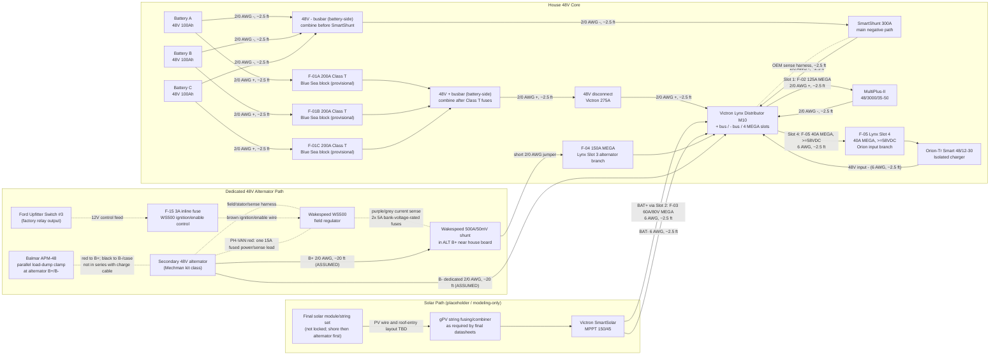
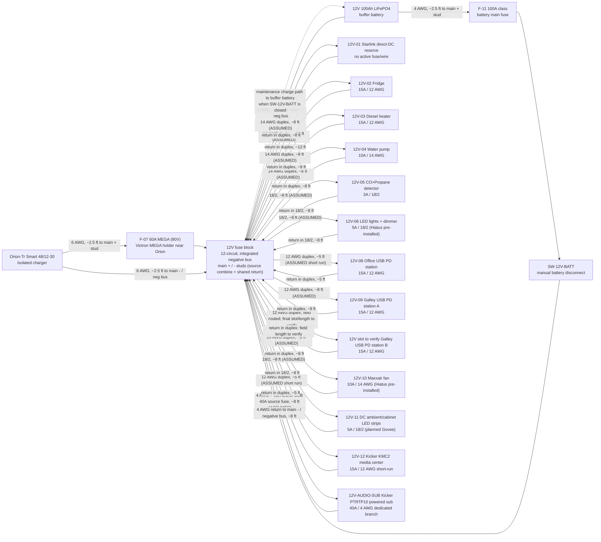
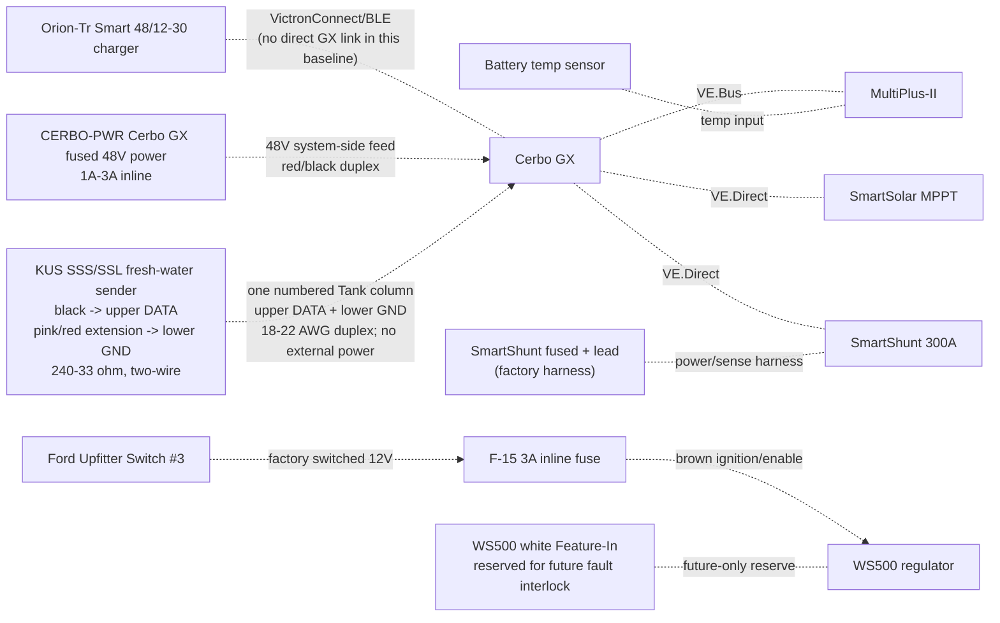

---
aliases:
  - Electrical topology diagram
tags:
  - hiatus/implementation
  - hiatus/electrical
status: active
related:
  - "[[ELECTRICAL_48V_ARCHITECTURE]]"
  - "[[ELECTRICAL_fuse_schedule]]"
  - "[[ELECTRICAL_Mechman_WS500_APM48_install_guide]]"
  - "[[SYSTEMS]]"
  - "[[CAMPER_audio_system]]"
---

# Electrical Topology Diagram (Implementation v6)

As-of date: `2026-07-19`

Purpose: provide a complete, install-level electrical topology for the current build scope, including all major electrical components, fuse IDs, fuse housings, planned wire gauges, and estimated one-way run lengths for procurement planning.

Related docs:
- Canonical electrical/system baseline: `docs/core/SYSTEMS.md`
- Detailed fuse matrix: `docs/implementation/ELECTRICAL_fuse_schedule.md`
- Battery and trunk recalculation record: `docs/studies/ELECTRICAL_battery_fuse_wire_recalc_2026-02-18.md`
- Decisions and unresolved items: `docs/core/TRACKING.md`
- Procurement source of truth: `bom/bom_estimated_items.csv`

## Sweep Outcomes Included In This Revision
- Keeps alternator charging architecture on the dedicated `48V` secondary alternator path (`Mechman + WS500 + APM-48` baseline); obsolete pre-Mechman charger paths are removed from primary topology.
- Keeps Lynx Slot 3 branch to alternator input with `F-04 150A` (`58V/80V` MEGA).
- Removes obsolete pre-Mechman engine-bay fuse/conductor placeholders from active architecture.
- Clarifies the confirmed `PH-VAN` harness as one `15A` fused combined power/positive-sense red lead (`F-12/F-13-PHVAN`) and locks the separate Wakespeed `500A/50mV` shunt into alternator `B+`, with one bank-voltage-rated `5A` fuse in each purple/grey sense lead immediately at the shunt.
- Adds Ford `Upfitter #3 -> F-15 -> WS500 brown ignition` manual alternator-control path.
- Adds the detailed Mechman/WS500/APM-48 install guide as the shop reference for staged installation, first-run checks, and load-dump/shutdown handling.
- Defines APM-48 as a parallel surge clamp at the alternator rather than a series charge-current device.
- Added explicit fuse-holder/housing definitions for every fuse family (`Class T`, Lynx `MEGA`, inline `MIDI/ANL/AMI`, PV `gPV`, and `ATO/ATC`).
- Added conductor schedule across `48V`, `12V`, PV, and AC segments with explicit assumptions.
- Updated 12V topology to a shared 12V junction fed by an Orion-Tr Smart `48/12-30` charger and a `12V 100Ah` buffer battery branch, with `F-11` source fuse plus `SW-12V-BATT` manual isolation.
- Added a full-circuit estimated run-length validation pass (`C-01` through `C-40`) and purchase-ready wire rollup totals.

## Current Commissioning Snapshot (`2026-08-02`)
- `48V` bus live-tested at `55.5V` throughout the system, including at the MultiPlus.
- MultiPlus-II inverter mode tested with inverter light on, slight normal hum, and no reported errors.
- SmartShunt and Orion-Tr Smart connected in VictronConnect.
- Cerbo GX access point/remote-console workflow active; Cerbo is powered from a small inline fused `48V` feed and connected to MultiPlus via `VE.Bus` RJ45.
- Short AC-in shore-charge test passed at household-source current limits: about `1294W` shore input and about `54.3V x 21.6A` battery charging in bulk.
- MultiPlus LiFePO4 charge profile is programmed/owner-verified by supervised first-battery behavior. Owner reports the Orion/`12V` buffer path now charges and operates correctly. Hold open: permanent-path shore dead checks/first-use acceptance, full-bank charge/rest/match/parallel closeout, AC-out branch/GFCI, alternator commissioning, Cerbo hard-mounting, and final strain-relief/abrasion-control.

## Current Physical Installation Snapshot (`2026-08-03`)
- The electrical module is hard-mounted through the finished Lonseal/plywood floor into registered truck-bed hardpoints and tied into the hard-mounted Bench/Galley extrusion structure. Owner reports the integrated assembly is extremely stiff; remaining mobile restraint is battery/cooler capture plus terminal/cable protection.
- The driver-rear shore inlet and exterior-to-module cable route are installed. One accessible, enclosed, conductor/gauge-rated three-wire `L/N/PE` splice into the AC-input side remains before dead checks and controlled energization.
- All three batteries' positive and negative `2/0 AWG` branch cables are cut, lugged, heat-shrunk, and landed at the battery-side busbars. Battery 1 completed the corrected isolated charge cycle, Battery 2 resumed and reached absorption on `2026-08-03`, and Battery 3 remains pending; keep all three isolated until their rested voltages are matched within `0.1V` before paralleling.
- The `12V` buffer-battery/Orion branch is owner-reported operational. Keep its negative direct to the fuse-panel main negative stud, not through `SW-12V-BATT`; the positive path remains `F-11 -> SW-12V-BATT -> panel main +`.
- Owner report `2026-08-03`: the ICECO appliance lead is landed on `12V-02`, protected by a `15A` blade fuse, and switched. Its appliance pigtail is `16 AWG`; exposed positive switch terminals still require individual insulation and temporary hard mounting before normal powered work. Verify connector polarity and voltage drop before appliance acceptance.
- Owner report `2026-08-05`: the pump, ICECO/fridge feed, and KUS sender circuit are wired; three separate `12 AWG / 15A` USB-PD branches are routed (`1x` Desk and `2x` Galley); and the Desk and Galley GFCIs are wired on separate breakers. Commissioning remains open for exact fuse/slot labels, polarity/load tests, KUS configuration/sanity check, AC LINE/LOAD/PE proof, and GFCI trip/reset. The third PD branch's actual source slot must be audited and labeled rather than inferred from this document.

### Orion fuse discriminator — one input fuse only
- Lynx Slot 4 / `F-05`: **Orion `48V` input positive**, one verified `40A` MEGA (`58VDC` minimum under the locked `56.8V` charge ceiling; Victron `CIP138040020 40A/80V` is the replacement fallback) feeding the existing `6 AWG` directly. This is the final single input fuse.
- `F-06`: **retired standalone Orion input-fuse position**. Do not install MIDI, FKS/ATO, DIN, or a second fuse after Slot 4.
- Lynx Slot 2 / `F-03`: **MPPT branch**, `60A/80V` MEGA. If the physically X-marked/misrated Lynx fuse is in Slot 2, replace it with the purchased Victron `60A/80V` MEGA; it is not the Orion input fuse.
- `F-07`: **Orion `12V` output positive**, `60A/80V` MEGA in the separate Victron holder near the Orion.
- `F-11`: **`12V` buffer-battery positive**, `100A` ANL near the battery, upstream of `SW-12V-BATT`.
- No `32V`-rated fuse is acceptable on any energized `48V` branch. Identify the physical X-marked fuse by Lynx slot before replacing or discarding it.

## Length Estimation Defaults Used In This Pass
1. Cabinet internal interconnect default: `2.5 ft` one-way (`ASSUMED`).
2. Cabinet-to-near load branch default: `8 ft` one-way (`ASSUMED`).
3. Cabinet-to-far load branch default: `12 ft` one-way (`ASSUMED`).
4. AC branch to receptacle chain default: `15 ft` one-way per branch leg (`ASSUMED`).
5. Policy lock: use the smallest gauge that meets current and voltage-drop targets; do not auto-upsize, but flag warnings when margin is tight.
6. Parallel battery bank lock: keep each battery's **total positive + negative path resistance** similar. Equal positive-only length is not required if the positive-length differences are offset by negative-length differences; do not add unnecessary 2/0 cable coils solely for cosmetic equality.

## Battery Fuse/Wire Recalculation Basis (2026-02-18 + 2026-03-19 sync)
- Scope in this pass is limited to battery-side and major `48V` trunk paths (`C-01` through `C-15`).
- Provisional battery listing inputs used: `51.2V 100Ah`, `<=200A` current limit per battery.
- Conservative sizing factors used in this pass:
1. Parallel-sharing factor `K_share = 1.5`
2. Continuous margin factor `K_cont = 1.25`
- Current envelope used for battery-discharge branch sizing: `I_total = F-02 + F-05 = 125A + 40A = 165A`.
- Per-battery design current: `I_batt_design = (165A / 3) * 1.5 = 82.5A`.
- Continuous-adjusted minimum battery branch fuse threshold: `82.5A * 1.25 = 103.1A`.
- Provisional battery branch fuse selection: `F-01A/B/C = 200A Class T`, constrained by the provisional battery `<=200A` current-limit listing.
- Final lock gate: validate true `51.2V` battery datasheet/manual current and terminal limits before permanent fuse lock; if lower limits are confirmed, move to `175A`.
- Cable procurement remains estimate-based until CAD/field run lengths are frozen. This pass sets a no-padding `2/0` estimate baseline of `77.5 ft` total (`42.5 ft` red, `35.0 ft` black), including the dedicated alternator migration path.

## Complete Power Topology (48V Core + Charge Sources)

## 12V Distribution Topology (Shared Junction With Buffer Battery)

### 12V Operating Intent (Locked)
- Orion-Tr Smart `48/12-30` is the primary `12V` charger/feed source.
- `SW-12V-BATT` is **normally closed** in operation; open is service/isolation mode only.
- With `SW-12V-BATT` closed, Orion output at the fuse-block main `+` stud maintains/charges the `12V` buffer battery through the shared-junction path.
- With `SW-12V-BATT` open, the buffer battery is isolated from the main `+` stud, but the fuse-panel bus can remain powered from the Orion while the Orion is enabled. For service isolation, turn active loads off, disable the Orion and confirm off/not charging, then open `SW-12V-BATT` and meter the bus before work.
- Replace the Orion's always-on L-H jumper with a maintained SPST dry-contact remote switch. Startup closes `SW-12V-BATT` before enabling the Orion; normal shutdown disables the Orion before opening the battery switch.
- The buffer battery remains in the active operating path during normal use and is intended to absorb transients/peaks on the `12V` rail.
- The fuse block is the `12V` junction device in this baseline: main `+` stud is the source-combine point, and the integrated negative bus/main `-` is the shared return point.
- Do not solder-splice high-current source conductors; terminate with crimped lugs on rated studs/junction hardware.
- Hiatus pre-installed 12V branches are tracked here as `12V-06` (factory LED lights with dimmer) and `12V-10` (Maxxair fan); verify final installed branch labeling during electrical audit.
- Planned Govee/ambient strip lighting is a separate branch (`12V-11`) and not part of the Hiatus factory `12V-06` lighting circuit.
- DC-first lighting intent: keep ambient/cabinet strip lighting on `12V-11` so nighttime lighting does not require inverter operation.
- Camper audio intent: Kicker `46KMC2` source unit uses a `15A` `12V-12` branch from the fuse block, while Kicker `49PTRTP10` powered sub uses a separate `40A` fused `4 AWG` branch from the 12V source/junction rather than a normal blade-fuse panel branch. Bass peaks may exceed the Orion `30A` continuous feed and are supported by the `12V` buffer battery for short durations.

## AC Path Topology (Shore + Inverter Output, Full Hierarchy)

```mermaid
flowchart LR
    subgraph SHORE_SRC["Shore Source Path"]
        EMS["Portable EMS/surge protection\n30A source-side"]
        CORD["Shore cord + adapters\n(service-limited by pedestal/source)"]
        INLET["Shore inlet (120VAC)"]
        ACBOXIN["Combined 6-way AC DIN enclosure\nAC-in neutral isolated from AC-out neutral"]
        ACINBRK["AC input breaker/disconnect\n30A UL489"]
        EMS -- "30A shore cord" --> CORD
        CORD -- "10/3 shore to camper inlet" --> INLET
        INLET -- "10/3 shore, ~8 ft total path (ASSUMED)" --> ACBOXIN
        ACBOXIN --> ACINBRK
    end

    subgraph MULTI_AC["MultiPlus-II AC Conversion + Transfer"]
        ACIN["AC-in terminals (L/N/PE)"]
        XFER["Internal transfer relay + charger stage\n(shore present = pass-through + charging)"]
        OUT1["AC-out-1 (inverter-backed output)"]
        OUT2["AC-out-2 (shore-only optional output)"]
        ACIN --> XFER --> OUT1
        XFER --> OUT2
    end

    subgraph AC_DIST["AC Distribution and Protection"]
        ACBOXOUT["Same combined 6-way AC DIN enclosure\noutput neutral isolated from input neutral"]
        OUTMAIN["AC-out main breaker\n30A UL489"]
        OUT1PROT["Branch protection for AC-out-1\n20A + 20A; GFCI at first outlet"]
        BR_A["Branch A: office / driver-side outlet"]
        BR_B["Branch B: galley / passenger-side outlet"]
        OUT2PROT["AC-out-2 reserve path only\n(capped route, no energized Phase 1 hardware)"]
        ACBOXOUT --> OUTMAIN --> OUT1PROT
        OUT1PROT -- "12 AWG branch cable, ~15 ft (ASSUMED)" --> BR_A
        OUT1PROT -- "12 AWG branch cable, ~15 ft (ASSUMED)" --> BR_B
    end

    subgraph AC_LOADS["Planned AC Loads"]
        IND["Induction cooktop"]
        OVEN["Ninja SP151 air fryer/toaster oven"]
        MON["External monitor + office chargers"]
        OFFICE_REC["Office/driver GFCI receptacle"]
        GALLEY_REC["Galley/passenger GFCI receptacle"]
        SHORE_ONLY["Future shore-only load (optional)\nA/C or electric water heat"]
    end

    subgraph USB_PD["USB/USB-C PD Strategy"]
        PD_DC["Locked: 12V branch -> USB PD stations\n3 total stations (1 office + 2 galley)"]
        PD_AC["Alternative: USB receptacles on AC branch"]
    end

    ACINBRK -- "10 AWG AC conductors, ~2.5 ft" --> ACIN
    OUT1 -- "10/3 AC feeder, ~2.5 ft" --> ACBOXOUT
    OUT2 -. "12 AWG capped reserve route, ~15 ft (ASSUMED optional)" .-> OUT2PROT

    BR_A --> OFFICE_REC
    BR_A --> MON
    BR_B --> GALLEY_REC
    BR_B --> IND
    BR_B --> OVEN
    OUT2PROT -. "future activation only" .-> SHORE_ONLY

    BR_A -. "if AC USB outlets selected" .-> PD_AC
```

### AC Operating Behavior (Expected)
- Shore present: MultiPlus transfer relay closes, AC-in is passed to AC-out paths, and charger stage charges the `48V` bank.
- Shore absent: MultiPlus transfers to inverter mode and powers `AC-out-1` from battery; `AC-out-2` drops by design.
- AC-in hardware is `30A` (`source/adapters -> portable EMS -> shore cord -> L5-30 inlet -> 30A breaker -> 10 AWG AC-in conductors`); set MultiPlus input current limit to actual source (`15A`, `20A`, or `30A`) to avoid pedestal/source breaker trips.
- Initial battery charging may use AC-in-only mode with AC-out branch loads disconnected.

### AC Safety/Protection Chain (What Must Exist)
- Upstream shore protection chain before MultiPlus AC-in: shore source/adapters -> portable EMS -> shore cord -> shore inlet -> `30A` AC input breaker/disconnect.
- AC-out protection chain: MultiPlus AC-out-1 -> `10/3` feeder -> `30A` AC-out main breaker -> `20A` branch breakers -> GFCI receptacles.
- Single-enclosure DIN architecture with isolated AC-in and AC-out neutral paths and no neutral mixing.
- Continuous equipment grounding path from shore inlet through MultiPlus and branch circuits. The MultiPlus external `M6 PE` lug gets at least `4 mm²`, selected as `10 AWG` green stranded copper, to a verified truck-chassis bond point; the aluminum shell gets a separate corrosion-compatible bond into the same equipment-ground network and is not the only PE path.
- Neutral/ground handling follows the MultiPlus internal relay: AC-out neutral bonds to chassis in inverter mode and opens that bond when shore is accepted. Do not add an always-bonded downstream neutral-ground bond in branch receptacle wiring.
- Keep PE and DC return roles separate: no MultiPlus case/PE jumper to Lynx or `12V` negative. Confirm whether the Mechman is isolated- or case-grounded and prove no chassis path bypasses the SmartShunt before alternator commissioning.

### AC Reference Basis (Manufacturer Guidance)
- Victron MultiPlus-II `120V` installation guidance (`AC-in` breaker sizing, UL943-class residual-current protection on outputs, and AC-out-2 shore-only behavior): `https://www.victronenergy.com/media/pg/MultiPlus-II_120V/en/installation.html`
- Victron MultiPlus-II datasheet (`48/3000/35-50` baseline model reference): `https://www.victronenergy.com/upload/documents/Datasheet-MultiPlus-II-inverter-charger-120V-EN.pdf`

### AC/USB Baseline Locked For BOM
- Shore interface: `30A` RV-style inlet baseline with adapter kit for `15A`/`20A` hookups.
- AC input protection: portable EMS + combined DIN enclosure + `30A` AC input breaker/disconnect upstream of MultiPlus AC-in.
- AC-out-1 distribution: `30A` AC-out main plus two protected `20A` branches with GFCI-at-first-outlet strategy.
- Receptacle plan: `2` first-in-chain `120V` GFCI receptacles remain required, one per active branch: Branch A = office/driver side, Branch B = galley/passenger side. Owner reopened a small number of downstream receptacles on `2026-08-05`; final count/locations remain field-fit gated and must continue from each first GFCI's `LOAD` terminals with `12 AWG` conductors, accessible listed boxes, and full-chain trip testing.
- USB charging plan: `3` DC-fed USB PD station assemblies on separate `12V` branches (`1` office, `2` Galley), each standardized to `15A / 12 AWG`. The third branch's actual fuse-panel slot/label is a field-audit item.
- AC-out-2 remains reserve-only in Phase 1 (labeled capped route; no energized branch hardware procured).

## Monitoring and Control Topology

## Fuse and Switch Housing Map (Where Each Item Is Physically Housed)
| Item ID | Item value/type | Housing method | Location |
| --- | --- | --- | --- |
| `F-01A` | `200A Class T` (provisional) | Blue Sea Class T fuse block (`110A-200A` family) | Battery compartment near Battery A `+` |
| `F-01B` | `200A Class T` (provisional) | Blue Sea Class T fuse block (`110A-200A` family) | Battery compartment near Battery B `+` |
| `F-01C` | `200A Class T` (provisional) | Blue Sea Class T fuse block (`110A-200A` family) | Battery compartment near Battery C `+` |
| `F-02` | `125A MEGA` | Lynx integrated slot holder | Lynx Slot 1 |
| `F-03` | `60A MEGA` (`80V` Victron replacement stock) | Lynx integrated slot holder | Lynx Slot 2 |
| `F-04` | `150A MEGA` | Lynx integrated slot holder | Lynx Slot 3 (dedicated alternator branch) |
| `F-05` | `40A` MEGA, body-marked `>=58VDC`; Victron `CIP138040020 40A/80V` replacement fallback | Lynx integrated slot holder | Lynx Slot 4; Orion `48V` input feeder |
| `F-06` | Not installed / retired standalone input-fuse position | No holder | MIDI/FKS/DIN concepts superseded; do not stack after `F-05` |
| `F-07` | `60A MEGA` (`80V` Victron replacement stock) | Victron MEGA fuse holder | Electrical cabinet at Orion `12V +` source end |
| `F-09A/B/C` | `15A gPV` each | `10x38` touch-safe fuse holders in PV combiner | Roof-entry combiner enclosure |
| `F-10` | Per branch (`ATO/ATC`) | Integrated blade sockets in generic 12V fuse block | Electrical cabinet |
| `AUDIO-HU` / `12V-12` | `15A` source/head-unit branch; KMC2 harness also contains a `15A ATM` fuse | 12V fuse block branch plus KMC2 harness fuse | Electrical cabinet to driver-side DC shelf/source face |
| `AUDIO-SUB` | `40A` external fuse for Kicker PTRTP10 powered sub branch | Inline/MRBF/AFS/ANL-class holder matched to selected 4 AWG kit; use `40A`, not a generic `100A` kit fuse | Within about `18 in` of the 12V source takeoff feeding the powered sub |
| `F-11` | `100A` class (12V buffer battery main) | Sealed inline MIDI/AMI/ANL holder | Within ~`7"` of 12V buffer battery positive post |
| `F-12/F-13-PHVAN` | `15A` WS500 combined regulator-power / positive-sense fuse | Sealed inline holder rated above actual `48V` bank maximum | At the house/main positive bus feeding the short `PH-VAN` red lead; do not extend |
| `CERBO-PWR` | `1A-3A` Cerbo GX power fuse | Small inline holder rated for the `48V` bank maximum | Electrical cabinet near `48V` system-positive takeoff; system side of disconnect preferred for bench shutdown |
| WS500 current-sense pair | No fuse; purple/grey high/low sense pair to shunt/current-sense point | Twist pair if extended; route away from noise | Shunt/current-sense source point |
| `F-15` | `3A` WS500 ignition/enable control fuse | Sealed inline ATC/ATO holder; 12V control circuit | Near Ford upfitter blunt-cut wire / WS500 control-wire handoff |
| `SW-12V-BATT` | Manual battery disconnect switch | Sealed rotary DC switch body | Electrical cabinet near 12V fuse-block main `+` stud for service access |
| `OEM-SHUNT` | External Victron-supplied inline fuse in red SmartShunt `Vbatt+` cable | Inline holder in supplied red cable | Prefer battery-side positive if SOC continuity is desired with the main disconnect open; system side is acceptable for zero disconnect-off parasitic draw |

Retired from active architecture:
- Obsolete pre-Mechman charger/fuse paths are removed from active board layout and labels.

## Conductor Schedule (Start-to-Finish)
| Segment ID | Circuit segment | Nominal voltage | Current basis | Overcurrent protection | Planned wire gauge | Estimated one-way length (this pass) |
| --- | --- | --- | --- | --- | --- | --- |
| `C-01` | Battery A `+` -> `F-01A` | `48V` | Battery branch, fuse-limited | `F-01A` `200A` provisional | `2/0 AWG` | `2.5 ft` planning placeholder; balance total loop path |
| `C-02` | Battery B `+` -> `F-01B` | `48V` | Battery branch, fuse-limited | `F-01B` `200A` provisional | `2/0 AWG` | `2.5 ft` planning placeholder; balance total loop path |
| `C-02C` | Battery C `+` -> `F-01C` | `48V` | Battery branch, fuse-limited | `F-01C` `200A` provisional | `2/0 AWG` | `2.5 ft` planning placeholder; balance total loop path |
| `C-03` | Class T outputs -> battery-side `48V +` busbar -> disconnect input | `48V` | Combined trunk current | `F-01A/B/C` | `2/0 AWG` each branch | `2.5 ft each branch` (`ASSUMED`, `4` conductors in rollup) |
| `C-04` | Disconnect output -> Lynx `+` bus | `48V` | Aggregate discharge design current (`165A = F-02 125A + Orion F-05 40A`) | Upstream Class T fuses | `2/0 AWG` | `2.5 ft` (`ASSUMED`) |
| `C-05` | Battery negatives -> battery-side `48V -` busbar -> SmartShunt battery side | `48V` | Mixed-path rollup: `3x` battery-negative branches at `82.5A` design each + `NEGBUS_TO_SHUNT` trunk at `165A` aggregate | N/A (main negative path) | `2/0 AWG` each branch | `2.5 ft each branch` (`ASSUMED`, `4` conductors in rollup) |
| `C-06` | SmartShunt load side -> Lynx `-` bus | `48V` | Aggregate return current | N/A | `2/0 AWG` | `2.5 ft` (`ASSUMED`) |
| `C-06A` | Lynx positive tap -> SmartShunt positive sense/power lead | `48V` | Shunt electronics supply (very low current) | Factory inline fuse in OEM harness | OEM harness lead | `2.5 ft` (`ASSUMED`) |
| `C-07` | Lynx Slot 1 (`F-02`) -> MultiPlus `DC+` | `48V` | Inverter branch, fuse-limited | `F-02` `125A` | `2/0 AWG` (manual minimum `AWG 1` on short runs) | `2.5 ft` (`ASSUMED`) |
| `C-08` | MultiPlus `DC-` -> Lynx `-` bus | `48V` | Inverter return current | `F-02` protects paired positive | `2/0 AWG` | `2.5 ft` (`ASSUMED`) |
| `C-09` | MPPT `BAT+` -> Lynx Slot 2 (`F-03`) | `48V` | Controller output (`45A` max) | `F-03` `60A/80V` Victron row `188` | `6 AWG` | `2.5 ft` (`ASSUMED`) |
| `C-10` | MPPT `BAT-` -> Lynx `-` bus | `48V` | Controller return current | `F-03` protects paired positive | `6 AWG` | `2.5 ft` (`ASSUMED`) |
| `C-11` | Secondary alternator `B+` -> APM-48 -> Lynx Slot 3 (`F-04`) | `48V` | Alternator branch design current | `F-04` `150A` | `2/0 AWG` | `20 ft` (`ASSUMED`, one-way) |
| `C-12` | Secondary alternator `B-` -> Lynx `-` bus (dedicated return) | `48V` | Alternator branch return current | `F-04` paired | `2/0 AWG` | `20 ft` (`ASSUMED`, one-way) |
| `C-13/C-14` | Lynx Slot 4 (`F-05`) -> Orion `48V +` input | `48V` | Orion feeder, fuse-limited | `F-05 40A` MEGA, `>=58VDC` | Existing `6 AWG` direct; `10 AWG` adequate if ever replaced | `2.5 ft` (`ASSUMED`) |
| `C-15` | Orion `48V -` input -> Lynx `-` bus | `48V` | Orion input return current | Orion input positive protection paired | `6 AWG` | `2.5 ft` (`ASSUMED`) |
| `C-18` | Orion `12V +` -> `F-07` -> 12V fuse block main `+` stud | `12V` | Charger output path (`30A` continuous, `60A` fuse) | `F-07` `60A` | `6 AWG` planned (`8 AWG` minimum per Orion table) | `2.5 ft` (`ASSUMED`) |
| `C-19` | Orion `12V -` -> 12V fuse block integrated `-` bus / main `-` stud | `12V` | Charger output return | `F-07` protects paired positive | `6 AWG` | `2.5 ft` (`ASSUMED`) |
| `C-19A` | 12V buffer battery `+` -> `F-11` -> `SW-12V-BATT` -> 12V fuse block main `+` stud | `12V` | Buffer source path and service isolation path | `F-11` `100A` class | `4 AWG` planned | `2.5 ft` (`ASSUMED`) |
| `C-19B` | 12V buffer battery `-` -> 12V fuse block integrated `-` bus / main `-` stud | `12V` | Buffer battery return path | N/A (paired with `C-19A`) | `4 AWG` planned | `2.5 ft` (`ASSUMED`) |
| `C-20` | Reserved 12V panel -> future Starlink direct-DC conversion | `12V` | Not active; Standard 4 X remains on its supplied AC power path | No fuse installed until exact converter/input is selected | No conductor committed | Pull string/conduit only if useful while access is open |
| `C-21` | 12V panel -> Fridge | `12V` | Branch load | `F-10` `15A` | `12 AWG duplex` | `12 ft` (`ASSUMED`, far-load branch; upsize avoids the prior voltage-drop warning) |
| `C-22` | 12V panel -> LF Bros diesel-heater harness | `12V` | Startup/cooldown branch; keep energized through controller-commanded shutdown | `F-10` `15A` (retain any supplied harness fuse; verify coordination) | `12 AWG duplex` | `8 ft` (`ASSUMED`; measure before final cable landing) |
| `C-23` | 12V panel -> Water pump | `12V` | Branch load | `F-10` `10A` | `14 AWG duplex` | `8 ft` (`ASSUMED`, near-load branch) |
| `C-24` | 12V panel -> CO + propane detector | `12V` | Branch load | `F-10` `3A` | `18/2` | `8 ft` (`ASSUMED`, near-load branch) |
| `C-25` | 12V panel -> LED lights + dimmer (Hiatus pre-installed) | `12V` | Branch load | `F-10` `5A` | `18/2` | `8 ft` (`ASSUMED`, near-load branch) |
| `C-26` | `48V` system positive/negative -> `CERBO-PWR` -> Cerbo GX power input | `48V` | Cerbo electronics feed (`~3W`) | `CERBO-PWR` `1A-3A` inline fuse | `18 AWG` red/black duplex acceptable | `2.5 ft` (`ASSUMED`, cabinet internal) |
| `C-27` | PV strings -> `F-09` combiner -> MPPT PV input | PV string voltage (`3S`) | String current + combiner output current | `F-09A/B/C` `15A` each | `10 AWG` PV wire | `12 ft` trunk + `3x8 ft` string legs (`ASSUMED`) |
| `C-28` | Shore source/adapters -> portable EMS -> shore cord -> shore inlet -> combined AC DIN enclosure / AC input breaker | `120VAC` | Source-limited shore current (adapter-constrained at source) | `30A` AC input breaker/disconnect baseline with source-current-limit settings policy | `10/3` shore feed to inlet/AC-in area | `8 ft` (`ASSUMED`) |
| `C-29` | AC input breaker/disconnect -> MultiPlus AC-in | `120VAC` | MultiPlus AC input current (`30A` hardware basis) | Upstream `30A` AC breaker/disconnect (`C-28`) | `10 AWG` stranded AC conductors | `2.5 ft` (`ASSUMED`, cabinet internal) |
| `C-30` | MultiPlus AC-out-1 -> combined AC DIN enclosure / AC-out main breaker | `120VAC` | Inverter-backed AC-out feeder current (`30A` system cap) | `30A` AC-out main breaker | `10/3` stranded AC feeder | `2.5 ft` (`ASSUMED`, cabinet internal) |
| `C-31` | Branch A -> office/driver GFCI receptacle | `120VAC` | Branch load (office monitor/chargers/general outlet use) | `20A` branch breaker + GFCI receptacle | `12/3` stranded AC branch cable | `15 ft` (`ASSUMED`, branch leg default) |
| `C-32` | Branch B -> galley/passenger GFCI receptacle | `120VAC` | Branch load (galley/general high-draw outlet; induction/Ninja SP151 sequenced) | `20A` branch breaker + GFCI receptacle | `12/3` stranded AC branch cable | `15 ft` (`ASSUMED`, branch leg default) |
| `C-33` | MultiPlus AC-out-2 (reserve-only) -> capped route for future shore-only branch | `120VAC` | N/A in Phase 1 (route reserved only) | N/A in Phase 1 (no energized branch hardware) | `12 AWG` stranded AC conductors (reserve path only) | `15 ft` (`ASSUMED`, reserve route default) |
| `C-34` | 12V panel -> USB PD station branch (office zone) | `12V` | One Acegoo `118W` station | `F-10` branch fuse (`15A`) | `12 AWG duplex` baseline | `5 ft` (`ASSUMED`, short-run requirement) |
| `C-35` | 12V panel -> USB PD station branch (galley zone) | `12V` | Galley charging branch (`65W` class USB-C plus USB-A/C loads) | `F-10` branch fuse (`15A`) | `12 AWG duplex` baseline | `8 ft` (`ASSUMED`; standardized with the office PD/fridge rough-in for voltage-drop margin) |
| `C-36` | 12V panel -> Maxxair fan (Hiatus pre-installed) | `12V` | Roof ventilation branch | `F-10` branch fuse (`10A`) | `14 AWG duplex` baseline | `8 ft` (`ASSUMED`, near-load branch) |
| `C-37` | 12V panel -> DC ambient/cabinet LED strips (planned Govee) | `12V` | Branch load | `F-10` branch fuse (`5A`) | `18/2` baseline | `8 ft` (`ASSUMED`, near-load branch) |
| `C-38` | House/main positive bus -> WS500 `PH-VAN` short red lead | `48V` bank | Combined regulator-power / positive-voltage-sense feed | `F-12/F-13-PHVAN` (`15A`) | Short harness lead; do not extend | Local at house bus |
| `C-39` | Retired separate WS500 positive-sense conductor | N/A | Not installed with confirmed `PH-VAN` harness | None | N/A | N/A |
| `C-40` | WS500 current-sense high/low pair to selected shunt/current-sense point | low-current sense | Regulator current feedback | No fuse per current Wakespeed manual; twist pair if extended | Harness lead | `8 ft` (`ASSUMED`) |
| `C-41` | Ford Upfitter `#3` output -> `F-15` -> WS500 brown ignition/enable wire | `12V` control lead | Manual alternator-enable signal only | `F-15` (`3A`) | `16 AWG` TXL/GXL | `6 ft` (`ASSUMED`) |
| `C-42` | 12V panel -> Kicker `46KMC2` media center/source unit | `12V` | Source/head-unit branch (`15A` max; KMC2 manual shows `15A ATM`) | `F-10`/`AUDIO-HU` `15A` branch plus KMC2 harness fuse | `12 AWG duplex` if kept near `5 ft`; use `10 AWG` if longer | `5 ft` (`ASSUMED`, driver-side DC shelf) |
| `C-43` | 12V source/main `+` stud -> `AUDIO-SUB` source fuse -> Kicker `49PTRTP10` powered sub `+` | `12V` | Powered sub branch; PTRTP10 manual external fuse value | `AUDIO-SUB` `40A` | `4 AWG` tinned/OFC | `8 ft` (`ASSUMED`; shorten by placing sub near 12V junction) |
| `C-44` | Kicker `49PTRTP10` powered sub `-` -> 12V negative bus/main `-` stud | `12V` | Powered sub return | `AUDIO-SUB` protects paired positive | `4 AWG` tinned/OFC | `8 ft` (`ASSUMED`, paired with positive) |
| `C-45` | KMC2 remote turn-on output -> PTRTP10 remote input | `12V` low-current control | Remote amp/sub enable | KMC2/source branch protected | `18 AWG` | `8 ft` (`ASSUMED`) |
| `C-46` | KMC2 RCA line-out -> PTRTP10 RCA input | low-level audio signal | Subwoofer signal | N/A | shielded 2-channel RCA | measured route (`~4m` planning cable) |
| `C-47L/R` | KMC2 front speaker outputs -> left/right Kicker `CSC67` speakers | speaker-level audio | One `4 ohm` speaker per KMC2 channel | KMC2 internal protection / `AUDIO-HU` source branch | `16 AWG` marine speaker wire | `10-12 ft` each (`ASSUMED`) |
| `C-48` | KUS SSS/SSL sender black signal + pink return -> matching signal/negative pair in Cerbo GX MK2 `Tank 1` column | Cerbo low-current resistive-sender excitation | Fresh-water level, US `240-30 ohm` | No external fuse or power feed; do not share chassis return | `18-22 AWG` tinned duplex, ferrules at Cerbo, sealed pigtail splices at sender | Measure after tank/Cerbo endpoints are installed (`ASSUMED <10 ft`) |
| `C-49` | 12V panel -> second Galley USB PD station | `12V` | Third independent PD branch | `F-10` branch fuse (`15A`); exact panel slot/label to verify in field | `12 AWG duplex` | Owner reports routed `2026-08-05`; measure/record final length |

## Wiring Validation Worksheet (Estimate Pass, 2026-02-18)
Calculation basis for drop screening:
1. `V_drop = I * (2 * L_one_way * R_per_ft)`
2. Resistance basis used in this pass (`ohm/ft`): `2/0=0.0000779`, `6 AWG=0.0003951`, `4 AWG=0.0002485`, `12 AWG=0.001588`, `14 AWG=0.002525`, `18/2=0.006385`, `10 AWG=0.000999`.
3. Design targets: `<=2%` on major `48V` trunks, `<=3%` on planned `12V`/AC branches.
4. `C-05` is a rollup row that includes both branch and trunk return paths; voltage-drop screen shown is the conservative interim worst-case (`155A`) within that rollup.

| Circuit ID | From | To | Fuse | Current basis | Gauge | Estimated one-way length | Voltage drop % | BOM gauge bucket | Status |
| --- | --- | --- | --- | --- | --- | --- | --- | --- | --- |
| `C-01` | Battery A `+` | `F-01A` | `F-01A 200A` | `77.5A` interim design branch share | `2/0 AWG` | `2.5 ft` planning placeholder; field layout may use unequal positive lengths if total loop path is balanced | `0.059%` @ `51.2V` planning placeholder | Row `28` (`2/0 red`) | PASS |
| `C-02` | Battery B `+` | `F-01B` | `F-01B 200A` | `77.5A` interim design branch share | `2/0 AWG` | `2.5 ft` planning placeholder; field layout may use unequal positive lengths if total loop path is balanced | `0.059%` @ `51.2V` planning placeholder | Row `28` (`2/0 red`) | PASS |
| `C-02C` | Battery C `+` | `F-01C` | `F-01C 200A` | `77.5A` interim design branch share | `2/0 AWG` | `2.5 ft` planning placeholder; field layout may use unequal positive lengths if total loop path is balanced | `0.059%` @ `51.2V` planning placeholder | Row `28` (`2/0 red`) | PASS |
| `C-03` | Class T load studs | `48V +` bus / disconnect input | `F-01A/B/C` | `77.5A` interim per branch | `2/0 AWG` | `2.5 ft` each (`x4` conductors) | `0.059%` @ `51.2V` | Row `28` (`2/0 red`) | PASS |
| `C-04` | Disconnect output | Lynx `+` bus | Upstream Class T | `155A` interim / `145A` final aggregate | `2/0 AWG` | `2.5 ft` | `0.12%` @ `51.2V` interim | Row `28` (`2/0 red`) | PASS |
| `C-05` | Battery `-` branches | SmartShunt battery side via `48V -` bus | N/A | `77.5A` per battery-negative branch; row rollup also includes one `155A` interim trunk (`NEGBUS_TO_SHUNT`) | `2/0 AWG` | `2.5 ft` each (`x4` conductors) | `0.12%` @ `51.2V` (worst-case rollup) | Row `28` (`2/0 black`) | PASS |
| `C-06` | SmartShunt load side | Lynx `-` bus | N/A | `155A` interim / `145A` final aggregate return | `2/0 AWG` | `2.5 ft` | `0.12%` @ `51.2V` interim | Row `28` (`2/0 black`) | PASS |
| `C-06A` | Lynx positive tap | SmartShunt sense/power lead | OEM inline fuse | OEM harness current | OEM harness | `2.5 ft` | N/A (low-current OEM lead) | Row `23` (kit harness) | PASS |
| `C-07` | Lynx Slot 1 `DC+` | MultiPlus `DC+` | `F-02 125A` | `125A` | `2/0 AWG` | `2.5 ft` | `0.10%` @ `51.2V` | Row `28` (`2/0 red`) | PASS |
| `C-08` | MultiPlus `DC-` | Lynx `-` bus | `F-02` paired | `125A` | `2/0 AWG` | `2.5 ft` | `0.10%` @ `51.2V` | Row `28` (`2/0 black`) | PASS |
| `C-09` | MPPT `BAT+` | Lynx Slot 2 | `F-03 60A` (`80V` Victron row `188`) | `45A` | `6 AWG` | `2.5 ft` | `0.17%` @ `51.2V` | Row `29` (`6 AWG red`) | PASS |
| `C-10` | MPPT `BAT-` | Lynx `-` bus | `F-03` paired | `45A` | `6 AWG` | `2.5 ft` | `0.17%` @ `51.2V` | Row `29` (`6 AWG black`) | PASS |
| `C-11` | Secondary alternator `B+` | Lynx Slot 3 via APM-48 | `F-04 150A` | `150A` design | `2/0 AWG` | `20 ft` | `0.80%` @ `58.4V` | Row `28` (`2/0 red`) | PASS |
| `C-12` | Secondary alternator `B-` | Lynx `-` bus (dedicated return) | `F-04` paired | `150A` design | `2/0 AWG` | `20 ft` | `0.80%` @ `58.4V` | Row `28` (`2/0 black`) | PASS |
| `C-13/C-14` | Lynx Slot 4 | Orion `48V +` | `F-05 40A` MEGA, `>=58VDC` | `40A` fuse basis | Existing `6 AWG` direct | `2.5 ft` | `0.16%` @ `51.2V` | Row `29` (`6 AWG red`) | PASS; no separate holder or splice stack |
| `C-15` | Orion `48V -` | Lynx `-` bus | Orion input positive protection paired | `40A` fuse basis | `6 AWG` | `2.5 ft` | `0.16%` @ `51.2V` | Row `29` (`6 AWG black`) | PASS |
| `C-18` | Orion `12V +` | Fuse block main `+` stud | `F-07 60A/80V` Victron row `188` | `30A` | `6 AWG` | `2.5 ft` | `0.49%` @ `12V` | Row `29` (`6 AWG red`) | PASS |
| `C-19` | Orion `12V -` | Fuse block integrated `-` bus / main `-` stud | `F-07` paired | `30A` | `6 AWG` | `2.5 ft` | `0.49%` @ `12V` | Row `29` (`6 AWG black`) | PASS |
| `C-19A` | Buffer battery `+` | Fuse block main `+` stud (via `F-11/SW`) | `F-11 100A` | `50A` design | `4 AWG` | `2.5 ft` | `0.52%` @ `12V` | Row `30` (`4 AWG red`) | PASS |
| `C-19B` | Buffer battery `-` | Fuse block integrated `-` bus / main `-` stud | N/A | `50A` design | `4 AWG` | `2.5 ft` | `0.52%` @ `12V` | Row `30` (`4 AWG black`) | PASS |
| `C-20` | 12V fuse panel | Future Starlink direct-DC conversion | None active | N/A | No conductor committed | N/A | N/A | Conditional BOM row `27` | RESERVE; use supplied AC power path until exact converter is selected |
| `C-21` | 12V fuse panel | Fridge | `F-10 15A` | `7A` | `12 AWG duplex` | `12 ft` | `2.23%` @ `12V` | Row `116` / field `12 AWG duplex` stock | PASS |
| `C-22` | 12V fuse panel | LF Bros diesel-heater harness | `F-10 15A` + supplied harness fuse if present | `10A` startup screen | `12 AWG duplex` | `8 ft` assumed | `2.12%` @ `12V` | Field `12 AWG duplex` stock | PASS; measure final run, test startup voltage, and preserve cooldown power |
| `C-23` | 12V fuse panel | Water pump | `F-10 10A` | `7A` | `14 AWG duplex` | `8 ft` | `2.36%` @ `12V` | Row `32` (`14 AWG duplex`) | PASS |
| `C-24` | 12V fuse panel | CO+propane detector | `F-10 3A` | `0.2A` | `18/2` | `8 ft` | `0.17%` @ `12V` | Row `33` (`18/2`) | PASS |
| `C-25` | 12V fuse panel | LED lights + dimmer (Hiatus pre-installed) | `F-10 5A` | `5A` | `18/2` | `8 ft` | `4.26%` @ `12V` | Row `33` (`18/2`) | WARN (`18/2` only if shorter run/lower current) |
| `C-26` | 48V system feed | Cerbo GX | `CERBO-PWR 1A-3A` | `~3W` | `18 AWG` duplex acceptable | `2.5 ft` | N/A (low-current electronics feed) | Low-current install stock / row `22` device | PASS |
| `C-27` | PV strings/combiner | MPPT PV input | `F-09A/B/C 15A` | `30A` trunk screen | `10 AWG PV` | `12 ft` trunk + `3x8 ft` string legs | `0.72%` @ `100V` trunk screen | Row `31` (10 AWG pair-equivalent) | PASS (string leg lengths still ASSUMED) |
| `C-28` | Shore inlet path | AC input breaker/disconnect | Source-limited AC OCP | `30A` hardware basis | `10/3` | `8 ft` | `0.40%` @ `120VAC` | Row `114` (`10/3 shore + AC-in/out feed`) | PASS |
| `C-29` | AC input breaker/disconnect | MultiPlus AC-in | Upstream AC OCP | `30A` hardware basis | `10 AWG AC` | `2.5 ft` | `0.12%` @ `120VAC` | Row `114` (`10/3 shore + AC-in/out feed`) | PASS |
| `C-30` | MultiPlus AC-out-1 | AC-out main breaker | `30A` AC-out main | `30A` hardware basis | `10/3` | `2.5 ft` | `0.12%` @ `120VAC` | Row `114` (`10/3 shore + AC-in/out feed`) | PASS |
| `C-31` | Branch A | Office/driver receptacle chain | `20A` branch OCP | `20A` | `12 AWG AC` | `15 ft` | `0.79%` @ `120VAC` | Row `113` (`12 AWG AC branch`) | PASS |
| `C-32` | Branch B | Galley/passenger receptacle chain | `20A` branch OCP | `20A` | `12 AWG AC` | `15 ft` | `0.79%` @ `120VAC` | Row `113` (`12 AWG AC branch`) | PASS |
| `C-33` | MultiPlus AC-out-2 | Reserve-only capped route | N/A in Phase 1 | N/A | `12 AWG AC` (reserve path only) | `15 ft` | `0.60%` @ `120VAC` (future-use screen) | N/A (not procured in Phase 1) | RESERVE |
| `C-34` | 12V fuse panel | Office USB PD station | `F-10 15A` | `15A` design cap | `12 AWG duplex` | `5 ft` | `1.99%` @ `12V` | Row `116` (`12 AWG USB branch stock`) | PASS |
| `C-35` | 12V fuse panel | Galley USB PD station | `F-10 15A` | `8A` expected | `12 AWG duplex` | `8 ft` | `1.69%` @ `12V` | Row `116` (`12 AWG USB branch stock`) | PASS |
| `C-49` | 12V fuse panel | Second Galley USB PD station | `F-10 15A`; slot to verify | `15A` design cap | `12 AWG duplex` | Field routed; measure | Recalculate from measured length | Field stock | VERIFY label/length/polarity, then load-test |
| `C-36` | 12V fuse panel | Maxxair fan (Hiatus pre-installed) | `F-10 10A` | `4A` expected | `14 AWG duplex` | `8 ft` | `1.35%` @ `12V` | Row `32` (`14 AWG duplex`) | PASS |
| `C-37` | 12V fuse panel | DC ambient/cabinet LED strips (planned Govee) | `F-10 5A` | `5A` design cap | `18/2` | `8 ft` | `4.26%` @ `12V` | Row `33` (`18/2`) | WARN (`18/2` only if shorter run/lower current) |
| `C-38` | House/main positive bus | WS500 `PH-VAN` short red lead | `F-12/F-13-PHVAN 15A` | combined regulator-power / voltage-sense feed at `48V` bank voltage | Short harness lead | Local | N/A (harness-limited) | Active row `171` | VERIFY one holder/fuse rated above bank maximum |
| `C-39` | Retired separate positive-sense source | Not installed | None | superseded by confirmed `PH-VAN` combined lead | N/A | N/A | N/A | Inactive row `320` | RETIRED |
| `C-40` | WS500 current-sense high/low pair | WS500 current-sense input | No fuse per current manual | low-current sense; twist pair if extended | Harness lead | `8 ft` | N/A (harness-limited) | Harness kit | PASS after routing/noise check |
| `C-41` | Ford Upfitter `#3` output | WS500 brown ignition/enable input via `F-15` | `F-15 3A` | manual low-current control only | `16 AWG` TXL/GXL | `6 ft` | N/A (control circuit) | Row `176` (upfitter control kit) | PASS |
| `C-42` | 12V panel | Kicker `46KMC2` media center | `AUDIO-HU 15A` branch + KMC2 `15A ATM` harness fuse | `15A` max fuse basis | `12 AWG duplex` | `5 ft` | `1.99%` @ `12V` | Row `192/193` audio wiring | PASS if kept short; use `10 AWG` if longer |
| `C-43/C-44` | 12V source/main studs | Kicker `49PTRTP10` powered sub | `AUDIO-SUB 40A` external source fuse | `40A` manual fuse basis | `4 AWG` positive + matching return | `8 ft` | `1.33%` @ `12V` | Row `192` audio power kit | PASS; keep branch short and dry |
| `C-45` | KMC2 remote output | PTRTP10 remote input | KMC2/source branch protected | low-current remote | `18 AWG` | `8 ft` | N/A | Row `193` audio signal/control | PASS |
| `C-46` | KMC2 RCA line-out | PTRTP10 RCA input | N/A | low-level signal | shielded RCA | measured route | N/A | Row `193` audio signal/control | Route away from 4 AWG power |
| `C-47L/R` | KMC2 front speaker outputs | Left/right `CSC67` speakers | KMC2/source branch protected | one `4 ohm` speaker per channel | `16 AWG` marine speaker wire | `10-12 ft` each | N/A | Row `193` audio speaker wire | Do not parallel speakers |

## Wire Rollup (No-Padding Purchase Baseline)
| Gauge / cable family | Estimated total | Source circuits | BOM row |
| --- | --- | --- | --- |
| `2/0 AWG` red | `42.5 ft` | `C-01`, `C-02`, `C-02C`, `C-03`, `C-04`, `C-07`, `C-11` | `28` |
| `2/0 AWG` black | `35.0 ft` | `C-05`, `C-06`, `C-08`, `C-12` | `28` |
| `6 AWG` red | `7.5 ft` | `C-09`, `C-13/C-14`, `C-18` | `29` |
| `6 AWG` black | `7.5 ft` | `C-10`, `C-15`, `C-19` | `29` |
| `4 AWG` red | `10.5 ft` (`2.5 ft` existing + `8 ft` audio sub planning branch) | `C-19A`, `C-43` | `30`, `192` |
| `4 AWG` black | `10.5 ft` (`2.5 ft` existing + `8 ft` audio sub return) | `C-19B`, `C-44` | `30`, `192` |
| `10 AWG pair-equivalent` (PV) | placeholder only | `C-27` final module/string topology deferred until solar workstream; do not buy combiner/fuse count or cut roof entries from the old `3S3P` model | `31` |
| `14 AWG duplex` | `16 ft` | `C-23`, `C-36` | `32` |
| `18/2` | `24.0 ft` plus separate Cerbo low-current duplex | `C-24`, `C-25`, `C-37`; Cerbo `C-26` uses 48V fused low-current duplex | `33` / low-current stock |
| `12 AWG AC branch cable` | `30 ft` (`C-33` excluded in Phase 1) | `C-31`, `C-32` | `113` |
| `10/3 shore + AC-in/out feed` | `13 ft` | `C-28`, `C-29`, `C-30` | `114` |
| `12 AWG` fridge/heater/USB/audio branch mix | Fridge: `12 ft`; heater: `8 ft`; USB: `5 ft` office + `8 ft` Galley A + measured Galley B field run; audio source: `5 ft` short-run assumption | `C-21`, `C-22`, `C-34`, `C-35`, `C-49`, `C-42` | `116`, `193` / field stock |
| Camper audio signal/speaker/control wiring | RCA measured route, `18 AWG` remote, and `16 AWG` marine speaker wire runs | `C-45`, `C-46`, `C-47L/R` | `193` |
| WS500 harness/sense leads | Included in selected kit/harness set; `C-39` is retired under `PH-VAN` | `C-38`, `C-40` | `168`, `171` |
| `16 AWG` TXL/GXL control wire | `6 ft` | `C-41` | `176` |

Notes:
1. This table is a base estimate only; it intentionally excludes order padding and termination waste.
2. Apply personal order overage at checkout based on actual spool cut increments and routing confidence.
3. Parallel bank balancing is locked by similar total loop resistance per battery. Positive-only leads may differ if the paired negative path offsets the difference; verify with final measured lengths and, if needed, clamp-current checks.

## 3x Battery Bank Bench-Build Cut List (2/0 AWG)
Purpose: make the bench build orderable without needing final camper run lengths. Treat lengths below as *bench module* lengths only; final install harnesses should be re-cut after layout freeze.

Assumptions:
1. Battery terminals are `M8` (verify your battery stud size before ordering lugs).
2. Class T fuse blocks and battery-side busbars use `3/8"` studs (treat as `M10` lugs unless your specific hardware differs).
3. Lynx Distributor is the `M10` model (main connections `M10`; internal/fuse studs may still be `M8` depending on the position).

| Cable ID | Qty | From -> To | Color | Gauge | Est. one-way length | Lug A | Lug B |
| --- | --- | --- | --- | --- | --- | --- | --- |
| `BATT+_A/B/C` | `3` | Battery `+` -> Class T block line side | red | `2/0` | `2.5 ft` each (`ASSUMED`) | `M8` | `M10` |
| `FUSE_TO_POSBUS_A/B/C` | `3` | Class T block load side -> `48V +` busbar | red | `2/0` | `2.5 ft` each (`ASSUMED`) | `M10` | `M10` |
| `POSBUS_TO_DISC` | `1` | `48V +` busbar -> disconnect input | red | `2/0` | `2.5 ft` (`ASSUMED`) | `M10` | `M10` |
| `DISC_TO_LYNX+` | `1` | disconnect output -> Lynx `+` input | red | `2/0` | `2.5 ft` (`ASSUMED`) | `M10` | `M10` |
| `BATT-_A/B/C` | `3` | Battery `-` -> `48V -` busbar | black | `2/0` | `2.5 ft` each (`ASSUMED`) | `M8` | `M10` |
| `NEGBUS_TO_SHUNT` | `1` | `48V -` busbar -> SmartShunt battery side | black | `2/0` | `2.5 ft` (`ASSUMED`) | `M10` | `M10` |
| `SHUNT_TO_LYNX-` | `1` | SmartShunt load side -> Lynx `-` input | black | `2/0` | `2.5 ft` (`ASSUMED`) | `M10` | `M10` |
| `LYNX_SLOT1_TO_MULTI+` | `1` | Lynx Slot 1 `DC+` -> MultiPlus `DC+` | red | `2/0` | `2.5 ft` (`ASSUMED`) | `M8` | `M8` |
| `LYNX_TO_MULTI-` | `1` | Lynx `-` -> MultiPlus `DC-` | black | `2/0` | `2.5 ft` (`ASSUMED`) | `M8` | `M8` |

Locked balancing rule for the `3x` parallel bank:
1. Keep each battery path's total positive + negative loop resistance similar.
2. Equal positive-only leads are not required when the negative lead lengths intentionally offset the positive lead differences.
3. Keep the same cable family, lug geometry, fuse/holder family, and termination quality across all three battery paths.
4. Verify sharing with clamp-current checks under charge/load if final measured path lengths differ materially.

Torque reference (verify against your exact manuals/hardware):
- MultiPlus-II DC terminals: `12 Nm` (`M8` nut) per Victron installation guidance.
- SmartShunt shunt bolts: verify torque for the installed `300A` model per Victron installation guidance.
- Lynx Distributor `M10` model: `M10` nuts `33 Nm` (older serials may be lower), and `M8` nuts `14 Nm` per Victron Lynx installation guidance.

## Additional Components Included In Topology Scope
- `48V` disconnect (`275A`)
- Pre-charge resistor (commissioning/soft-charge aid before connecting large DC loads)
- Battery-side `48V +` combine busbar (after Class T fuses)
- Battery-side `48V -` combine busbar (battery-only, before SmartShunt)
- 12V fuse block main `+` stud used as source-combine point (Orion + buffer battery feed)
- 12V fuse block integrated negative bus/main `-` used as shared return point
- 12V buffer battery main fuse (`F-11`) and manual disconnect switch (`SW-12V-BATT`)
- Shore AC inlet + cord/adapter interface hardware
- Portable EMS in source-side shore path before camper inlet
- Single combined 6-way AC DIN enclosure with isolated AC-in and AC-out neutral paths plus common equipment grounding/PE handling
- AC-out `30A` main breaker plus `20A`/`20A` branch breaker and GFCI receptacle hardware
- Receptacle boxes + `120V` outlets (current purchased baseline `2` GFCI receptacles/covers in row `15`; inactive row `112` records the closed separate box/faceplate allowance)
- AC-out-2 reserve-only capped route (no energized Phase 1 branch hardware)
- USB PD station branch hardware (`3` stations / independent routes owner-reported `2026-08-05`: `1x` office and `2x` Galley; row `115` owns the exact purchased Acegoo evidence while the additional station purchase provenance remains untracked)
- Camper audio hardware: Kicker `46KMC2` source branch, Kicker `49PTRTP10` powered sub branch, `AUDIO-HU` 15A source protection, `AUDIO-SUB` 40A source fuse, RCA/speaker/remote wiring
- Battery temperature sensor wiring to inverter/monitoring path
- SmartShunt fused positive sense/power lead (factory harness)
- Cerbo GX `CERBO-PWR` small inline fused `48V` power feed
- Ford `Upfitter #3` control lead and local `F-15` inline fuse for the WS500 brown ignition/enable wire

## Assumptions (Explicit)
1. Cable sizing assumes fine-strand copper conductors (OFC welding-cable baseline for high-current DC paths), enclosed vehicle routing, and the estimated one-way lengths listed in this document.
2. Voltage-drop design intent used here: `<=2%` on major `48V` power runs and `<=3%` on `12V` branch circuits.
3. `F-09` PV string fuse value (`15A`) remains provisional until final module datasheet max-series-fuse rating is confirmed.
4. Cerbo GX feed is now a small inline fused `48V` feed (`CERBO-PWR`) from the system/load side of the main disconnect during bench commissioning, so the Cerbo powers down with the house system.
5. Orion branch uses one source-side fuse only: `F-05 40A` MEGA, body-marked at least `58VDC`, in Lynx Slot 4 feeding the existing `6 AWG` input pair directly. The `58VDC` minimum is tied to the locked `56.8V` charge ceiling; use Victron `CIP138040020 40A/80V` if replacement is needed. Standalone `F-06` is retired; do not add an inline fuse after the Lynx slot.
6. No low-voltage-disconnect (LVD) automation is included in Phase 1; protection is source fusing plus manual `SW-12V-BATT` isolation.
7. Alternator architecture lock is dedicated `48V` secondary alternator path (`Mechman + WS500 + APM-48`) with `F-04 150A`; obsolete pre-Mechman engine-bay fuse paths are removed from active layout.
8. `F-01A/B/C` are provisionally set to `200A` pending final `51.2V` battery datasheet/manual confirmation; if validated limits are lower, shift to `175A`.
9. `2/0` cable quantity planning baseline in this pass is `77.5 ft` total no-padding (`42.5 ft` red + `35.0 ft` black); user-applied order padding is intentionally deferred to checkout.
10. Manual alternator shutdown baseline is Ford `Upfitter #3` feeding the WS500 brown ignition/enable wire through `F-15`; `WS500` white `Feature-In` remains a future-only reserve for automatic interlock work.
11. Camper audio is a `12V` accessory load. KMC2 source branch is `15A`; PTRTP10 sub branch is `40A` with `4 AWG` power and return. Audio peaks can exceed Orion continuous output and rely on the `12V` buffer battery, so first loud testing should watch `12V` voltage/SOC.

## Completion Status
- DC/PV topology is complete for current BOM scope and load model scope.
- AC hierarchy is complete at architecture level, including transfer behavior, branch strategy, and protection chain.
- Full-circuit estimate pass is now documented with run lengths, voltage-drop screening, and purchase rollups.
- Camper audio branch added as a DC-first `12V` accessory package: Kicker `46KMC2` source branch plus Kicker `49PTRTP10` powered sub branch; detailed product/routing notes live in `docs/implementation/CAMPER_audio_system.md`.
- Remaining work is final measured-length replacement and SKU-level closeout before final cut-to-length harness production.
