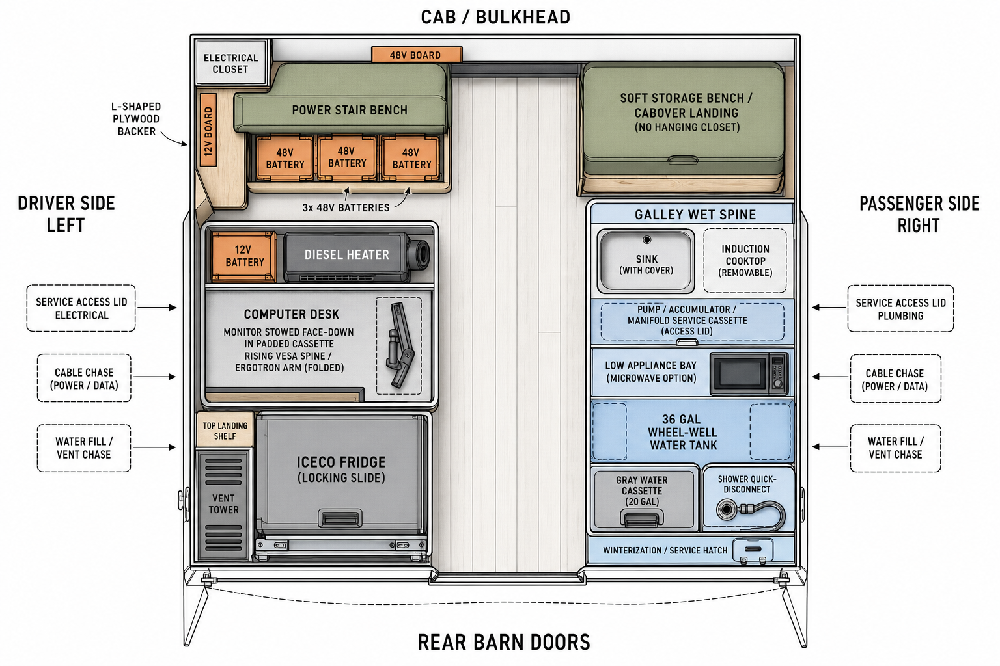
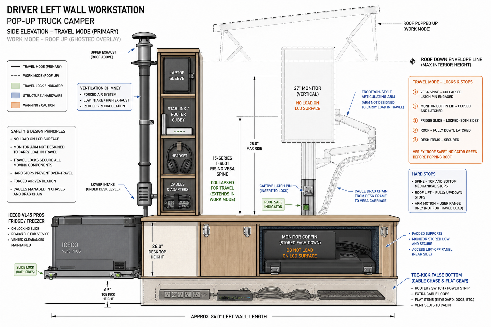
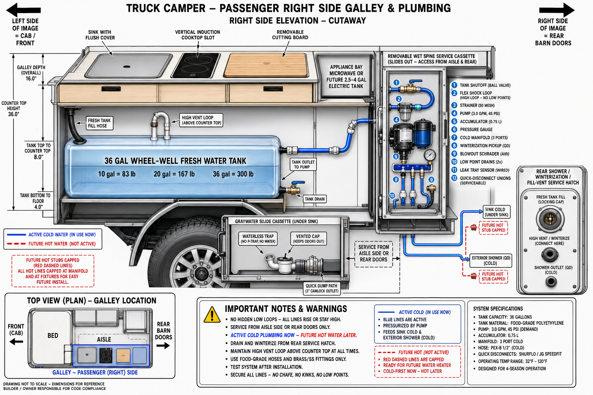
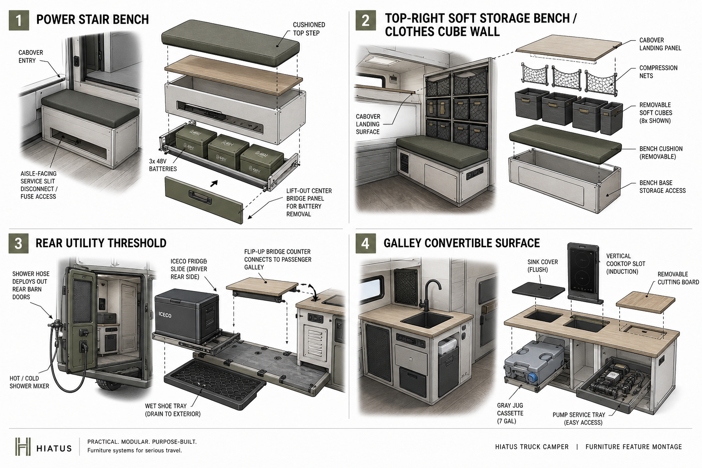

---
aliases:
  - Interior furniture layout and galley plan
  - Hiatus camper furniture concepts
  - Office-first hybrid layout
  - Galley wet spine
  - Power stair bench
tags:
  - hiatus/implementation
  - hiatus/interior
  - hiatus/furniture
  - hiatus/galley
  - hiatus/plumbing
status: draft
related:
  - "[[SYSTEMS]]"
  - "[[TRACKING]]"
  - "[[INTERIOR_driver_side_workstation]]"
  - "[[INTERIOR_finish_paneling_and_feature_choices]]"
---

# Interior Furniture Layout and Galley Design Concepts

As-of date: `2026-07-16`

Purpose: capture the active furniture/layout direction for the Hiatus/F-350 camper before final cuts. This document owns the interior **layout concept**, driver-side electrical-module/bench/desk integration, passenger-side lofted fridge/wet-spine exoskeleton, separated battery bench, galley/plumbing service strategy, high-density furniture ideas, and loose furniture construction intent. The driver-side monitor/workstation mechanism detail remains in `docs/implementation/INTERIOR_driver_side_workstation.md`; the finish/paneling/storage feature-design detail now lives in `docs/implementation/INTERIOR_finish_paneling_and_feature_choices.md`.

Status: **draft implementation baseline for utilities-first module reinstall**, refreshed `2026-07-16` after the permanent Lonseal floor installation. The Galley/Bench/Electrical/Desk system was integrated/test-fit and then removed for flooring. After the `72 hr` floor cure and inspection, hard-mount the electrical module first, install/wire/fuse the `3x 48V` bank with the bench open, and add the bench bridge/remaining furniture only after extraction and service gates pass. In parallel, map the `36 gal` tank on the workbench, perform one bare in-truck dry fit before drilling, then install the tank restraint and wet spine before the passenger-side exoskeleton closes access. Keep final skins, exact drawer slides, exterior shore/water penetrations, and premium walnut cuts gated on installed route/service validation.

Orientation convention throughout:

```text
TOP    = cab / bulkhead / cabover
BOTTOM = rear barn doors
LEFT   = driver side
RIGHT  = passenger side
```

---

## 1) Generated diagram set

The following images were generated on `2026-05-04` for this design pass and stored in the repo.

Primary use images:

- 
- 
- 
- 

Iteration archive:

- `media/diagrams/interior-furniture-2026-05-04/03-galley-wet-spine-original.png` is retained as a first-pass generation. It was superseded by `05-galley-wet-spine-corrected.png` because the first version had ambiguous front/rear labeling and used “city water” language that could confuse the intended fresh-tank-fill design.

Image verification notes:

- These `2026-05-04` images are retained as concept/iteration artifacts, not current fabrication geometry.
- `01` still shows useful plan orientation and early office-first reasoning, but its rear-left Iceco/top-right storage layout is superseded by the active passenger-side lofted fridge/wet-spine baseline.
- `02` still captures the stow-low monitor, rising VESA/Ergotron-style work mode, roof-safe state, drag chain, toe-kick storage, and travel locks. Its Iceco/fridge tower portion is superseded.
- `05` remains useful for cold-first/future-hot plumbing logic, but the pump/accumulator board now belongs below the lofted passenger-side fridge next to the wheel-well tank, not as a generic hidden galley cassette.
- `04` is a creative feature montage; it is useful for concept direction, not construction geometry.

---

## 2) Design thesis

Build the camper as a serviceable, separated wet/dry systems cluster around a clear center aisle:

1. **Passenger side = lofted fridge / wet spine / water-tank module.**
   - Iceco/fridge returns to the passenger side, raised about `16 in` on an extrusion exoskeleton.
   - The fridge slightly overlaps the `36 gal` wheel-well water tank envelope, so the frame must be mocked in 3D before exact cuts.
   - Pump and accumulator sit below the fridge, next to the water tank, with direct service access instead of being buried behind drawers.
   - Sink/graywater/fill/vent/winterization remain cold-first and hot-ready.
2. **Battery bench = separated energy mass adjacent to wet spine, not mixed plumbing storage.**
   - Batteries sit in separated enclosures inside an approximately `30 in` tall bench.
   - A flat board above the batteries separates bench storage/cushion use from battery service volume below.
   - The lid opens for battery/service access, and Hiatus bed cushions can cover the bench when the bed is not in use.
3. **Driver side = electrical closet / workstation / diesel heater zone.**
   - Electrical panel/closet extends up to the `46 in` maximum interior build height.
   - A shelf/box can project toward the computer desk/camper entry doors for DC electronics, laptop plugs, and office power access.
   - Diesel heater stays low in the driver-side utility zone, physically separated from battery and wet-service cavities.
4. **Exterior diesel preference = keep fuel outside the cabin.**
   - Investigate a narrow truck-bed-wall diesel tank, ideally around `8 gal` and roughly `3 in x 17 in` if a product exists.
   - Preferred fill/spill/pump exposure is outside, with only a protected fuel line passing through a grommet or sealed bulkhead to the heater.

Bottom line: the new layout is better because the fridge, tank, pump, batteries, electrical closet, and heater now form a real serviceable 3D systems package instead of a flat garage-floor mockup. The tradeoff is that rough 80/20 skeleton work becomes part of layout validation, not just final cabinetry.

### Physical mockup update — 2026-05-15

Owner-provided installed-camper photo/mockup confirms these current physical envelopes:

- Blue tape on the floor marks the current module footprints; use it as layout evidence, not final cut geometry.
- The taped battery bench area sits near the bulkhead/front wall and currently holds the `3x 51.2V 100Ah` batteries as a mass/extraction check.
- Cardboard represents the driver-side electrical box plus the step box projecting from/integrating with it.
- The desk is around the wheel-well area, planned at about `24 in x 48 in`, and integrates with the electrical step box.
- The fridge remains at the same raised height but should slide deeper into the passenger-side corner.
- Additional rear-entry/top-down photos show the Iceco/fridge physically mocked on top of the passenger-side wheel-well water tank, with the pump/accumulator staged low nearby in the wet-side footprint.
- The rear-entry view confirms a clear center aisle is still plausible with the fridge/tank stack on passenger side and the cardboard electrical/step/desk mass on driver side, but finished skins and handles could easily steal this margin.
- The side/top photo with the tape measure shows the driver-side cardboard electrical/step-box projection being checked against aisle/desk space; treat the visible roughly `18 in` tape span as a photo scale cue only, not a canonical measurement.

Practical implication: the next design artifact should be a measured block-envelope sketch from this taped mockup: datum, battery extraction path, step-box projection, desk/wheel-well notch, fridge slide/vent/lid sweep, pump-service access, and final aisle width after panel/handle allowances. Do not treat the photos as sufficient for exact extrusion lengths.

### Electrical module integration update — 2026-06-27

Owner-provided build update confirms the electrical module has moved from board/mockup work into physical `80/20` module integration:

- The electrical backer was trimmed to inset cleanly into the `80/20` electrical frame.
- Component positions were adjusted for actual MultiPlus depth; the change is a packaging/mechanical fit correction, not a change to the active `48V` electrical architecture.
- The electrical module is freestanding and ready to tie into the bench/desk structure, but it is too wobbly for road use as a standalone object.
- Near-term module strategy is now integrated construction rather than isolated electrical work: bench/battery/step structure first, desk desktop/workstation support next, then galley/wet-spine counter/appliance module.
- Available extra material includes two extra sticks, one `2010` extra-thick two-slot/two-bar stick, and regular angle stock; use these as fit/brace/prototype material before waiting on perfect final hardware.
- Pending dedicated `80/20` nuts/hardware should not block mock-fit, but final travel configuration should use the correct fastener standard, witness marks, and anti-rattle/retention hardware.

Travel rule: **do not drive with the electrical module freestanding**. Drive only after it is tied into the bench/desk/galley structure or otherwise braced to verified hardpoints, with panels/diagonals/latches installed enough to control racking and cargo/projectile risk.

### Black walnut surface commission update — 2026-07-05

Owner is leaning toward commissioning three final black walnut pieces from Nick after the current module geometry is locked:

1. **Passenger-side Galley countertop**
   - Target: black walnut live-edge slab, likely `~4 ft x 19 in` based on owner phrasing; confirm exact dimension sheet before cutting.
   - Thickness: `1.5 in` preferred; `2 in` acceptable if the best slab requires it.
   - Entry end: last `~15 in` should use a live edge that curves inward if Nick can source a suitable slab, so the camper entrance feels intentional and less snag-prone.
   - The live edge must remain functional: cleaned/eased/sealed, no loose bark, no dirt/water trap, and no hip/shoulder snag with the one-barn-door entry path.
2. **Driver-side computer desk top**
   - Target: dimensional black walnut rather than generic phenolic/Richlite as the final surface, while keeping plywood templates for fit validation first.
   - Finish and edge language should match the Galley: satin, softened wrist/front edge, quiet hardware, and sealed underside/holes.
3. **L-shaped Bench/lid top**
   - Target: dimensional black walnut L-shaped lid/top over the storage cubby.
   - Support: tabs/lands on the aluminum extrusion, with hinge line and support surfaces proven by template.
   - Lift assist: gas struts are desired if actual lid weight and geometry support it; add closed-state latch, anti-rattle bumpers, and mechanical open/overtravel control.

Finish posture for all three: satin polyurethane or equivalent durable clear film finish by default; epoxy only as a selective void/crack stabilizer unless the plasticky flood-coat look is deliberately chosen. Seal all faces, undersides, holes, live edges, and sink/cutout edges.

---

## 3) Recommended baseline: Office-first hybrid layout

This remains the recommended direction because the mission is full-time off-grid professional work, but the active layout now moves the fridge/wet-spine mass back to the passenger side.

```text
CAB / BULKHEAD / CABOVER
┌──────────────────────────────┬──────────────────────────────┐
│ DRIVER FRONT                 │ PASSENGER FRONT              │
│ Electrical closet / panel    │ Lofted Iceco/fridge skeleton │
│ Up to 46 in build height     │ ~16 in raised over service   │
│ DC electronics shelf/box     │ Slight tank overlap          │
│ Laptop plugs / office power  │ 36 gal wheel-well tank       │
├──────────────────────────────┼──────────────────────────────┤
│ DRIVER MID                   │ PASSENGER MID                │
│ Fixed computer desk          │ Pump + accumulator below     │
│ Monitor stow-low cassette    │ Strainer / manifold service  │
│ Electrical/service access    │ Battery bench adjacent       │
│ Diesel heater low            │ Separated enclosures         │
├──────────────────────────────┼──────────────────────────────┤
│ DRIVER REAR / ENTRY          │ PASSENGER REAR               │
│ Entry-side desk/DC access    │ Wet service / fill / shower  │
│ Heater service path          │ Graywater / winterization    │
│ Clear aisle preserved        │ Cushion-covered bench top    │
└──────────────────────────────┴──────────────────────────────┘
REAR BARN DOORS
```

Why this wins:

- Puts the fridge directly with the wet side and water tank instead of forcing a driver-side fridge tower.
- Uses the under-fridge volume for pump/accumulator/service hardware, which is exactly the kind of awkward space that should become mechanical volume.
- Keeps batteries in their own bench/enclosures with a real divider between electrical service and ordinary bench storage.
- Keeps the driver side focused on work ergonomics, electrical access, DC electronics, and the diesel heater.
- Preserves the clear center aisle while letting the 80/20 skeleton solve real 3D interference rather than pretending this can be fully drafted on the garage floor.

Tradeoffs:

- Passenger side becomes a dense systems stack; service hatches and removable panels are mandatory, not aesthetic options.
- The lofted fridge skeleton must be mocked with real component envelopes before exact cuts because it overlaps the tank and sits above plumbing.
- Wet/dry separation between pump plumbing and the adjacent battery bench needs hard partitions, drip paths, and service discipline.
- Driver-side electrical closet height and projecting DC shelf must be checked against entry movement, desk ergonomics, and roof-down clearance.

---

## 4) Alternate concept: Rear utility threshold layout

Use this only if outdoor shower/cooking and rear-door utility become more important than a permanently ready desk.

```text
CAB / BULKHEAD / CABOVER
┌──────────────────────────────┬──────────────────────────────┐
│ Wide power lounge / stair    │ Soft bench / clothes cubes   │
│ Batteries + electrical       │ Lightweight pantry / bedding │
├──────────────────────────────┼──────────────────────────────┤
│ Convertible desk             │ Shorter wet wall             │
│ Bench/desk shared seating    │ Tank + sink + removable cook │
├──────────────────────────────┼──────────────────────────────┤
│ Iceco outdoor/aisle slide    │ Wet threshold / shower QD    │
│ Shoe tray / utility landing  │ Fill / winterize / hose bay  │
└──────────────────────────────┴──────────────────────────────┘
REAR BARN DOORS
```

Use cases where this may be better:

- Outdoor cooking and showering are dominant.
- The rear threshold becomes the mudroom/wet zone.
- Desk can be setup/tear-down rather than always ready.
- Passenger/rear plumbing serviceability beats indoor counter length.

Why it is not the default:

- It risks making the desk side feel temporary.
- It clusters too many active things at the rear: fridge slide, shower hose, shoes, entry, bridge counter, and galley.
- It is more rear-heavy unless dense pantry/tank mass stays forward.
- It creates more moving panels, latches, and rattle points.

Best hybrid: keep the **office-first interior spine** but borrow the **rear wet-service hatch and wet threshold discipline** from this concept.

---

## 5) Driver-side electrical closet and battery-adjacent bench

### Required functions

The driver-side electrical/desk zone and adjacent battery bench have to solve these jobs together without mixing incompatible service cavities:

1. House the `3x 48V` batteries in separated, restrained enclosures inside an approximately `30 in` tall bench.
2. Keep a flat divider board above the batteries so ordinary bench storage/cushion use cannot intrude into battery service volume.
3. Carry the driver-side electrical closet/panel up to the `46 in` maximum interior build height.
4. Provide a projecting shelf/box toward the computer desk/camper entry for DC electronics, laptop plugs, chargers, and office power access.
5. Preserve a cushioned bench/lid surface that can be covered by Hiatus bed cushions when the bed is not in use.

### Recommended construction concept
- **Electrical module tie-in:** treat the current freestanding electrical tower as a braced part of the bench/desk system, not an independent road-travel object. The bench/step frame should give it lateral restraint, anti-rack support, and hardpoint paths while preserving service access to disconnects, fuses, Cerbo, Orion, AC enclosure, and cable clamps.
- **Battery well:** low, restrained, partitioned from wet-service volume, and sized so batteries can be extracted without dismantling the whole interior.
- **Flat divider board:** separates battery bay below from bench storage/cushion use above; treat this as a protective service boundary, not just a shelf.
- **Lift/hinged lid:** lid must open for battery/storage access and include mechanical stays, gas struts, or controlled support sized to the actual lid weight; loose lift-off panels become projectiles. If the final L-shaped top is black walnut, verify hinge line, support tabs, strut geometry, closed latch, and service reach before cutting the finished lid.
- **Electrical closet:** use a vertical backer/closet face for serviceable fuses, disconnects, Lynx/Shunt/12V hardware, and labels, with dead-front protection where daily furniture users can touch it.
- **DC shelf/box:** acceptable toward the desk/entry if it remains shallow, ventilated, spill-protected, and does not block entry movement.
- **Service slit/access door:** keep emergency disconnect/fuse inspection reachable without pulling cushions or unloading the cabover.
- **Hard edge protection:** every positive stud, Class T terminal, bus, and high-current cable path needs covered/booted dead-front treatment before the bench becomes daily furniture.

Non-obvious details:

- Add a tactile/visible **“48V isolated”** indicator flag near the aisle service slit.
- Use cushion seams that reveal service panel divisions instead of hiding them.
- Put a removable sacrificial scuff plate on any step/bench edge that will be kicked constantly.
- Do not use the battery bay for random storage. Use only the separated bench storage volume above/adjacent to the protected battery bay.

---

## 6) Passenger-side lofted fridge, wet-spine skeleton, and battery bench

The old top-right soft-storage idea is superseded. The passenger side now carries the lofted fridge/wet-spine/water-tank cluster plus the adjacent separated battery bench.

Recommended roles:

- Lofted Iceco/fridge about `16 in` above the floor/tank service zone.
- `10-series` or targeted 80/20 exoskeleton to support the fridge and define service-panel edges.
- Under-fridge pump/accumulator/strainer/manifold bay next to the `36 gal` wheel-well tank.
- Battery bench adjacent to the plumbing bay, with hard separation between wet service and battery/electrical cavities.
- Cushion-compatible bench top/lid when the Hiatus bed cushions are not deployed as the bed.

Build direction:

- Mock the fridge, tank, pump, accumulator, battery boxes, bench lid, electrical step box, and `24 in x 48 in` wheel-well desk as one 3D package before buying exact-cut extrusion.
- Keep the pump strainer, accumulator, pressure gauge, shutoff, winterization pickup, and electrical connector visible through one service opening.
- Use drip trays, leak sensor, and physical partitions so a plumbing leak cannot run into the battery enclosure.
- Use overlay/removable panels for finished faces only after the skeleton passes access and interference checks.
- Do not place the powered audio subwoofer or audio wiring in the wet-service bay. If camper audio uses the planned powered sub, keep it in a dry low bench/toe-kick/electrical-side volume and preserve service access/ventilation.
- Keep the fridge vent path open: lower cool-air intake, upper warm-air exhaust, and no tight skin around compressor vents.

Advanced detail: treat this as a **systems exoskeleton**, not cabinetry. Every extrusion member should have a job: structural support, service-panel edge, pump-board mount, fridge restraint, battery-bench boundary, or anti-rattle locator.

---

## 7) Driver-side workstation and monitor

Detailed implementation owner: `docs/implementation/INTERIOR_driver_side_workstation.md`.

Use the following summary as the layout-level baseline:

- Fixed full-time desk, not a wobbly camping table.
- Stow-low / face-down monitor cassette at desk height.
- Rising VESA spine or hinged carriage that deploys only after the roof is popped.
- Ergotron-style arm is for ergonomic adjustment, not for travel load.
- Monitor stores against hard stops and padded supports; no load on LCD surface.
- Positive latch/pin for monitor mast, monitor angle, fridge slide, desk leaf, and any doors.
- Cable drag chain or controlled service loop; no proud cable loop above roof-safe line.
- Shallow wall storage around desk; keep knee/foot space sacred.
- Toe-kick false bottom can carry flat gear, cable chase, and low-voltage/service loops if protected from dirt and kicks.

Layout-level storage around the desk:

- Laptop vertical sleeve.
- Dock/router/Starlink power cubby with ventilation.
- Headset hook or cubby.
- Paper/notebook slot.
- Keyboard flat slot.
- Small trash slot.
- Cable/adapters bin.
- Red/amber night strip under desk edge and warm task LED above work surface.

Hard rule: the desk side can gain storage, but not by sacrificing seated work geometry. A camper office that is miserable for `8` hours will fail the build mission.

---

## 8) Passenger-side lofted Iceco/fridge module

The Iceco/fridge has moved back to the passenger side. Current baseline: raise it about `16 in` on an extrusion exoskeleton so pump/accumulator hardware can live below it next to the wheel-well water tank. Treat this as a service module, not just an appliance bay.

Recommended roles:

- Fridge support tray or fixed lofted shelf with positive travel restraint.
- Under-fridge plumbing/service bay for pump, accumulator, strainer, shutoff, manifold, and winterization hardware.
- Vent chimney / warm-air escape path that does not heat the battery bench, tank bay, or desk electronics.
- Shallow landing surface or rail only where it does not interfere with lid opening, venting, or service access.
- Structural/service boundary between wet hardware and adjacent battery enclosures.

Design requirements:

- Measure body envelope including handles, hinges, lid sweep, cord bend radius, compressor vent sides, and required hand clearance at the raised height.
- Confirm whether lid access works fixed in place or needs a partial/full slide at the lofted height.
- Use positive travel lock plus secondary strap/draw latch if any slide is used.
- Add hard stops so the fridge cannot overextend into the aisle/rear entry or pull its cord.
- Provide lower cool-air intake and upper warm-air exhaust path. If boxed, use a small thermostatic `12V` fan and washable dust screen.
- Keep plumbing service possible with the fridge installed; if the fridge must be removed to clean the pump strainer, inspect a leak tray, or reach winterization fittings, the exoskeleton is wrong.

Non-obvious feature: make the fridge skeleton do double duty as the wet-spine service-panel frame. The same 80/20 that supports the fridge can define removable panels, leak-tray edges, cable clips, and anti-rattle landings.

---

## 9) Passenger-side galley and wet spine

### Core recommendation

Build a **cold-water-first wet spine** and reserve hot-water capability with capped stubs. Do not let water-heater uncertainty block the sink/tank/pump/faucet/drain build.

Current north/middle/south routing concept (`2026-07-16`; fitting sizes remain measurement-gated):

```text
MIDDLE: fresh tank
  -> north-end low outlet + tank shutoff
  -> short reinforced potable-water flex / shock loop
  -> NORTH: strainer -> pump -> flex -> accumulator + gauge
  -> NORTH cold manifold
      -> MIDDLE: sink cold
      -> SOUTH: isolated/capped future-heater cold feed
      -> SOUTH: pressurized ambient-water washdown QD
      -> optional drinking filter/spigot

SOUTH: future outdoor/listed heater interface
  -> isolated hot return in 1/2 in PEX
  -> MIDDLE: faucet hot
  -> optional short SOUTH tempered-shower branch/QD

Separate unpressurized paths
  -> high end-port gravity fill + high end-port vent
  -> low tank drain for emptying the fresh tank
  -> sink gray drain/graywater cassette
```

Do not use rigid PEX between the tank, strainer, and vibrating pump. Start the fixed `1/2 in` PEX distribution after the pump outlet flex section. Keep the fresh-tank drain, sink gray drain, and pressurized cold washdown as three distinct functions; a gravity tank drain is not a useful pressure wash outlet.

### Wet spine cassette

Mount the service-intensive plumbing on one removable or swing-out board/tray:

- Tank shutoff.
- Flex shock/load hose loop.
- Strainer.
- Pump.
- Accumulator.
- Pressure gauge.
- Cold manifold.
- Winterization pickup.
- Blowout Schrader.
- Low-point drains.
- Leak tray/sensor.
- Quick-disconnect unions and pump electrical connector.

Stock wet-tray footnote: any pump/accumulator/strainer area below the lofted fridge should have a shallow removable wet tray or pan with small upturned edges, a visible inspection/leak-sensor point, and a path to lift/wipe/dry it without disassembling the fridge frame. Treat it as early warning and cleanup management, not as primary containment; plumbing joints still need proper unions, clamps, strain relief, and post-drive leak checks.

Service rule: one hatch or one lift-out bin should expose the whole pump/strainer/accumulator/manifold cluster. If you need to remove drawers, unload pantry, or pull the tank to change a pump strainer, the furniture is wrong.

### Gravity-fill vent hose sizing

Owner measurement on `2026-05-12`: the gravity-fill vent nipple measures about `10 mm` OD on the main land and about `11 mm` OD at the largest barb/ridge. Correct vent hose sizing is therefore based on hose **ID**, not hose OD:

- Preferred spec: `10 mm ID` food-grade/potable flexible tube.
- Common inch fallback: `3/8 in ID` food-grade/potable tube (`9.5 mm` ID), warmed if needed for installation over the `11 mm` barb.
- Do **not** use the previously ordered `1/2 in ID x 5/8 in OD` tube for this nipple; `1/2 in ID` is about `12.7 mm` and is oversized for an `11 mm` barb.
- If an inch-size hose must slide on without heat/stretch, `7/16 in ID` (`11.1 mm`) is the next size up, but treat it as a looser fit and use a proper clamp plus leak/vent-flow check.

Use a stainless clamp, avoid kinking the vent line, and re-check after the first fill/drive cycle.

### Tank-specific notes

Owner-confirmed physical port geometry (`2026-07-16`): the tank has four molded ports on each end, with two visibly large and two smaller ports per end, and no obvious/open top port. Exact model and thread sizes remain unconfirmed. The pattern resembles common wheel-well tanks advertised with `1.5 in` and `1/2 in` female NPT end ports, but that resemblance is not sufficient to order fittings. Inspect for a membrane-covered top boss, model/logo markings, and supplied plugs; verify each selected thread physically before procurement.

Provisional role map, subject to the installed-orientation dry fit:

- Upper large end port nearest the exterior hatch: gravity fill.
- Upper small end port that remains highest in normal fill orientation: unrestricted vent/overflow to the hatch vent nipple.
- Low port nearest the north pump bay: tank suction through a shutoff and short reinforced flex run.
- Low south/service-side port: gravity tank drain, with the valve and hose weight supported by the structure rather than cantilevered from the polyethylene boss.
- KUS sender: new mechanically backed/gasketed top opening over the deepest unobstructed tank section unless physical inspection reveals a suitable top boss.
- Unused ports: leave their membranes intact where applicable or reinstall manufacturer-compatible plugs with potable-water/plastic-compatible thread sealant.

Water mass planning values:

- `10 gal`: about `83.5 lb`
- `20 gal`: about `166.9 lb`
- `36 gal`: about `300.4 lb`
- Installed full tank, brackets, hoses, and hardware: plan around `320+ lb`

Implications:

- Treat fill level as a load-management choice, not background detail.
- Add a fill-level load label near the fill hatch.
- Verify bracket/plusnut locations and decide whether a secondary floor/tie-down path is needed.
- Keep dense pantry/tools away from the high passenger wall if the water tank is full; use lighter/bulkier storage above the tank.

### Tank workbench-to-install sequence (`2026-07-16`)

1. **Inventory before cutting:** photograph every molded opening and cap, measure threads/neck IDs/ODs, and label only temporary candidate functions (`fill`, `vent`, `pump outlet`, `drain`, `sender`, `spare`). Do not infer function from port size alone.
2. **Workbench mockup:** place the empty tank in its installed orientation on blocks; lay out the KUS sender, gravity-fill hose, vent hose, pump-outlet flex loop, drain, restraint brackets, and removable wet-spine board. Verify sender length against internal depth at the actual proposed location.
3. **Mandatory bare-tank truck dry fit:** after the floor cure gate, protect the Lonseal and place only the empty tank in the truck. Check wheel-well contact, extrusion/fridge envelope, plusnut/bracket reach, sender-removal clearance, fill/vent bend radius, continuous hose fall/rise, pump-board service access, low drain, and where a leak would travel.
4. **Freeze the port map:** with the reported end-port-only geometry, default the gravity fill to an upper large end port and the vent to the highest suitable upper small end port. Neither needs a literal top-surface penetration if both communicate with the tank airspace and the fill hose falls continuously from the exterior hatch while the unrestricted vent rises continuously to its nipple. Verify whether a membrane-covered top boss exists before cutting a separate KUS sender opening.
5. **Choose fitting methods:** use tank-manufacturer-approved molded, spin-weld, or properly backed bulkhead/under-ring methods appropriate to the polyethylene wall and access. The KUS sender method is now selected: purchased KUS/Wema `FLS-U` stainless SAE five-hole C-ring under-ring plus the supplied sender gasket and M5 screws; do not treat sealant or self-tapping screws alone as structure.
6. **Cut and test on the bench:** for the selected `FLS-U` method, follow the official manual's single `60 mm` opening requirement (`2-3/8 in` hole saw), not the smaller sender-alone opening guidance. Preassemble the sender, gasket, screws, and C-ring as shown; tilt/rotate the ring through the one opening and tighten the five screws into it—do **not** drill five separate pilot holes through the tank top. Capture/remove all chips, deburr without thinning the sealing land, install without distorting the wall, then fill and leak-test the tank/fittings before the extrusion locks access.
7. **Install wet-side first:** hard-mount the tank restraint and wet-spine service board before passenger-side furniture closure. Keep tank shutoff, strainer, pump, accumulator, gauge, manifold, winterization pickup, blowout point, low drain, and unions visible/removable from the aisle/rear.
8. **Cut the exterior fill/vent last:** physically prove the installed tank endpoints, hose fall/vent rise, backing, service access, and spill/overflow path from both sides before cutting the camper/bed-side interface.

### Provisional cold/hot routing baseline (`2026-07-16`)

This is the recommended full-scale mockup baseline, not frozen cut geometry. Preserve the tank's assigned functions: upper south ports for gravity fill and unrestricted vent, low north `1/2 in` port for pump pickup, and low south `1/2 in` port as a dedicated gravity tank drain.

```text
low north tank pickup
  -> tank shutoff
  -> short service/flex transition
  -> strainer -> pump -> flex -> accumulator
  -> one 1/2 in cold trunk south behind the tank
  -> central accessible cold manifold under/near the sink
       -> sink cold
       -> rear pressurized cold washdown
       -> isolated south heater feed

south heater feed
  -> three-valve heater isolation/bypass reservation
  -> future heater
  -> tempering/mixing protection when required by heater class
  -> local rear shower/sprayer branch
  -> one hot return north to the sink
```

Route the long cold trunk low along the bed-wall side behind the tank, supported independently and protected from chafe, rather than across the tank top. Use a continuous length with **no concealed joints or valves** behind the installed tank; keep every union, shutoff, manifold, filter, pump component, and drain serviceable from the aisle/rear. This preserves tank-top storage without burying failure points.

Keep three south functions distinct:

1. The low south tank port remains a gravity fresh-tank drain with its own supported valve and capped/hose-ready outlet.
2. Rear cold washdown comes from the pressurized cold manifold.
3. Rear hot shower/sprayer comes from the heater output or a hot/cold exterior mixer. Tee this locally at the rear instead of routing hot water north to the sink and back south.

Do not cross-connect the gravity drain into the pressure/hot circuit. The separate pressurized rear branch provides the desired hot sprayer without backflow paths, confusing valve choreography, or loss of a simple emergency tank drain.

The stated zero-setup goal changes the heater decision. A portable outdoor propane heater plus a cylinder/hose crossing a bumper swingout is not the clean permanent baseline: portable heaters remain outdoor-use systems, and a hose spanning a moving pivot creates avoidable setup, abrasion, pinch, and inspection problems. Mock these two permanent classes before committing:

- `4-4.2 gal` electric/marine storage heater: lowest gas-system complexity, compatible with the current `48/3000` electrical architecture under manual/load-shed control, and roughly `4%` of the `15.36 kWh` nominal bank for a representative heat cycle from cold to shower temperature. Preserve bypass, drain, T&P discharge, and tempering provisions.
- Listed exterior-vented RV propane tankless: best continuous-hot-water comfort if the owner accepts the exterior cutout, fixed stationary LP supply, `12V` controls, combustion/vent clearances, detector package, leak testing, and winterization required by the exact manual. Do not finalize a cylinder mount until that appliance is selected; avoid a permanently connected supply hose across a swingout pivot.

For sink graywater, start with a removable under-sink vessel before adding an under-truck tank. Mock `2.5 gal` (`~20.9 lb` water) and `5 gal` (`~41.7 lb` water) sizes with the actual sink drain. The baseline should include a compact waterless trap, vented container connection, positive travel retention, removable spill tray/leak-sensor point, and a lift path that works when full. An under-truck gray tank remains a post-shakedown option because it adds a bed penetration, external vent/dump hardware, road-debris protection, freeze exposure, and legal-dump discipline; its dump valve should not be treated as a normally open drain.

### Countertop and appliance strategy
Use convertible surfaces:

- Small sink with flush cover.
- Purchased galley fixture baseline: Sarlai drop-in/workstation sink, black topmount, `15 in x 15 in` exterior with approx. `11 in x 13 in` interior basin, plus FORIOUS black pull-out faucet with soap dispenser.
- Current fit assumption: an `18-19 in` countertop with about `14 in` clear extrusion opening is probably workable because the chosen sink is topmount, but the actual sink cutout, faucet shank/nut/hose bends, drain/graywater path, and any local rail/connector drop still need field validation before final cuts.
- Final Galley surface direction: commission a black walnut live-edge slab after the plywood template is proven; current owner target is likely `~4 ft x 19 in`, `1.5 in` preferred thickness / `2 in` acceptable, with the last `~15 in` of the entry end curving inward if the slab allows.
- Treat the final walnut counter as protected furniture, not a raw cutting board: satin polyurethane or equivalent durable finish, all faces/cutouts/live edges sealed, and epoxy limited to void/check stabilization unless the full flood-coat look is intentionally selected.
- Removable Duxtop `8100MC/BT-180G3` induction cooktop stored vertically or in a retained slot when not in use; cooking position must keep pan handle, cord, GFCI outlet, and countertop heat clearance clear of the sink/faucet.
- Dedicated low cubby for the Ninja SP151 air-fryer/toaster oven with positive travel restraint, heat clearance, crumb-cleanout access, and a plug/service path that does not cross the wet bay.
- Cutting board / sink cover slot.
- Collapsible dish tub instead of a deep domestic sink if vertical volume is tight.
- Low appliance bay can remain flexible around the Ninja SP151: future `2.5-4 gal` electric tank, dry food bins, or removable appliance crate only if they do not compromise heat clearance, graywater access, or wet/dry separation.
- Graywater slide cassette under sink with waterless trap or removable drain approach.

Avoid:

- Deep fixed drawers that block tank fittings.
- Permanent microwave high on the wall.
- A large sink that consumes the only prep surface.
- Hidden graywater plumbing with a trap that cannot be winterized.

---

## 10) Hot water decision tree

Current best posture: **cold-first now, hot-ready later**.

### Option A: Cold-first + kettle/induction

Use for phase 1.

- Sink works immediately.
- Exterior rinse/shower can be cold-only.
- Dishwater can come from induction/kettle.
- Lowest risk and least plumbing delay.

### Option B: Outdoor propane shower module

Use if the priority is rear/outdoor showering.

- Keep appliance outside.
- Feed with cold QD from pump/manifold.
- Propane stays rear/exterior.
- Hot output either goes to exterior shower only or to a deliberate temporary hot return QD.
- No indoor combustion, no concealed propane joints, no casual cubby propane without proper standards.

### Option C: Small electric tanked heater later

Plausible, but treat it as a managed load and a winterization object.

Energy reference:

- `2.5 gal` at `60°F` rise: about `367 Wh`
- `4.0 gal` at `60°F` rise: about `587 Wh`

Power conflict examples:

- Induction high + Ninja SP151 air fryer/toaster oven input can exceed `2.4 kW` inverter-continuous class.
- Ninja SP151 air fryer/toaster oven + common `1440 W` electric heater load can also exceed comfort margin.
- Induction high + a `1440 W` electric heater is not acceptable as a normal simultaneous load.

If electric tanked hot water is added:

- Put it low/mid, not high.
- Add drain pan and visible drain/relief path.
- Add bypass/winterization valves.
- Put it on a labeled manual switch or load-shed relay.
- Treat it as a thermal battery preheated from shore/drive/solar surplus, not an unlimited shower source.

---

## 11) Storage system by access frequency

Storage locations are owner-fit decisions to make in the actual camper, not prescriptive layout geometry in this doc. Keep only the travel-retention rules below when adding bins, drawers, shelves, or soft goods.

Travel-retention standards:

- Soft bins need compression nets or doors.
- Drawers need real travel latches.
- Slides need positive lock plus secondary retention.
- No open shelf should be trusted on washboard roads.
- Magnets are secondary, not primary.

---

## 12) Materials and mechanisms

Recommended material logic:

- **10-series / light rail / L-track / strut:** default for interior module framing, accessory rails, panels, baskets, hooks, removable dividers, wet-spine retainers, and soft-storage retention when the load is not clearly structural/dynamic.
- **15-series T-slot:** no longer a broad starter-stock default after the `36 gal` wheel-well tank downscope. Use only for measured heavy/dynamic modules that prove they need the stiffness: possibly the lofted fridge support, electrical closet frame, battery bench structure, monitor mast/spine, or desk frame.
- **Plywood:** main carcasses, L-shaped electrical backer, lids, service panels.
- **Phenolic/Richlite/laminated birch:** desk and galley top candidates if budget/weight tolerates it.
- **HDPE/ABS/aluminum panels:** wet-service access panels, shower hatch backing, removable scuff/kick plates.
- **Frosted acrylic/smoke-grey covers:** shallow cubby covers where visibility + retention matters.
- **Anti-rattle tape/felt/neoprene:** panel interfaces, drawers, lid perimeters.
- **Cable drag chain:** monitor mast, slide-out powered surfaces, fridge slide power if required.

Panel mounting direction:

- **Baseline finished look:** use overlay panels on living-facing/front/aisle surfaces so the finished camper reads as clean cabinetry rather than an exposed industrial frame.
- **Prototype logic:** overlay panels can be easier than inset panels because the `10-series` frame can be built and adjusted first; panels can then be scribed, trimmed, and bolted on without disassembling the extrusion to slide them into slots.
- **Strength logic:** mechanically fastened overlay panels can act as shear skins and reduce racking better than thin inset panels. Use bolts into T-nuts, threaded inserts, or accessible panel fasteners as the primary retention.
- **Panel thickness:** do not force `1/4 in` inset skins just because the extrusion slot invites it. Use thickness by function: thin for cosmetic/low-load covers, thicker plywood/composite where the panel is part of stiffness, service protection, or a step/load surface.
- **Service zones:** keep 80/20 visible or use quick-removable panels in electrical, plumbing, rear utility, and wet-spine areas. Do not hide fuses, disconnects, pump/strainer, valves, winterization points, or frequent fasteners behind permanent skins.
- **Visible face screws are acceptable:** do not over-engineer every panel just to hide screw heads. Countersunk face screws are valid on non-premium faces, especially if covered by carpet, fabric, laminate, removable trim strip, wood plugs, or a deliberate black/finish-washer hardware language. Stain alone will not hide screw heads; use plugs/filler only on panels that do not need frequent removal.
- **Magnetic panels:** acceptable as a promising option for light, non-structural service covers. Preferred pattern is routed/counterbored magnets in the back of the panel landing on steel brackets/plates attached to the 80/20, with felt/neoprene tape for anti-rattle.
- **Magnet limits:** magnets are strongest in pull and weaker in shear. Do not make them the primary retention for heavy panels, step faces, drawer/counter structure, or anything that could become cargo on rough roads. Use a captive tether, hidden screw, quarter-turn, latch, or positive stop where panel loss would matter.
- **Anti-shift locating features:** combine magnets with a small lip, cleat, dowel/locator pin, shoulder screw, rubber bumper, 3D-printed nub, or bracket tab that drops into/against an 80/20 slot. Let the locator carry shear/slide loads and let the magnets pull the panel tight.
- **Adhesive/tape:** use foam tape/VHB/felt mainly for anti-rattle, bedding, or light bonding after surface prep. Do not rely on adhesive alone for structural or service-critical panels.

Mechanism rules:

- Every moving piece gets an open-state and closed-state latch if both states matter.
- Use hard stops for slides/arms, not cable tension.
- Use witness marks/paint pen on structural fasteners after final assembly.
- Build service panels so they can be removed with common tools, not hidden behind permanent trim.

---

## 13) Mockup and validation gates

### Gate I0: electrical module road-restraint tie-in

- Tie the freestanding electrical module into the bench/desk structure or verified hardpoints before any road travel.
- Add anti-rack restraint: panels, diagonals, angle, gussets, or equivalent bracing enough that the tower cannot sway independently.
- Confirm service access remains reachable after tie-in: main disconnect, Class T/fuse areas, Lynx, Orion, Cerbo, AC enclosure, cable clamps, and labels.
- Add final fastener standardization, torque/witness marks, anti-rattle interfaces, and strain-relief checks.

Pass when: the electrical module behaves as part of the interior structure, not a loose freestanding rack, and emergency electrical access still works.

### Gate I1: roof-down, bench, and cabover-step sweep

- Tape full-size battery bench height, lid swing, cushion stack, and divider-board elevation.
- Tape passenger-side lofted fridge height, wet-spine service opening, and battery-bench partition.
- Tape monitor stow height, DC shelf projection, and cable loop.
- Cycle or simulate roof-down envelope.
- Confirm cabover entry path with cushions installed.

Pass when: roof closes with margin, bench/cushion use is plausible, and cabover entry does not require stepping on fragile service panels.

### Gate I2: passenger-side lofted fridge / wet-spine envelope

- Measure Iceco body, handles, hinge/lid sweep, cord exit, vent sides, and service clearance at the raised `~16 in` height.
- Mock the water tank overlap, under-fridge pump/accumulator board, battery bench wall, vent path, and any slide extension if used.
- Confirm the fridge opens, ventilates, locks, and still allows pump/strainer/accumulator service without removing major furniture.

Pass when: the fridge, tank, plumbing service bay, battery separation, vent path, and aisle/entry clearance all work together.

### Gate I3: seated workday mockup

- Mock chair/stool, desk height/depth, knee width/depth, footrest, monitor distance, keyboard/mouse reach, and outlet/USB placement.
- Work at it for long enough to find actual ergonomic problems.

Pass when: the desk is plausible for a full workday, not just a five-minute laptop perch.

### Gate I4: wet-spine service test

- Mock tank, under-fridge pump board, accumulator, graywater cassette, fill/vent chase, leak tray, battery separation wall, and rear/aisle service hatch.
- Simulate cleaning pump strainer, winterizing, dumping graywater, and connecting shower hose.

Pass when: all service actions can be done without unloading the whole galley.

### Gate I5: load sequencing test

Before using the Ninja SP151 air fryer/toaster oven, induction, or electric hot water, write and label a simple operating hierarchy:

1. Induction cooking.
2. Ninja SP151 air fryer/toaster oven.
3. Water-heater recovery.
4. Office loads.

Pass when: a user can tell which high-draw appliance is allowed from labels/switching, not memory.

---

## 14) Procurement posture

Buy/commit later, after mockup:

- Final extrusion cut lengths.
- Drawer slide lengths.
- Final panels/skins.
- Monitor arm/mast exact hardware if roof sweep is unknown.
- Appliance bay final pocket/restraint for the Ninja SP151.
- Electric tanked heater.
- Propane cubby/hot-water hardware.
- Permanent penetrations.

Reasonable low-regret prep:

- Cardboard/foam mockup materials.
- A small assortment of `10-series` T-slot/rail connector samples plus a few representative `15-series` samples for stiffness comparison only.
- Latches/draw-latch samples.
- Anti-rattle tape samples.
- Cable-chain/sample loom sized to monitor, desk/DC shelf, and fridge wiring where motion/service loops are needed.
- Service-panel fastener samples.
- Cushion/lid hardware, service-panel latch, and divider-board samples for the separated battery bench.

Do not buy broad `15-series` because “camper furniture needs extrusion.” Buy it only where a measured module actually needs that stiffness. Exact-cut `10-series` should also wait until the taped/cardboard envelope proves the module; stock-length/sacrificial prototype pieces are lower risk than final cut lists.

---

## 15) Current open questions owned by this design

- Exact installed camper interior dimensions and roof-down sweep line.
- Final electrical step-box and battery-bench height/lid segmentation.
- Battery extraction path with the step/bench bridge removed.
- Whether any fridge-adjacent or desk-adjacent vertical storage clears roof/window/shoulder geometry.
- Exact Iceco model, raised passenger-side lid/vent/cord/slide envelope, deeper-corner slide position, tank overlap, and service-panel clearance.
- Final driver-side desk height/depth after real seated mockup.
- Monitor mechanism choice: rising VESA spine vs under-desk flip-up vs quick-release sleeve.
- Wheel-well tank fitting orientation, fill/vent bend radius, drain access, and restraint path.
- Pump board location below the lofted fridge: aisle-facing, rear-facing, swing-out, or hybrid removable cassette.
- Graywater strategy: jug/cassette size, waterless trap, vent, dump path, overflow behavior.
- Hot-water scope: cold-only phase 1, outdoor propane shower only, sink hot water, or small electric tanked later.
- Shower deployment: rear barn doors, passenger access window, or both.
- Appliance bay identity: Ninja SP151 restraint/storage, electric tank, bins, or swappable crate.

---

## 16) Recommendation summary

Recommended baseline:

- **Use the office-first hybrid.** The full-time workstation is the mission-critical feature.
- **Turn the driver-side electrical/step-box and adjacent battery bench into a serviceable step/bench system.** Make it removable in sections, safe to step on where intended, and clear about which volume is electrical service versus ordinary storage.
- **Build the passenger side as a lofted fridge/wet-spine exoskeleton.** Raise the Iceco/fridge about `16 in`, put pump/accumulator below it, and prove the tank overlap/service access physically.
- **Make the battery bench separated and cushion-compatible.** Batteries low in their own enclosures, flat divider board above, lid access, storage/cushion use kept out of battery volume.
- **Keep the driver desk shallow but serious.** Preserve knee room; use the driver-side electrical closet/DC shelf for office power without blocking entry or roof closure.
- **Build plumbing as a service bay, not a hidden nest.** Under-fridge pump/manifold access, graywater cassette, service hatch, leak tray, and wet/dry separation are mandatory.
- **Cold-first, hot-ready.** Add capped future hot stubs; do not commit to propane/electric hot water until service-map freeze.
- **Treat every moving panel like cargo.** Latches, hard stops, anti-rattle, and roof-safe checks are not optional.
