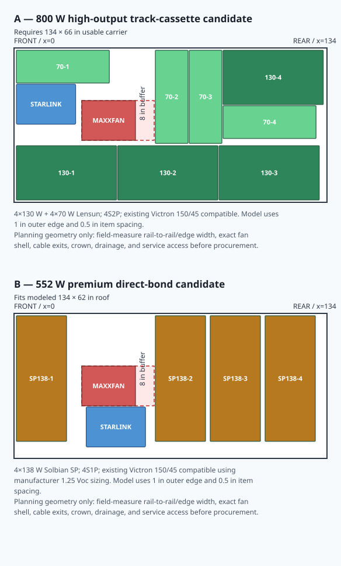

# Starlink + solar moving-roof umbilical

Status: **one-panel Starlink architecture selected; solar geometry audit complete; all roof procurement remains field-survey- and manufacturer-approval-gated**
Last current-source check: `2026-08-09`

## Decision

Complete Starlink as its own pathway now. Install one dedicated rugged shielded RJ45 bulkhead in the fixed camper body near the Desk/router service zone, then bridge the pop-up movement with one removable shielded retractile Ethernet/PoE jumper. The same bulkhead must accept either the normal roof jumper or a long ground-deployment cable.

Solar is not part of this penetration or purchase. When the panel model, stringing, cold `Voc`, `Isc`, conductor size, and roof layout are real, add a separate PV-rated route and two-pole load-break disconnect. It may eventually sit beside the Starlink route, but it does not share conductors, connectors, or a guessed oversize gland.

This supersedes the prior no-new-hole/existing-service-route baseline, twin-coil-now, chain-first, guided-loose-loop, and shared-entry recommendations. The existing truck-bed service route and complete factory cable remain recovery paths, not the normal finished installation.

## Why the other two moving-section concepts lost

### Side-mounted energy chain — rejected as the default

A chain does not make the cable branch-proof. On an exposed vertical camper wall, the return bend still needs somewhere to collect when the roof closes. Without a measured recess or enclosed guide trough, the chain will project outward or bunch into a side lump. Keeping it against the wall would require another trough, retractor, or stow mechanism, increasing bulk and making trail removal harder.

An energy chain remains a contingency only if later geometry reveals a real inboard trough; there is no reason to buy one for the current exterior-wall concept.

### Loose cable/service loop in sleeve — rejected

Without an added spring reel, elastic take-up, or guided carriage, it is simply a slack cable hanging from two anchors. The sleeve supplies abrasion resistance but does not store slack. Adding the missing take-up hardware recreates a less predictable cable-carrier system.

### Meaning of `sheltered`

A route is sheltered only if an existing rigid camper feature projects outward farther than the cable and the cable stays inside that feature's contact shadow through the full roof stroke. No such location has been physically confirmed. The earlier `front guard` wording referred to an imagined fabricated pouch/deflector, not an existing Hiatus component, and is withdrawn.

No exterior always-connected cable is branch-proof. Normal-road mode keeps the coils attached; tight-trail mode powers/isolate the circuits, removes the coils, and caps the fixed ends.

## Selected Starlink physical layout

```text
MOVING ROOF / REMOVABLE MOUNT
  Standard 4 X terminal in TRIO protective edge frame
    -> upper AUDEETO Gen 3 weather/retention pigtail
    -> removable 3 m stretched shielded retractile jumper
    -> NE8MXR1-B-TOP-D locking/weather-sealed cable connector

FIXED CAMPER BODY
  NE8FDX-P6-W shielded RJ45 panel bulkhead with captive cap
    -> fixed interior shielded pure-copper Cat6A patch cable
    -> lower AUDEETO Gen 3 weather/retention pigtail
    -> Gen 3 router
    -> 12V-to-57V converter primary / factory AC supply + inverter fallback
```

Put the panel bulkhead in rigid fixed-body structure below the folding/moving seam and near enough to the Desk/router that the interior patch cable remains serviceable. Put the upper structural anchor directly above it on moving-roof structure/rail. Add a P-clamp behind the upper adapter joint and strain relief at the panel so neither electrical connector carries spring tension. The exact panel location, wall stack, anchor spacing, interior cable length, free extension, tangent lengths, and down-state coil projection still require a physical mockup.

The selected moving jumper must provide more free extension than measured roof travel plus endpoint routing and strain-relief reserve. The current upper-bound estimate is `36 in` lift + `8 in` fixed-body rise + `12 in` roof routing = `56 in` before drip-loop, tangent, and strain-relief reserve. A `6 ft` maximum-stretch coil is therefore too close to full extension; use the `3 m / 9.8 ft` stretched candidate and mock it through the complete roof stroke.

## Starlink cable, panel, and deployment topology

### Cable and panel topology

- Establish a working baseline with the complete factory Starlink cable, then remove and retain that cable as the unmodified direct recovery spare.
- Use the two-pack of passive AUDEETO Gen 3 weather/retention pigtails: one at the Standard 4 X terminal and one at Router 3. These are not protocol or voltage converters; each provides a Starlink-port-compatible shielded male plug, short pigtail, and gland-sealed standard RJ45 female joint. The router-side pigtail keeps the service joint and cable strain off the router port; direct indoor RJ45 fit remains a bench-test simplification, not a planning assumption.
- From the router pigtail, run a field-measured shielded pure-copper Cat6A patch cable to the rear of one [Neutrik `NE8FDX-P6-W`](https://www.neutrik.com/en/product/ne8fdx-p6-w) shielded feedthrough panel connector. Neutrik publishes Cat6A/10 Gbit/s, PoE Type 4 Class 8 / `100W`, `>1000` mating cycles, and IP65 both when correctly mated and when its captive cap is closed.
- Fit the lower end of the selected retractile jumper with [Neutrik `NE8MXR1-B-TOP-D`](https://www.neutrik.com/en/product/ne8mxr1-b-top-d), the retractable TOP carrier that includes the matched Cat6A RJ45 plug and wire manager. It accepts `5.5-8.0 mm` cable OD and AWG `24/7-27/7` stranded conductors, so the listed `26 AWG` coil is conductor-compatible only if its measured jacket OD is also inside that range. It intermates with `NE8FDX-P6-W`; Neutrik's published incompatibility is with `NE8FDY-C6` / `NE8FDY-C6-B`, not the selected panel connector. The panel accepts an ordinary RJ45 plug for dry-weather ground deployment, but a plain RJ45 connection is not the weather-sealed/locked normal-road interface.
- Join the jumper's upper end to the terminal adapter using the adapter's threaded weatherproof RJ45 gland.
- Do not confuse a male device pigtail with the female/female factory-cable coupler. A third AUDEETO pigtail cannot directly accept the factory cable because both ends are male. If panel-fed factory-cable deployment is wanted, use one Furnique-style Gen 3/Cat6-Cat7 inline coupler on the camper end of the factory cable plus a short shielded RJ45-to-Neutrik TOP jumper to the panel. The coupler is electrically passive; “plug and play” means it joins two male-ended cables without cutting either one.
- Put structural P-clamps/anchors behind the upper exterior joint and beside the panel; do not let the Starlink socket, RJ45 contacts, or panel connector carry coil tension.
- Keep the Gen 3 router and selected `10-36V` input / `57V 4.5A` output converter in an accessible ventilated Desk/service cubby. Feed the converter from a dedicated fused `12V` branch; retain the factory AC supply at a fixed GFCI-protected receptacle as the inverter fallback. Do not power Starlink through the plug-in desktop pop-up module.

### Roof / ground mode

- **Roof mode:** protective-framed dish stays on the selected magnetic/VHB-disc or crossbar attachment package; retractile jumper stays connected at the dish and locks into the panel connector. Power down, disconnect/cap at the panel and upper pigtail, release the independent tether, then remove the complete dish/frame for tight brush.
- **Ground recovery mode — preferred:** remove the dish/frame, remove the upper pigtail from the terminal, and run the complete OEM Starlink cable directly from terminal to router through the existing service route. This bypasses every third-party data interface and needs no additional coupler.
- **Ground mode through the panel — optional convenience:** plug the factory cable into the terminal, connect its camper end to one Gen 3/Cat6-Cat7 female/female inline coupler, then use a short shielded male-ended jumper to the Neutrik panel. Fit a second `NE8MXR1-B-TOP-D` on the panel end if this mode must remain sealed in weather. Carrying this small adapter jumper is cleaner than buying a third device pigtail.
- Preserve the complete OEM cable for direct router-to-terminal recovery if any adapter, bulkhead, reterminated plug, or retractile jumper fails.

## Roof mount and branch-protection direction

Current lead: [TRIO Gen 3 Standard Speedmount](https://www.trioflatmount.com/products/gen3speedmount), **white**, purchased `2026-08-06` for `$285` including the `75 mm` stainless through-bolting hardware option. It is explicitly compatible with Standard 4, wraps/protects all four dish edges, is `1.85 in` high, is sold for permanent/temporary highway use, and leaves the factory kickstand usable.

Purchased removal-first attachment package is TRIO's own `$80` set of four rubber-coated magnets plus VHB-backed steel mounting discs. TRIO explicitly lists this semi-permanent combination for fiberglass roofs. It claims `60 lb` nominal holding force per magnet and high-speed mount testing, while also making final securement the user's responsibility. Accept it only if the actual gelcoat is sound, smooth, nonporous, flat at all four feet, and does not let the frame rock. Install at TRIO's stated `70-100 F` ideal temperature, use its surface prep, allow about `72 hours` full cure before highway/weather load, perform a low-speed test/reinspection, and add an independent coated-stainless tether to an existing Yakima-track hardpoint. The tether remains mandatory for brush and adhesive/gelcoat failure even though the mount is vendor-supported. The purchased `75 mm` stainless frame hardware preserves the hard-mount-to-extrusion option.

Mechanical fallback/current mockup is now a stock-driven `1010`/angle-aluminum package, not two full-height `1020` crossbars. Likely geometry is short/leftover `1010` running directly over and parallel to the Yakima tracks, with two continuous transverse members made from suitably stiff angle or other continuous stock; direct track-to-track crossmembers may omit the longitudinal extrusion if future modularity is not worth the extra joints. Do not use a long flat bar laid flat as the only wide-span crossmember unless a physical bending/twist test proves it; angle with a vertical leg is materially stiffer. Keep the main transverse members continuous and confine patchwork/splices to low-moment adapter or longitudinal sections.

The selected `M6 x 35 mm`, `20 x 20 x 4 mm` square-head track bolts are a plausible length for a **bare `25.4 mm`-high 1010 through-stack**: a nominal `1.6 mm` washer plus `6 mm` M6 nut leaves about `2 mm` / two threads of projection. They become marginal if angle, spacers, thick washers, or an additional plate share that same bolt. `M6 x 40 mm` would provide more tolerance, but an exact Yakima-compatible square-head variant is not readily sourced; `M6 x 65 mm` is unnecessarily long for the revised one-inch stack and remains relevant only to a roughly two-inch through-stack. Dry-fit before drilling and avoid crushing unsupported extrusion walls with a crush sleeve, internal spacer, or a load path through supported profile webs.

Preferred known-fit alternative is eight genuine Yakima [`8810074` Anchor Plate A](https://yakima.com/products/anchor-plate-a) threaded plates plus separately selected `M6 x 1.0` bolts. Yakima lists eight plates per kit; published third-party measurements are `3/4 x 7/8 in`, and the companion LandingPad hardware bag uses `M6 x 20 mm` bolts. The finite track floor makes bolt depth an acceptance item: with the intended bracket/member clamped in place, select or trim each bolt so its tip ends flush with or slightly shy of the plate underside while retaining nearly full plate-thread engagement. Use standard `M6` length steps and one or two measured hardened shim washers under the head for fine correction, or cut/chamfer a longer bolt; do not solve a large mismatch with a loose washer tower and never let a bottomed bolt imitate clamp torque. A representative plate/stack should be assembled outside the track first, then installed with marker or soft-clay evidence proving the tip does not contact the track floor. Prefer the known steel plates over hand-tapped thin aluminum; if custom plates are unavoidable, copy the proven plate envelope in adequate stainless and verify thread engagement, track clearance, edge distance, and pullout resistance.

The protective frame improves side/edge survival but does not make the terminal branch-proof. For tight, brushy routes, disconnect the cable and tether and stow/ground-deploy the dish. A thick limb contacting the face or using the frame as a lever is still a no-go for roof carriage.

## Solar geometry audit and current recommendation

### Correction to the earlier `800W CIGS` direction

The earlier repo screening was **electrical- and weight-valid but geometry-invalid**. It should not have promoted `800W` Yuma CIGS before comparing raw panel area with the measured roof envelope.

Using the supplied `134 x 62 in` roof model:

- Total roof rectangle: `57.69 sqft` before the fan, Starlink, rails, gaps, crown, drainage, or cable exits.
- `8x` Yuma 100W Compact panels: `61.53 sqft` by themselves.
- `4x` Yuma 200W panels: `59.37 sqft` by themselves.
- Conservative MaxxFan envelope used for layout: `31 x 17 in` (`23 in` outer body plus an `8 in` rear airflow/service buffer).
- Conservative Starlink/TRIO envelope used by the packages: `25.4 x 17.1 in`; TRIO currently publishes an assembled mount size of about `24.60 x 15.86 in`, so the package is not under-modeling Starlink.

Therefore the MaxxFan is **not** what killed `800W` CIGS. Both plausible Yuma `800W` arrays exceed the entire modeled roof area even before the fan and Starlink exist. The MaxxFan package footprint is close to published overall dimensions; its additional `8 in` rear buffer is a planning allowance rather than a located Maxxair minimum-clearance specification.

### Audit of the two AI-generated packages

| Package result | Geometry verdict | Electrical / product verdict |
| --- | --- | --- |
| Yuma CIGS layouts `A-C`, `400W` | Credible physical starting points on `134 x 62 in`; `A` and `B` preserve the cleanest gaps. | `4S` is the only clean current-`150/45` string. Final release still needs exact cold-`Voc` at the travel minimum temperature. |
| Yuma CIGS layout `D`, `500W` | Physical fit is credible. A separate integer rectangle-packing check also fit `1x` long + `4x` compact with `1 in` outer edge, `0.5 in` spacing, full fan buffer, and Starlink. | The package correctly calls it physical-only: `5S` is about `152V` at STC and cannot use the `150/45`. A `250V` MPPT makes it electrically possible, but replacing the purchased controller for only `100W` is poor leverage. |
| Any `600W` Yuma mix on the `62 in` field | No six-panel long/compact mix fit the same conservative model. | A six-panel CIGS array would also need `6S` on a `250V` controller; `3S2P` lacks reliable hot-roof voltage headroom for a `48V` bank. |
| Planner-v2 Lensun `800W` (`4x130 + 4x70`) | Fits only with `0.25 in` roof edges, `0.25 in` panel gaps, and the `23 in` fan body only. Every supplied `800W` layout occupies the added rear-louver buffer, and the packing is too tolerance-fragile for release as drawn. | The `4S2P` topology is electrically sound on the purchased Victron: `4x130W` and `4x70W` are separate series strings with close operating voltages, then paralleled. Current Lensun pages still list the `130W` and `70W` sizes used by the package. |
| Planner-v2 Lensun `760W` (`4x120 + 4x70`) | The package clears its conservative fan envelope, but the layout is stale. Lensun's current `120W` page lists `32.3 x 30.5 in`, not the package's `40.9 x 22.1 in`; those four layouts must be discarded and repacked. | Do not procure from the `760W` drawings. |



### Ranked architecture

1. **Lead high-output path — minimal track-spanning vented cassettes, not direct-bond CIGS and not a full cargo rack.**
   - Target `4x Lensun 130W + 4x Lensun 70W = 800W`, wired `4S2P` into the purchased Victron `150/45`.
   - A fresh packing run with the full `31 x 17 in` fan buffer, Starlink, `1 in` outer edges, and `0.5 in` item spacing was infeasible at `134 x 62 in` but feasible at **`134 x 66 in`**. The difference is only `2 in` of reclaimed support width per side.
   - Build only shallow panel-specific transverse support/cassettes from the Yakima tracks, with a real open underside airflow path and removable fasteners. Do not resurrect the tall perimeter/grid rack. The carrier must remain inside the actual roof/body envelope and use rounded branch-resistant edges.
   - Lensun currently permits adhesive/VHB installation in product copy, but its general warranty is only `24 months` and excludes damage associated with improper installation or insufficient ventilation. That makes a removable, ventilated cassette more defensible than permanent fiberglass direct bond. Require written Lensun approval for the final backer, adhesive, bend radius, ventilation, and mobile use before purchase.

2. **Premium durable direct-bond fallback — `4x Solbian SP138 = 552W`, `4S1P`, existing `150/45`.**
   - The conservative `134 x 62 in` solver fit four transverse `SP138` strips while preserving the full fan buffer, Starlink, `1 in` roof edges, and `0.5 in` spacing.
   - Solbian's current SP line uses Maxeon IBC cells, carries IEC `61215`/`61730`/`61701` certifications and a `5-year` manufacturing-defect warranty, and explicitly supports manufacturer-supplied structural double-sided adhesive. Its manual requires at least `4 mm` between adjacent panels and says panels are walkable only when fully supported on a rigid smooth surface.
   - `4S` is `552W`, `97.6V Vmp`, and `116.4V Voc` at STC; Solbian's required `1.25x` preliminary voltage sizing gives `145.5V`, inside but close to the Victron's `150V` absolute input limit. Final release needs an exact minimum-temperature calculation, not the generic multiplier alone.

3. **Lowest-profile/value CIGS fallback — Yuma `400W` on the existing controller, or `500W` only with a controller change.**
   - This remains the cleanest flush and branch-resistant option, but it does not satisfy the desired energy contribution. At the current model's `68%` harvest factor, `500W` produces about `1.36 kWh` on a `4`-PSH day; `800W` produces about `2.18 kWh`. The modeled core workday is `3.915 kWh`, so neither provides full autonomy, but `800W` materially reduces alternator/shore dependence.

4. **Premium custom inquiry — hold as an option, not an assumption.**
   - Solbian offers customization. A roof-zone-specific SP design with rear cables, factory adhesive, matched electrical strings, and `700-800W` would beat Lensun on warranty/certification if Solbian will issue a formal drawing, electrical schedule, mounting approval, price, and delivery date. Do not count custom wattage before that written package exists.

### Release gates before any solar purchase

- Measure a common origin grid on the real roof: usable skin width inside the edge rails, total safe carrier width outside/over the rails, exact rail spacing/height, fan body and open-lid projection, Starlink/TRIO removal envelope, crown, seams, drainage paths, cable/junction exits, and safe service/walk lanes.
- Prove whether **`66 in` of safe supported width** is available. If yes, continue the `800W` cassette path. If no, stop trying to force the current `800W` package and choose the `552W` Solbian direct-bond path or request custom modules.
- Make full-size templates of the exact current SKUs and their junction boxes. Product-family wattage is not enough; dimensions and cable exits have already changed within Lensun's catalog.
- Get written panel-manufacturer approval for the exact fiberglass/gelcoat or cassette substrate, adhesive, ventilation, bend radius, walkability, and mobile/wind use.
- Confirm with Hiatus whether the `75 lb` limit includes **all** moving-roof additions. Panel nameplate weights alone are not the lift/dynamic load; include carriers, crossmembers, fasteners, Starlink/TRIO, cable, glands, and rub protection.
- Run exact cold-`Voc`, hot-`Vmp`, string-fuse/combiner, conductor, disconnect, and roof-jumper calculations from the final SKU datasheets before releasing the PV route or purchase.

Current source anchors: [Victron `150/35` and `150/45` specifications](https://www.victronenergy.com/media/pg/Manual_SmartSolar_MPPT_150-35__150-45/en/technical-specifications.html), [Solbian SP Series](https://solbian.eu/products/solar-panels/sp-series/), [Solbian installation manual](https://installation-manual.solbian.eu/english), [Lensun 130W](https://lensunsolar.com/products/lensun-130w-black-flexible-solar-panel), [Lensun 120W](https://lensunsolar.com/products/lensun-120w-full-black-flexible-solar-panel), [Lensun 70W](https://lensunsolar.com/products/lensunsolar-70w-black-12v-flexible-solar-panel), [Lensun warranty](https://lensunsolar.com/pages/warranty-policy), [TRIO Gen 3 Standard Speedmount](https://www.trioflatmount.com/products/gen3speedmount), and the downloaded BougeRV Yuma installation manual retained outside the public repo.

### Current-source shortlist

| Item | Current link / observed price | Posture |
| --- | --- | --- |
| `2x` AUDEETO 2 ft Gen 3/RJ45 weather-retention pigtails | [Amazon `B0DL358L3G`](https://www.amazon.com/dp/B0DL358L3G) — `$19.99` Prime-only / `$25.99` regular at check | **Budget bench-test lead replacing STARGEAR.** Two-pack provides one passive pigtail at the terminal and one at Router 3; seller claims `26 AWG`, shielding, `1000 Mbps`, and IP67 when correctly gland-mated/capped. Limited review history means continuity/shield/heat/retention testing remains mandatory. |
| Furnique Gen 3 / Cat6-Cat7 inline factory-cable coupler | [Amazon `B0GQZ5SNWR`](https://www.amazon.com/dp/B0GQZ5SNWR) — `$12.99` at check | **Optional panel-ground-mode part only.** Female/female passive coupler accepts the camper end of the unmodified factory cable and a short shielded male-ended jumper to the panel. It cannot plug into the terminal/router by itself; its IP68 claim is seller-supplied and must be spray/retention tested. Omit it if direct OEM cable through the existing service route is sufficient. |
| ZBLZGP 3 m stretched Cat6A retractile cable | [Amazon `B0H286KLWZ`](https://www.amazon.com/dp/B0H286KLWZ) — `$35.00`, two in stock/Prime at check | **Budget prototype only.** PUR, dual shield, pure-copper claim, but 26 AWG and no established review history. This is not accepted until a loaded Starlink heat/dropout test passes. |
| L-com `TRD815SZ-CH-1-6F` industrial coil | [L-com product page](https://www.l-com.com/category-5e-ethernet-coil-cord-rj45-rj45-180d-tangents-f-utp-foil-shielded-26awg-high-flex-industrial-zero-halogen-tpu-teal-1-to-6f) | Higher-confidence industrial construction and useful `1-6 ft` geometry, but current retail price/stock could not be verified without vendor challenge and prior pricing was poor. Do not buy unless the Amazon prototype fails or a distributor price is acceptable. |
| Fixed-body RJ45 bulkhead | [Neutrik `NE8FDX-P6-W`](https://www.neutrik.com/en/product/ne8fdx-p6-w) / [Mouser](https://www.mouser.com/ProductDetail/Neutrik/NE8FDX-P6-W) | **Purchased 2026-08-06; pending fulfillment.** One at `$28.45`. Shielded Cat6A feedthrough, PoE Type 4 Class 8 / `100W`, `>1000` cycles, rugged latch, captive cap, and IP65 correctly mated/capped. Rear panel plug is ordinary RJ45. Published rear-side body depth is about `29.5 mm`; allow additional cable bend/service space. |
| Roof-jumper cable connector | [Neutrik `NE8MXR1-B-TOP-D`](https://www.neutrik.com/en/product/ne8mxr1-b-top-d) / [Mouser](https://www.mouser.com/ProductDetail/Neutrik/NE8MXR1-B-TOP-D) | **Two purchased 2026-08-06; pending fulfillment.** `$8.93` each / `$17.86` extended. One is for the roof coil; the second supports the optional factory-cable panel jumper and first-termination insurance. Retractable TOP carrier includes the Cat6A plug/wire manager and accepts `5.5-8.0 mm` OD and AWG `24/7-27/7` stranded. |
| Protective removable dish frame and fiberglass attachment | [TRIO Gen 3 Standard Speedmount](https://www.trioflatmount.com/products/gen3speedmount) | **Purchased 2026-08-06; pending fulfillment.** White Speedmount with `75 mm` stainless through-bolting hardware, `$285`; four rubber-coated magnets, `$40`; VHB-backed magnet mounting discs, `$40`; `$365` total with free shipping. Require full flat magnet/disc contact, proper prep, about 72 h cure, low-speed reinspection, and an independent Yakima-track tether. Purchased through-hardware preserves the extrusion hard-mount option. |
| Gen 3 router DC converter | [Amazon `B0DLZWHPKJ`](https://www.amazon.com/dp/B0DLZWHPKJ) — `$38.99` at check | **Selected budget primary with factory-AC fallback.** Seller claims `10-36V` input and `57V 4.5A` output. Treat rating as seller-supplied, mount on a ventilated/noncombustible surface, and reject for heat, reboot, or voltage-instability behavior during loaded testing. |
| Lower exterior inline RJ45 joint | [trueCABLE Cat6A shielded waterproof coupler](https://www.truecable.com/products/cat6a-waterproof-couplers-shielded) / [Amazon `B0949S87V7`](https://www.amazon.com/dp/B0949S87V7) | **Fallback only.** No longer needed if the one-panel Neutrik interface and compatible cable carrier are accepted. |
| One-cable fixed-body entry | [Seaview retro-fit cable gland, Amazon `B077PQ4FGG`](https://www.amazon.com/dp/B077PQ4FGG) | **Withdrawn from the normal path.** The selected interface is a panel connector, not a through-cable gland. |
| Prior shared-entry candidate | [Scanstrut `DS-H-MULTI-BLK`, Amazon `B0CSTC4D3C`](https://www.amazon.com/dp/B0CSTC4D3C) — `$53.34` at prior check | **Withdrawn.** It is a horizontal cable-entry/deck-seal product, not the desired straight panel quick-disconnect. |
| Straight sidewall candidate | [Scanstrut `TBH-4`](https://www.scanstrut.com/marine/cable-seal/bulkhead/tbh-4) | **Withdrawn from this route.** It is a cable seal, not a detachable panel connector, and its larger multi-cable cut is not justified by deferred solar. |

Orders placed `2026-08-06`, pending fulfillment: Mouser one `NE8FDX-P6-W` plus two `NE8MXR1-B-TOP-D`, `$46.31` item subtotal / `$54.80` checkout total; TRIO white Speedmount, `75 mm` through-hardware, magnets, and VHB-backed discs, `$365` with free shipping. The remaining immediate bench/fit package is the AUDEETO pigtail pair, ZBLZGP 3 m coil, and a field-measured fixed Cat6A run. Add the Furnique inline coupler only if panel-fed factory-cable ground mode is worth the extra interface. The `26 AWG` pigtails/coil are accepted only after continuity/shield inspection and the loaded heat/dropout test. Dry-fit the magnet/disc points and the optional direct-through-bolted crossbar package before committing the roof route. Do not cut the camper wall or coil or bond VHB discs until connector, wall-stack, roof-flatness, and removal mockups are physically proven.

## Why the one-panel Neutrik path now wins

The prior rejection applied to a two-panel layout, which added unnecessary chassis connectors and RJ45 interfaces. The selected layout uses only one fixed-body `NE8FDX-P6-W`: it provides the solid panel quick-disconnect Dane asked for, is explicitly rated for `100W` 802.3bt Type 4, protects the normal roof connection when correctly mated, caps cleanly when disconnected, and still accepts an ordinary RJ45 ground-deployment cord. The upper dish end continues to use the AUDEETO pigtail's weatherproof RJ45 gland, so a second panel connector adds no value.

- [Neutrik `NE8FDX-P6-W`](https://www.neutrik.com/en/product/ne8fdx-p6-w) is female RJ45 on the rear, so the panel part itself needs no punch-down/crimp tool. The published rear panel cut uses one `>=24 mm` center opening plus four `>=3.2 mm` M3 clearance holes on `19.0 +/- 0.1 mm` horizontal by `24.0 +/- 0.1 mm` vertical centers; it is not the common two-screw D-series cutout.
- `NE8MX-B-TOP` is the correct outdoor choice over `NE8MX-B-1`, but it is only a carrier and does not include an RJ45 plug. The final buy-list preference is the newer `NE8MXR1-B-TOP-D`, which adds the matched Cat6A plug/wire manager and a retractable shell while keeping IP65 in the correctly mated TOP connection.
- [Neutrik `NE8MX6-T`](https://www.neutrik.com/en/product/ne8mx6-t) is the Cat6A/PoE++ self-termination alternative, but its published `7-9.5 mm` cable-OD range must match the selected coil.
- [Neutrik `NE8MX-B`](https://www.neutrik.com/en/product/ne8mx-b) accepts a preassembled RJ45 cable without retermination, but it is not the exterior `TOP` weather-sealed solution.

**Release gate:** measure the actual coil tangent OD and inspect its shield/conductors before choosing the cable-side part. Do not drill the D-size panel opening or cut the premade coil merely because the chassis connector itself is selected.

## Full Starlink buy list — planning lock, not purchase record

### Buy-now bench/mount package

| Qty | Item | Current source / allowance | Notes |
| ---: | --- | --- | --- |
| 1 | TRIO Gen 3 Standard Speedmount, white, with `75 mm` stainless through-bolting hardware | **Purchased from TRIO 2026-08-06; pending** — `$285` | Standard 4/4X frame; preserve kickstand. Through-hardware supports optional frame-to-extrusion mounting. |
| 1 pair | AUDEETO 2 ft Gen 3/RJ45 weather-retention pigtails | [Amazon `B0DL358L3G`](https://www.amazon.com/dp/B0DL358L3G) — `$19.99` Prime-only / `$25.99` regular | One passive pigtail at terminal, one at Router 3. Budget prototype replacing the `$58.99` STARGEAR pair; bench-test before install. |
| optional 1 | Furnique Gen 3/Cat6-Cat7 female/female inline coupler | [Amazon `B0GQZ5SNWR`](https://www.amazon.com/dp/B0GQZ5SNWR) — `$12.99` | Only for factory cable -> short shielded jumper -> Neutrik panel ground mode. Not needed for direct OEM cable recovery. |
| 1 | ZBLZGP 3 m / 9.8 ft stretched retractile Cat6A cable | [Amazon `B0H286KLWZ`](https://www.amazon.com/dp/B0H286KLWZ) — `$35.00` | Budget prototype; `26 AWG` pure-copper/PUR/dual-shield seller claims. Measure OD before cutting. |
| 1 | Neutrik `NE8FDX-P6-W` panel feedthrough | **Purchased from Mouser 2026-08-06; pending** — `$28.45` | Fixed-body female/female feedthrough with captive cap. |
| 2 | Neutrik `NE8MXR1-B-TOP-D` | **Purchased from Mouser 2026-08-06; pending** — `$8.93` each / `$17.86` extended | One on roof coil; second terminates the short factory-cable panel jumper and provides first-termination insurance. |
| 1 | VCELINK Cat7/6A shielded RJ45 crimper | [Amazon `B08LPMXM3Q`](https://www.amazon.com/dp/B08LPMXM3Q) — `$17.99` | Budget tool with standard/non-pass-through and shield-clip capability. It is not on Neutrik's approved-tool list; inspect contact depth and shield crimp, continuity-test, and have an AV/network shop reterminate if it does not make a clean full crimp. |
| 1 | Basic RJ45 continuity tester | [Amazon `B01M63EMBQ`](https://www.amazon.com/dp/B01M63EMBQ) — `$9.99` | Verify pins `1-8` in T568B order. This budget tester is not a Cat6A certifier; separately meter shield-shell continuity. |
| 1 | EAZUSE Gen 3 `12V` converter | [Amazon `B0DLZWHPKJ`](https://www.amazon.com/dp/B0DLZWHPKJ) — `$38.99` | `10-36V` input / `57V 4.5A` seller claim. Factory Starlink AC supply remains the inverter fallback. |
| 1 | Interior shielded Cat6A pure-copper patch cable | Cable Matters S/FTP, field-measured length; allow `$10-15` | Ordinary shielded RJ45 male at both ends: rear of panel to RJ45 side of the lower AUDEETO pigtail. Direct Router 3 fit may be tested indoors, but the pigtail is the retention/strain-relief baseline. |

### Removal-first fiberglass attachment package — purchased; installation remains roof-contact-gated

| Qty | Item | Specification / allowance |
| ---: | --- | --- |
| 1 set | TRIO rubber-coated magnets plus VHB-backed steel mounting discs | **Purchased 2026-08-06** — `$40` magnets plus `$40` discs. TRIO states four `60 lb` nominal magnets; verify received VHB/disc construction and instructions. |
| 1 | Independent coated-stainless safety tether | Anchor to real Yakima-track hardware, not another adhesive point. Release only after cable disconnection. |
| 1 | Surface/contact acceptance pass | Roof must be sound, smooth, nonporous, flat at all four feet, and free of rocking. Prep per TRIO, install at its stated `70-100 F` ideal range, cure about `72 h`, then low-speed test and re-inspect before highway use. |

### Roof-track/member package — `1010`/angle-aluminum mechanical candidate

| Qty | Item | Specification / allowance |
| ---: | --- | --- |
| 8 | Selected stainless square-head track T-bolts **or** Yakima `8810074` Anchor Plate A set | Current candidate is `M6 x 35 mm` with `20 x 20 x 4 mm` head. It is plausible for bare `1010`; end-feed and prove head/corner clearance. Prefer Anchor Plate A plus field-selected `M6 x 1.0` bolts when known Yakima fit and easy length changes matter more than bottom-up through-bolting. |
| 2 | Continuous transverse crossmembers | Prefer continuous angle aluminum with a vertical leg or another stiff section. Flat bar laid flat is an adapter/foot, not the default long-span beam. Direct track-to-track mounting is the simplest/lower-joint path; longitudinal `1010` over the tracks preserves modularity. |
| as needed | Leftover `1010` longitudinal rails/adapters | Patchwork is acceptable only with a clear load path. Keep main crossmembers continuous, stagger/brace any joints, and do not make several small brackets carry aerodynamic uplift in series. |
| 8 | M6 washers plus prevailing-torque nuts, or M6 bolts for threaded anchor plates | For bare `1010`, `35 mm` track studs leave about `2 mm` after a nominal washer/nut stack. Recalculate if another member is stacked at the same hole. Use bearing spread/crush control and corrosion isolation; no track-side L-bracket is inherently required. |
| 1 set | TRIO `75 mm` stainless through-bolting hardware | **Purchased with the Speedmount.** Use for frame-to-extrusion attachment only after confirming supplied diameter, four-corner hole stack, washers/nuts, and crossbar geometry. This does not replace the separate square-head track T-bolts that attach extrusion to the roof rails. |
| 1 | Independent coated-stainless safety tether | Separate from the four TRIO mounting bolts and anchored to real roof structure/track hardware. |
| 1 lot | Tef-Gel or equivalent anti-galling/corrosion compound | Stainless-to-aluminum and stainless track hardware; do not combine anti-seize and threadlocker on the same threads. |

### Fixed-body panel and DC branch package

| Qty | Item | Specification |
| ---: | --- | --- |
| 4 | M3 stainless panel screws, washers, and prevailing-torque nuts | Length after measuring shell stack; use all four `3.2 mm` clearance holes to preserve gasket compression. |
| 2 | Structural strain-relief clamps | One beside the panel and one behind the upper Type-4/RJ45 joint; sized only after measuring actual cable/adapter OD. |
| 1 run | Dedicated red/yellow marine duplex DC cable | `12 AWG` only when converter is within roughly `6 ft` one-way of the fuse panel; use `10 AWG` for the more likely longer Desk run. Measure first. |
| 1 | `20A` ATO/ATC branch fuse | Dedicated Starlink converter slot in the existing Blue Sea panel; label both ends. If nuisance trips occur, diagnose load/voltage/heat rather than increasing the fuse above wire/device limits. |
| 2 | Correct wire-size ring terminals + 2 butt splices or lever-free permanent splices | Tinned copper, adhesive-lined heat-shrink, sized to fuse-panel studs and converter pigtails. No cigarette-lighter socket in the permanent path. |
| optional | Small 12V ball-bearing ventilation fan and finger guard | Add only if service-cubby temperatures or converter heat-soak testing justify it. Never bury the converter in insulation. |

Current observed-price required core package is about `$454` before the measured interior cable, roof attachment, DC cable/fuse/terminations, shipping, and tax; this uses the actual `$46.31` Mouser item subtotal and the actual `$285` TRIO frame/through-hardware line. The purchased `$80` magnet/disc package plus normal interior/DC allowances brings the current installation subtotal to about `$579` before shipping/tax. Because the second Neutrik termination is already purchased, panel-fed factory-cable mode now adds only about `$21` for the inline coupler and short shielded cable. Allow roughly `$585-625` installed without that optional mode or `$610-645` with it. The Neutrik panel/connector package and all three TRIO mount lines are marked purchased; receipt, fit, installation, and bench tests remain open.

## Solar moving jumper — intentionally deferred

Do not buy, route, or pre-drill for the solar jumper yet. It remains sizing-gated because the panel model, string arrangement, cold `Voc`, array `Isc`, total moving length, and exact roof travel are not locked. Future PV stays electrically and mechanically separate from Starlink even if its anchors later share the same general area.

Required cable properties:

- two copper current-carrying conductors sized from final array current and total route voltage drop;
- jacket/conductor system explicitly rated above the final cold-array voltage;
- wet/outdoor, UV, oil, abrasion, and repeated-flex suitability;
- relaxed length and full-extension data for the actual finished coil;
- independent strain relief at both ends.

### Current candidate posture

| Item | Link / price posture | Decision |
| --- | --- | --- |
| igus `CF9-UL-60-04`, 10 AWG 4C straight chainflex | [Nassau National Cable](https://nassaunationalcable.com/products/igus-cf9-ul-60-04-10-awg-4c-stranded-bare-copper-unshielded-tpe-1000v-chainflex-cf9-ul-control-cable) — `$9.32/ft`, `15-day ARO`, shipping calculated at check | **Remove from the lead BOM.** It is affordable relative to Alpha EcoFlex, but it is straight four-conductor chain cable, not a retractile coil. It only solves flex life if a carrier/controlled loop is retained. |
| `RCC102SEO-1`, 10/2 SEOW 600 V retractile cord | [Wire & Cable Your Way](https://www.wireandcableyourway.com/retractable-cord-10-2-seow-600v) | Correct product class; current page requires a quote instead of presenting a checkout price. Hold until measured relaxed/extended requirements are known. |
| Generic Amazon 10 AWG PUR spring-cable listing | Current 2-conductor/2 m selection was about `$398` with long delivery during this check | **Reject as not reasonably priced.** |
| Trailer power coils with two 10 AWG conductors | Common on Amazon | **Reject for now.** Their low-voltage vehicle-cord rating does not establish suitability for the possible `150 V` PV circuit, and unused conductors add unnecessary bulk. |

No trustworthy, reasonably priced, checkout-ready Amazon 10 AWG two-conductor PV-capable retractile cable was found in this pass. Do not substitute a cheap low-voltage trailer coil or assume 10 AWG is final before the array is locked.

For frequent trail removal, use one connector family across the roof harness and removable coil. MC4/MC4-compatible connectors are acceptable only as matched-brand, de-energized service disconnects; do not mix brands or unplug under PV load. Exact connectors wait for the panel harness brand and array current.

## Compact PV disconnect

A rotary battery switch like the existing 12 V/48 V switches is not automatically suitable for a higher-voltage PV string. A rotary candidate must show a credible DC-PV load-break rating on the device, not merely `AC` ratings in an Amazon title.

Selection gates:

- voltage rating exceeds final cold-array `Voc`;
- current rating fits the final array/string configuration;
- two-pole switching opens both PV conductors;
- DC arc-interruption/load-break standard is visible on the device/datasheet;
- enclosure and glands fit the installed conductor OD and location;
- required string overcurrent protection remains separate unless the chosen device explicitly provides it.

| Candidate | Current link / observed price | Posture |
| --- | --- | --- |
| DIHOOL 30 A, 2-pole, 12-400 V AC/DC breaker in IP65 three-way DIN enclosure | [Amazon `B0B5QXYCTS`](https://www.amazon.com/dp/B0B5QXYCTS) — `$19.99`, in stock at check | **Practical compact budget candidate after array sizing.** Seller claims non-polarized thermal-magnetic interruption, glands, and `48-400 VDC`; current page does not establish a third-party PV certification. Inspect body markings before acceptance. |
| Generic Amazon 32 A rotary PV isolators | Approximately `$36-50` in current search | **Do not select by title alone.** Accept only if the actual unit/datasheet shows `IEC 60947-3`, `DC-PV2`, the necessary voltage/current topology, and a credible manufacturer. |
| IMO `SI32-PEL64R-2` enclosed rotary PV isolator | [US Solar Supplier](https://ussolarsupplier.com/products/imo-enclosed-dc-switch-ip66-32a-600vdc) — `$87.15`, listed available with `2026-08-11` to `2026-08-18` expected ship window at `2026-08-03` check; [FactoryMation technical listing](https://www.factorymation.com/SI32-PEL64R-2) | **Lead rotary service disconnect.** One-string, two-pole, lockable OFF, `32A`, `600VDC` UL508 listing / `DC-PV2` and IEC 60947-3 supplier claims, IP66/NEMA-class enclosure. Mount on the fixed body before the MPPT and open both PV conductors. Do not order until final cold `Voc`, array/string `Isc`, conductor OD/glands, and stringing prove fit; this is a service load-break, not string OCP. |

## Measurements needed before purchase lock

Record all dimensions in both roof-down and roof-up states:

1. actual vertical movement between the proposed fixed and moving anchors;
2. lower and upper tangent length from connector to strain-relief clamp;
3. desired retracted coil-body length and maximum allowed outward projection;
4. available connector/gland hole diameter and interior service access;
5. an existing rigid feature that actually projects farther outward than the coils, if any;
6. solar panel model/count, stringing, cold `Voc`, array/string `Isc`, and total one-way cable route;
7. actual OD of any purchased prototype cable before ordering Neutrik carriers or cable glands.

## Acceptance tests

### Starlink bench test

1. Establish a baseline with the complete factory cable.
2. Install the adapter pair and candidate coil on the bench.
3. Run the terminal at normal full service long enough to heat-soak the cable and connectors; verify no dropouts, speed instability, brownouts/reboots, connector heating, or visible arcing/carbonization.
4. Repeat with the coil relaxed and extended.
5. Preserve the complete factory cable as the recovery spare.

### Physical mockup

1. Use rope/cheap spring cable between proposed anchored points.
2. Cycle roof down, intermediate, and fully raised; the roof must never pull on a connector.
3. Confirm the down-state coil stays close to the body and does not fall below or outside the chosen profile.
4. Cycle repeatedly and inspect for coils winding together, slap, rub, pinch, and snag.
5. Prove trail removal and cap/stow workflow before drilling final holes.

### Trail-mode sequence

- Starlink: power down -> disconnect/remove coil -> cap fixed/moving RJ45 ends -> secure adapter pigtails.
- Solar: open the PV-rated disconnect -> verify current is stopped -> disconnect/remove the solar coil -> cap both ends.
