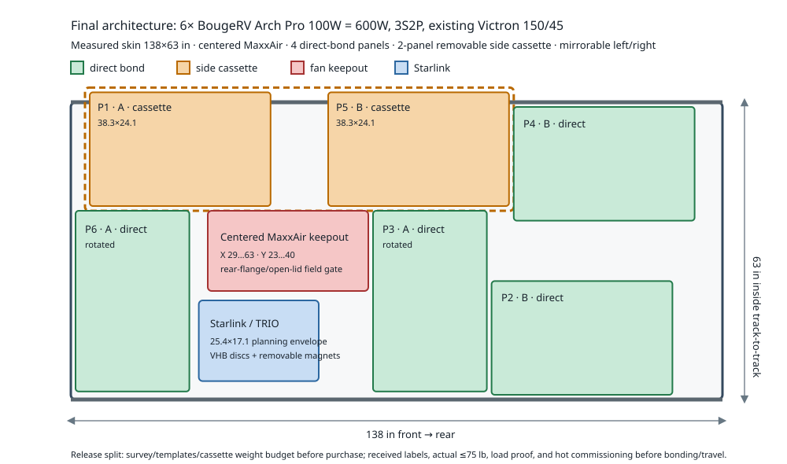

---
aliases:
  - Solar configuration matrix
  - Hiatus roof solar decision
  - Arch Pro 600W roof array
tags:
  - hiatus/study
  - hiatus/solar
status: active
related:
  - "[[SYSTEMS]]"
  - "[[ELECTRICAL_48V_ARCHITECTURE]]"
  - "[[STARLINK_SOLAR_MOVING_UMBILICAL]]"
---

# Solar Configuration Matrix — Final Roof Architecture

As-of date: `2026-08-10`

## Decision

Select:

- **Array:** `6x BougeRV Arch Pro 100W`, SKU `SP003`, `600W` total.
- **Controller:** retain the purchased Victron SmartSolar `MPPT 150/45`.
- **Wiring:** two identical `3S` strings in parallel (`3S2P`).
- **Mounting:** four modules direct-bonded to the clear fiberglass plane using BougeRV's prescribed polyurethane adhesive-rib method; two modules fully supported on one removable, ventilated, track-supported side cassette above one Yakima track.
- **Starlink:** TRIO Gen 3 Standard Speedmount on the purchased VHB-backed steel discs and rubber-coated magnets, directly on the fiberglass only after all four feet prove full contact; preserve the through-bolted/crossbar path as fallback.
- **Rejected architecture:** no full-roof aluminum deck and no rigid-panel rack.

This freezes the **product, topology, and mounting architecture**. It does not authorize panel purchase or adhesive work until the release gates below pass.

## Measured roof baseline

Permanent coordinate system:

- origin: front-left corner of the clear fiberglass rectangle;
- `X`: front to rear;
- `Y`: left to right;
- clear fiberglass: `138.0 x 63.0 in` inside the Yakima tracks;
- track step: `0.625 in` above fiberglass;
- MaxxAir is laterally centered; current conservative keepout is `X=29...63`, `Y=23...40`;
- Starlink/TRIO planning envelope: `25.4 x 17.1 in`;
- all-up moving-roof addition cap: `75 lb`.

The `X=63` fan boundary remains conservative until the **outer rear roof-flange edge** is measured; MaxxAir requires at least `8 in` clear behind that flange.

## Geometry proof

An independent integer optimizer was rerun with:

- measured `138 x 63 in` fiberglass;
- centered `17 in` fan width;
- conservative fan rear keepout through `X=63`;
- `1 in` panel-to-panel and panel-to-fan gaps;
- `2 in` Starlink clearance;
- `1 in` exterior support margin;
- panel and Starlink rotation allowed.

The best six-panel solution needs only **two** modules outside the direct-bond skin envelope; one outside module is infeasible under those constraints. The solution is mirrorable left/right.

| Item | String | X | Y | Installed L x W | Mount |
| --- | --- | ---: | ---: | ---: | --- |
| Arch P1 | A | `4.0` | `-2.1` | `38.3 x 24.1` | Side cassette |
| Arch P2 | B | `89.1` | `37.9` | `38.3 x 24.1` | Direct bond |
| Arch P3 | A | `64.0` | `23.0` | `24.1 x 38.3` | Direct bond, rotated |
| Arch P4 | B | `93.8` | `1.0` | `38.3 x 24.1` | Direct bond |
| Arch P5 | B | `54.5` | `-2.1` | `38.3 x 24.1` | Side cassette |
| Arch P6 | A | `1.0` | `23.0` | `24.1 x 38.3` | Direct bond, rotated |
| Starlink/TRIO | — | `27.1` | `42.0` | `25.4 x 17.1` | VHB discs + removable magnets |

These coordinates are **packing proof, not bond marks**. The side cassette support envelope is approximately `91 x 26 in` before final edge/fairing details.

### Mechanical correction to the prior analysis

A flexible panel cannot transition from the fiberglass plane across a track that stands `5/8 in` proud using only a narrow `~1.35 in/side` infill strip. Any module that crosses the track must remain on one continuous support plane. The selected layout solves this honestly by putting the full footprint of only two modules on one side cassette; the other four stay directly on fiberglass.

## Electrical audit

BougeRV's current `SP003` data:

| Parameter | One module | One `3S` string | `3S2P` array |
| --- | ---: | ---: | ---: |
| Pmax | `100W` | `300W` | `600W` |
| Vmp | `32.4V` | `97.2V` | `97.2V` |
| Voc | `37.8V` | `113.4V` | `113.4V` |
| Imp | `3.1A` | `3.1A` | `6.2A` |
| Isc | `3.2A` | `3.2A` | `6.4A` |
| Series-fuse rating | `15A` | — | — |

Controller checks:

- Victron `150/45`: `150V` absolute maximum PV Voc, `145V` startup/operating maximum, and `50A` maximum array Isc.
- At `-40 C / -40 F`, applying BougeRV's `-0.3%/K` Voc coefficient and full `+5%` Voc tolerance gives **`142.29V`** for one `3S` string: below both Victron limits.
- The tolerance-aware `3S` string reaches `145V` near `-47.6 C / -53.7 F`; colder connected operation requires a new calculation or PV isolation.
- BougeRV explicitly specifies at least three modules in series for a `48V` battery. As a conservative hot-operation screen at the panel's `+85 C` limit, using the published `-0.35%/K` Pmax coefficient, published `+0.048%/K` Isc coefficient as an Imp proxy, and `-5%` voltage tolerance gives about **`70.91V`** estimated `3S` Vmp. That is about `9.11V` above Victron's `56.8V + 5V` startup threshold before route drop. Because BougeRV does not publish a direct Vmp coefficient, final measured route-drop and hot-roof commissioning remain gates.
- A conservative array-Isc check at the panel's `+85 C` operating limit, including `+5%` Isc tolerance and `+0.048%/K`, is about **`6.91A`**: far below the controller's `50A` limit.
- `600W / 56.8V` is about **`10.56A`** of ideal battery-side charge current, well below the controller's `45A` rating.
- Two parallel strings do not ordinarily need individual string fuses because only one peer string can backfeed a faulted string and the module series-fuse rating is `15A`. Confirm this against received labels, conductor ampacity, connector ratings, and final PV rules before deleting `F-09` from the as-built schedule.

## Mounting decision

### Four direct-bond modules

Follow the Arch Pro manual rather than fully laminating the backsheet to the roof:

1. Clean the panel backs and roof bond zones.
2. Use multi-purpose polyurethane sealant/adhesive in strips at least `0.25 in` wide, spaced every `6.5 in`, leaving airflow channels.
3. Add adhesive at the windward edge.
4. Apply firm, distributed pressure.
5. Hold the roof stationary for the specified `48 h` cure.

Do not substitute an unspecified full-coverage tape pattern. Preserve drainage, junction-box access, cable bend radius, and a documented removal method.

### Two-module side cassette

Use one simple rectangular carrier, not a secondary roof:

- full support beneath both modules;
- top plane at or above the track top, with no panel bending over the `0.625 in` step;
- removable track attachment;
- no structural dependence on bare aluminum rubbing fiberglass;
- controlled roof clearance or broad compliant isolation at any anti-flutter contact;
- windward fairing and sealed/rounded edges;
- final mass target `<=20 lb` for cassette, brackets, isolation, and fasteners;
- structural load path and highway-uplift proof before adhesive work.

A planning-only `~91 x 26 in` cassette made from thin aluminum skin plus shallow angle stiffeners appears capable of staying inside the mass target, but exact alloy, thickness, stock geometry, fasteners, track connection, and uplift proof are still engineering gates.

## Weight budget

| Item | Planning mass |
| --- | ---: |
| `6x` Arch Pro modules | `27.6 lb` |
| Starlink Standard + TRIO mount | `~10.4 lb` |
| Fixed subtotal | **`38.0 lb`** |
| Remaining under `75 lb` | **`37.0 lb`** |

The remaining `37 lb` must cover the cassette, magnets/discs, adhesive, PV cable/connectors, roof gland, moving jumper, disconnect, clamps, labels, and fasteners. Weigh the complete roof package rather than relying on estimates.

## Energy consequence

Using the project's existing `68%` end-to-end planning factor:

| Effective sun | Daily harvest | Core-workday deficit (`3,915Wh`) | Winter-workday deficit (`4,829Wh`) |
| ---: | ---: | ---: | ---: |
| `2 PSH` | `816Wh` | `3,099Wh` | `4,013Wh` |
| `4 PSH` | `1,632Wh` | `2,283Wh` | `3,197Wh` |
| `5 PSH` | `2,040Wh` | `1,875Wh` | `2,789Wh` |

Solar remains a charge-source reducer, not workday autonomy. Break-even is about `9.60 PSH/day` for the core profile and `11.84 PSH/day` for the winter profile. The dedicated `48V` alternator and shore charging remain essential.

## Why this wins

| Candidate | Why it lost to the selected `600W` array |
| --- | --- |
| `4x Yuma CIGS = 400W` | Clean direct-bond durability path, but loses `544Wh/day` at `4 PSH` and severe-cold Voc margin is tighter. CIGS durability is plausible, not proven enough here to justify one-third less array power. |
| `5x Yuma CIGS = 500W` | Requires a `250V` controller and still gives less output. |
| `5x XPLOR 125 = 625W` | The nominal `63 in` fit depends on impractical near-zero spacing/edge tolerance; a practical layout needs added support, costs much more, and lacks the required published cold-Voc coefficient in the reviewed documentation. |
| `2x Arch 200 + 4x Arch 100 = 800W` | Requires a `250V` controller and a materially wider supported carrier. At `4 PSH`, it adds only `544Wh/day` over the selected array while reintroducing the fabrication the build is trying to avoid. |
| `7x Lensun 130 = 910W` | Strong watts/weight/cost, but the tested layout needs about a `69.1 in` supported envelope, broad carrier coverage, a `250V` controller, and accepts a general `24-month` workmanship warranty whose exclusions include insufficient ventilation. |
| Full aluminum solar deck | Provides ventilation, roof shade, and removability, but fan framing, stiffening, uplift, track transitions, fairing, vibration isolation, and weight turn it into a second roof. |
| Rigid modules | Useful service life and cooling, but realistic `600-800W` rigid arrays plus rack and Starlink do not credibly stay below the complete `75 lb` moving-roof cap. |

## Release gates

### Purchase release

These must pass before ordering panels or dedicated cassette hardware:

- [ ] Measure MaxxAir **outer rear roof-flange edge**, full open-lid footprint, and service/removal envelope.
- [ ] Measure track top width, outside-to-outside spacing, outer roof land, crown, and cassette attachment geometry.
- [ ] Place `1:1` Arch Pro templates including junction boxes, `33.5 in` leads, connectors, adhesive ribs, and service loops.
- [ ] Place the assembled Starlink/TRIO on all four magnet/disc feet; prove full contact, cable bend, removal, and tether path.
- [ ] Cycle the fan and Starlink removal with all templates present.
- [ ] Freeze which roof side receives the mirrorable cassette.
- [ ] Complete a cassette load/uplift/fairing design and preliminary itemized weight budget showing the complete roof package can remain `<=75 lb` with contingency.
- [ ] Obtain insurer/Hiatus acceptance if required for adhesive-bonded roof additions.

### Installation / adhesive release

These pass after receipt and before roof bonding or travel:

- [ ] Verify received `SP003` labels, dimensions, lead exits, connectors, and polarity; update cold Voc if connected operation below `-40 F` is intended.
- [ ] Build and load-check the cassette; prove full support, removable track load path, highway uplift/fairing, drainage, and no-rub roof isolation.
- [ ] Weigh the **actual complete** moving-roof package at `<=75 lb`.
- [ ] Lock compatible branch connectors or a listed two-string combiner, PV cable, two-pole disconnect, moving jumper, gland, strain relief, labels, and final OCP decision.
- [ ] Confirm estimated hot-string voltage minus measured route drop still clears the maximum configured battery voltage by at least Victron's `5V` startup requirement.
- [ ] Bond a representative coupon or noncritical test piece with the exact polyurethane product and cure process; verify adhesion and a controlled removal method.
- [ ] Complete stationary-roof hot-operation commissioning before travel acceptance.

## Source references

- [BougeRV Arch Pro 100W official product page](https://www.bougerv.com/products/arch-pro-12v-24v-100w-flexible-solar-panel)
- [BougeRV Arch Pro official installation manual](https://cdn.shopify.com/s/files/1/2672/9544/files/ArchPro_-2025-6-26.pdf?v=1756200936)
- [Victron SmartSolar MPPT 150/35 and 150/45 datasheet](https://www.victronenergy.com/upload/documents/Datasheet-SmartSolar-charge-controller-MPPT-150-35-%26-150-45-EN.pdf)
- [MAXXFAN Deluxe installation manual](https://library.maxxair.com/wp-content/uploads/2023/03/11e90001k_maxxfan-deluxe-install-11-2017.pdf)
- [TRIO VHB-backed magnet mounting discs](https://www.trioflatmount.com/products/vhb-backed-magnet-mount-pads)
- [Lensun 130W product page](https://lensunsolar.com/products/lensun-130w-black-flexible-solar-panel)
- [Lensun warranty policy](https://lensunsolar.com/pages/warranty-policy)

## Historical note

Earlier `134 x 62 in`, `134 x 66 in`, `800-1200W CIGS`, portable/foldable Lensun, Solbian, XPLOR, CMPower, and full-deck studies were useful exploration but are superseded by the measured `138 x 63 in` roof, centered fan, current products, and the decision above. Historical coordinates are not fabrication instructions.
