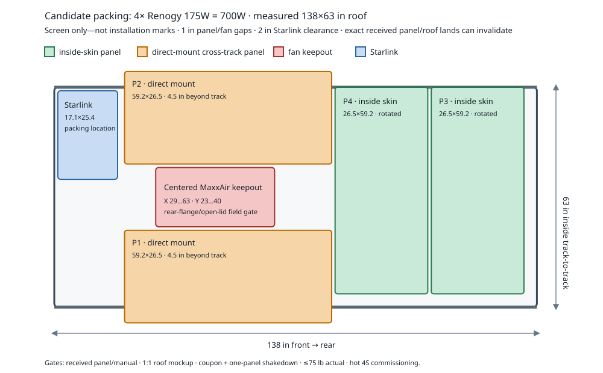

---
aliases:
  - Solar configuration matrix
  - Hiatus roof solar decision
  - Renogy 700W roof array
tags:
  - hiatus/study
  - hiatus/solar
status: active
related:
  - "[[SYSTEMS]]"
  - "[[ELECTRICAL_48V_ARCHITECTURE]]"
  - "[[STARLINK_SOLAR_MOVING_UMBILICAL]]"
---

# Solar Configuration Matrix — Purchased Renogy 700W Array

As-of date: `2026-08-27`

## Current decision

- **Received/test-fit:** `4x Renogy 175W 12V flexible monocrystalline panels = 700W`, purchased `2026-08-12` and owner-reported on hand by `2026-08-27`. One-panel physical test-fit plus measured layout indicates coexistence with Starlink/MaxxAir and near-total roof use.
- **Purchase evidence:** `$649.36` merchandise, `-$32.46` `WELCOME5` discount, `$616.90` net item subtotal, free shipping, `$44.73` estimated tax, and `$661.63` checkout total.
- **Controller:** retain the purchased Victron SmartSolar `MPPT 150/45` for fit testing and commissioning.
- **Electrical topology:** one `4S1P` series string. `2S2P` does not provide enough PV voltage for a `48V` bank, and unequal strings must not be paralleled on one tracker.
- **Mounting:** direct roof attachment with the exact controlling structural-silicone product/preparation/cure. Do not reintroduce a carrier, rack, cassette, or generic consumer reclosable fastener unless the owner explicitly reopens that direction.
- **Moving route:** the PV retractile cord is owner-reported ordered. Preserve only the two free `4S1P` string-end leads through one two-conductor route; received cord/rating/gland/full-motion proof and structural exterior restraint remain open.
- **Status:** physical fit is encouraging but does not release bonding or travel. Record the exact received SKU/labels/connectors/manual; prove roof/substrate preparation, coupon, drainage, cure, one-panel shakedown, full moving-route behavior, actual weight, route drop, and hot restart/tracking.

This supersedes D-069's `6x BougeRV Arch Pro 100W = 600W / 3S2P` product and layout decision. It preserves the measured roof, existing-controller preference, `75 lb` complete moving-roof cap, separate Starlink/PV pathways, and post-receipt commissioning gates.

## Evidence boundary

The checkout screenshot identifies the product as **Renogy 175 Watt 12 Volt Flexible Monocrystalline Solar Panel**, quantity `4`, but does not show a model suffix. Renogy's current support page names SKU `RNG-175DB-H`; its official linked G2 datasheet is the present planning basis. The received labels control if they differ.

Official G2 planning data:

| Parameter | One panel | `4S` candidate |
| --- | ---: | ---: |
| Pmax | `175W` | `700W` |
| Vmp | `19.5V` | `78.0V` |
| Voc | `23.9V` | `95.6V` |
| Imp | `8.98A` | `8.98A` |
| Isc | `9.50A` | `9.50A` |
| Max series fuse | `15A` | — |
| Dimensions | `59.2 x 26.5 x 0.1 in` | — |
| Weight | `6.2 lb` | `24.8 lb` total |
| Voc coefficient | `-0.31%/C` | — |
| Pmax coefficient | `-0.42%/C` | — |
| Isc coefficient | `+0.05%/C` | — |

The reviewed datasheet does not state a module-voltage manufacturing tolerance. Do not present the calculations below as received-label acceptance.

## Measured roof baseline

- clear fiberglass inside the Yakima tracks: `138.0 x 63.0 in`;
- coordinate origin: front-left corner of the clear fiberglass rectangle;
- `X`: front to rear; `Y`: left to right;
- track step: `0.625 in` above fiberglass;
- MaxxAir conservative keepout: `X=29...63`, `Y=23...40`;
- Starlink/TRIO planning envelope: `25.4 x 17.1 in`;
- complete moving-roof addition cap: `75 lb`.

The exact MaxxAir rear flange/open-lid/service envelope and track/crown geometry remain field measurements.

## Geometry re-screen

The Renogy panels are materially larger than the superseded `38.3 x 24.1 in` Arch Pro modules. A new integer-packing screen used:

- the measured `138 x 63 in` skin;
- the current fan keepout;
- `1 in` panel-to-panel and panel-to-fan separation;
- `2 in` Starlink clearance;
- `1 in` outer skin margins for direct panels;
- panel and Starlink rotation;
- up to `10 in` supported projection beyond either side track.

No all-inside-skin solution was found. No solution was found with support outside only one side within that `10 in` screen. A two-side-support packing solution was found with two full panels inside the skin and one full supported panel crossing each side track.

| Item | X | Y | Installed L x W | Posture |
| --- | ---: | ---: | ---: | --- |
| Renogy P1 | `20.1` | `41.0` | `59.2 x 26.5` | Direct roof attachment candidate; projects `4.5 in` past one side track |
| Renogy P2 | `20.1` | `-4.5` | `59.2 x 26.5` | Direct roof attachment candidate; projects `4.5 in` past opposite side track |
| Renogy P3 | `107.8` | `0.0` | `26.5 x 59.2` | Inside skin, rotated |
| Renogy P4 | `80.3` | `0.0` | `26.5 x 59.2` | Inside skin, rotated |
| Starlink/TRIO | `1.0` | `1.0` | `17.1 x 25.4` | Candidate packing location, rotated |

These coordinates remain **packing provenance, not installation marks**. Owner test-fit `2026-08-27` is stronger current evidence that the four-panel/Starlink/MaxxAir package fits while using nearly the complete roof, but full `1:1` templates still control exact panel edges, track transitions, junction boxes, lead exits, grommets, drainage, fan service, Starlink removal, and structural clamp locations. Add no carrier; use only a minimal local taper if the actual panel/manual requires it at a track step.

## Electrical audit

### Controller maximums

- Victron `150/45`: `150V` absolute maximum PV open-circuit voltage and `145V` startup/operating maximum. Current Victron references differ between `45A` and `50A` for maximum array short-circuit current; the candidate `9.50A` is far below either value.
- Renogy `4S` at STC: `95.6V Voc` and `9.50A Isc`; both are comfortably below the controller maximums.
- Applying the published `-0.31%/C` Voc coefficient from `25C` to `-40C` gives **`114.86V` nominal calculated cold Voc**.
- A non-manufacturer `+5%` voltage stress screen gives `120.61V`; this is still below `145V`, but it is not a substitute for received-label/tolerance data.

### Hot-start concern

Victron requires PV voltage to exceed battery voltage by `5V` to start and by `1V` to continue operating. At the current `56.8V` charge target, the corresponding screens are `61.8V` and `57.8V` before route drop.

Renogy does not publish a direct Vmp temperature coefficient in the reviewed G2 datasheet. Using the published Pmax coefficient and Isc coefficient as an Imp proxy produces only an estimate:

| Estimated module temperature | Estimated `4S` Vmp | Margin over `56.8V + 5V` startup screen |
| ---: | ---: | ---: |
| `65C` | `63.62V` | `+1.82V` before route drop |
| `70C` | `61.87V` | `+0.07V` before route drop |
| `75C` | `60.12V` | `-1.68V` before route drop |
| `85C` | `56.64V` | `-5.16V` before route drop |

This does **not** prove the array/controller combination unusable: the panels should normally start while cooler in the morning, and Victron's running threshold is lower. It does mean a hot restart near a full battery is marginal and the prior Arch Pro hot-voltage release cannot be reused. Treat direct bonding, route drop, and hot-roof restart/continuity testing as hard commissioning gates. If hot restart or sustained hot tracking fails, changing controller architecture may be required; do not pre-buy another controller before testing the received panels.

### String protection

One series string has no peer string that can backfeed it, so no individual `F-09` string fuse is presently planned. The module's published maximum series-fuse rating is `15A`. Confirm received labels, conductor ampacity, connector ratings, disconnect rating, and applicable mobile-PV rules before as-built release.

## Weight budget

| Item | Planning mass |
| --- | ---: |
| `4x` Renogy panels | `24.8 lb` |
| Starlink Standard + TRIO mount | `~10.4 lb` |
| Fixed subtotal | **`35.2 lb`** |
| Remaining under `75 lb` | **`39.8 lb`** |

The remaining `39.8 lb` must cover magnet discs, direct-mount adhesive/reclosable fastener, any small track-step spacer proven necessary, PV cable/connectors, roof entry, moving jumper, disconnect, clamps, labels, isolation, and all hardware. Weigh the actual complete moving-roof package.

## Energy consequence

Using the existing `68%` end-to-end planning factor:

| Effective sun | Daily harvest | Core-workday deficit (`3,915Wh`) | Winter-workday deficit (`4,829Wh`) |
| ---: | ---: | ---: | ---: |
| `2 PSH` | `952Wh` | `2,963Wh` | `3,877Wh` |
| `4 PSH` | `1,904Wh` | `2,011Wh` | `2,925Wh` |
| `5 PSH` | `2,380Wh` | `1,535Wh` | `2,449Wh` |

Ideal battery-side current at `56.8V` is about `12.32A`, well below the controller's `45A` rating. Break-even is about `8.22 PSH/day` for the core profile and `10.14 PSH/day` for the winter profile. Solar remains supplemental; alternator and shore charging remain essential.

## Release gates

### Receipt and geometry

- [~] All four panels are received; one-panel physical test-fit plus measured layout indicates coexistence with Starlink/MaxxAir and near-total roof use. Photograph/record exact SKU and all four labels.
- [ ] Verify each panel's dimensions, weight, lead lengths/exits, connector manufacturer, polarity, grommet layout, and current manual.
- [ ] Place full `1:1` templates with junction boxes, leads/connectors, grommets, attachment zones, service loops, exact track transitions, drainage, and structural cord supports; cycle fan operation and Starlink removal.

### Mechanical release

- [x] Architecture remains direct roof attachment only; no carrier/cassette/rack or generic consumer hook-and-loop is active.
- [ ] Verify the exact structural-silicone product is allowed for the received panel backsheet and roof substrate; document roof wash/decontamination, both-side preparation, bead/pattern, application temperature, cure window, drainage, and removal/service implications.
- [ ] Bond a representative coupon with the exact materials and cure. Inspect adhesion, edge peel, hot-soak behavior, water tracks, and roof/backsheet damage before panel work.
- [ ] Install one panel first. After cure, pass static inspection, heat/water exposure, roof cycles, and a temporary independent track-anchored test restraint. Then run a private/closed-course low-speed test with inspection stops; only after it passes, run a deliberate progressive road-acceptance test with staged speed/stop inspections.
- [ ] Where a panel crosses a raised track, add nothing if the actual panel/manual permits the transition; otherwise use only the smallest local taper needed to avoid a sharp crease.
- [ ] Weigh the actual complete moving-roof package at `<=75 lb` with contingency and confirm insurer/Hiatus acceptance if required.

### Electrical and travel release

- [ ] Confirm `4S1P` polarity and received-label Voc/Isc before connection. Use three panel-to-panel series mates and only the two free string ends; no combiner.
- [~] PV retractile cord is owner-reported ordered. On receipt record exact product/conductors/OD and prove `>=150VDC`, wet/UV/cold/coiled ampacity, tangents, spring force, gland fit, structural clamps/guard, and full `28 in` roof/cab articulation before drilling.
- [ ] Lock compatible series connectors/extensions, compact two-pole transition, continuous `12 AWG` two-conductor moving route, fixed two-pole DC-PV load-break, short stationary run, MPPT entry, labels, and final OCP decision. Adhesive zip-tie bases are guides only; structural supports carry spring/wind/branch loads.
- [ ] Confirm MPPT battery-output protection is `F-03 60A/80V MEGA` in Lynx Slot 2 and remove/quarantine any misrated `32V` substitute.
- [ ] Measure end-to-end route drop and commission stationary in cool/hot conditions: morning start, hot restart near charge target, sustained tracking, cable/connector temperature, and no dropout.
- [ ] Do not accept the remaining panel bonds or routine highway travel until exact-material cure, one-panel static/heat/water/roof-cycle proof, temporary independent test restraint, private low-speed test, controlled staged-speed road acceptance, actual weight, cable/penetration restraint, full-motion proof, attachment inspection, and hot electrical commissioning pass.

## Source references

- [Renogy support page — 175W flexible panel / SKU RNG-175DB-H](https://www.renogy.com/pages/175-watt-monocrystalline-solar-flexible-panels-rng-175db-h-html)
- [Renogy 175W product mounting recommendation — silicone structural adhesive for mobile use](https://eu.renogy.com/products/175-watt-12-volt-flexible-monocrystalline-solar-panel)
- [VELCRO Brand engineered commercial-roof solar fastener overview](https://www.velcro.com/news-and-blog/2025/07/mounting-solar-panels-on-roofs-with-velcro-brand/)
- [3M Dual Lock SJ3550 technical data — typical values require application-specific evaluation](https://multimedia.3m.com/mws/media/2366370O/3M-Dual-Lock-Reclosable-Fastener-SJ3550.pdf)
- [3M reclosable-fastener design selection guide — flexible solar/roofing-membrane wind application](https://assets.testequity.com/te1/Documents/pdf/3m/3M_Reclosable-Fasteners-Design-Selection_Guide_0224.pdf)
- [3M Dual Lock SJ3870 current technical data — Type 250, modified acrylic/LSE adhesive](https://multimedia.3m.com/mws/media/2366356O/3m-dual-lock-reclosable-fastener-sj3870.pdf)
- [3M Dual Lock SJ3871 current technical data — Type 400, modified acrylic/LSE adhesive](https://multimedia.3m.com/mws/media/2366436O/3M-Dual-Lock-Reclosable-Fastener-SJ3871.pdf?pif=001123)
- [Renogy official RNG-175DB-H-G2 datasheet](https://cdn.shopify.com/s/files/1/0631/0137/0483/files/RNG-175DB-H-G2_20Datasheet.pdf?v=1752029087)
- [Victron SmartSolar MPPT 150/35 and 150/45 manual](https://www.victronenergy.com/media/pg/Manual_SmartSolar_MPPT_150-35__150-45/en/index-en.html)
- [MAXXFAN Deluxe installation manual](https://library.maxxair.com/wp-content/uploads/2023/03/11e90001k_maxxfan-deluxe-install-11-2017.pdf)
- [TRIO VHB-backed magnet mounting discs](https://www.trioflatmount.com/products/vhb-backed-magnet-mount-pads)

## Historical note

The `2026-08-10` Arch Pro `600W / 3S2P` optimization remains useful history but is superseded by the owner-confirmed Renogy purchase. Its panel coordinates, adhesive-rib method, one-cassette architecture, electrical values, and weight subtotal are not fabrication instructions for the Renogy panels.
