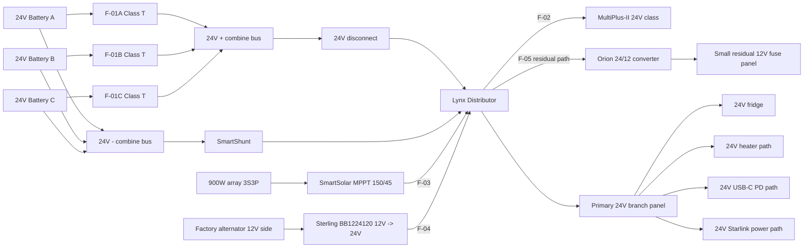

Status: 24V Candidate Variant (non-canonical; canonical remains 48V baseline)

# Electrical Topology Diagram (24V Candidate)

As-of date: `2026-02-20`

Purpose: implementation candidate topology for a `24V` core architecture with `24V-native-first` distribution and residual `12V` support only where needed.

Related candidate docs:
- `docs/variants/24v/ELECTRICAL_24V_vs_48V_trade_study.md`
- `docs/variants/24v/ELECTRICAL_fuse_schedule_24V_candidate.md`
- `docs/variants/24v/SYSTEMS_24V_candidate.md`
- `bom/variants/24v/bom_estimated_items_24V_candidate.csv`

## Candidate Core Topology

## Candidate Notes
- High-current architecture remains centralized via Lynx/busbar + shunt.
- Residual 12V path is intentionally constrained to low-power legacy/safety loads.
- No dedicated large 12V buffer battery in this candidate baseline.
- MPPT `150/45` remains valid for `900W` at 24V (no clipping at `~28.8V` output target).
